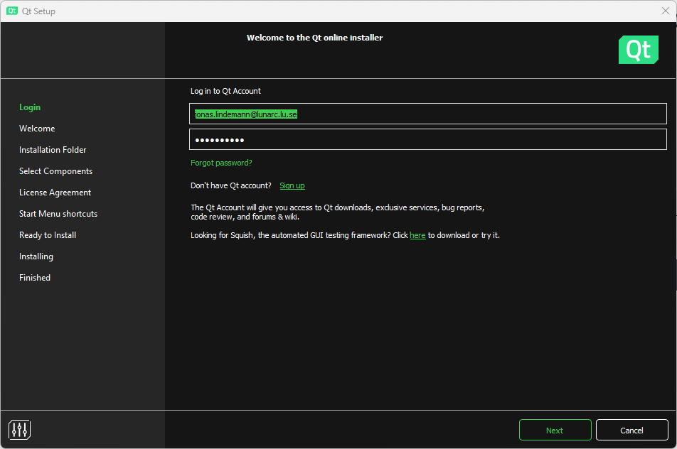
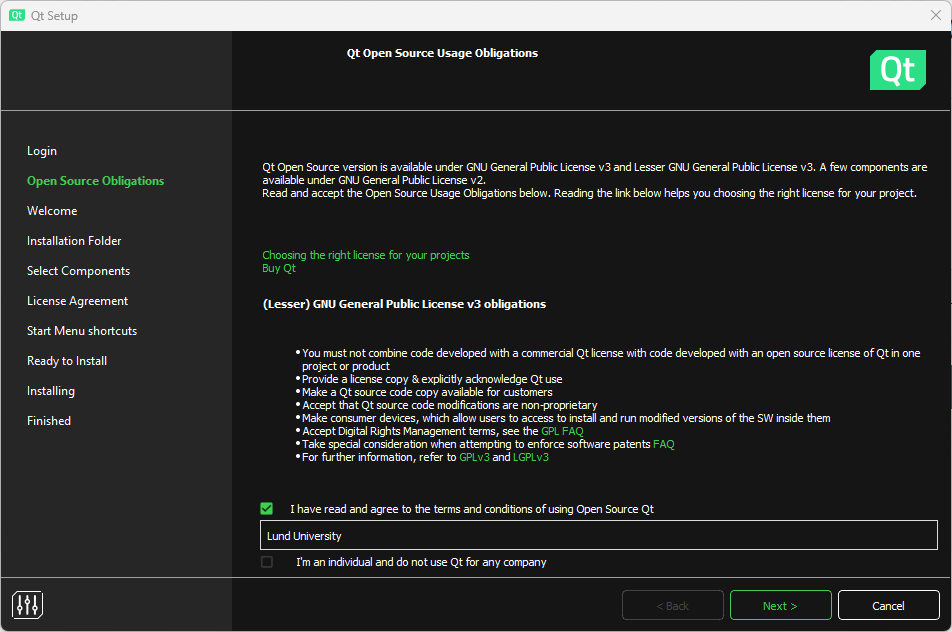

# Building and running C++ code

To install and run C++, you will need a compiler. There are several compilers available for C++ that work on all major platforms. For this course, we will be using the GNU C++ compiler. Along with the compiler, it is recommended to have a good text editor that has support for C++. To further simplify the process of compiling, running, and debugging C++ code, a development environment is recommended. In this course, we will use Qt Creator, which is an advanced environment specifically designed for C++. It provides features such as building, debugging, and running both command line and graphical applications using Qt.

As we are not going to develop commercial code in this course we can download and use the open source version of Qt Creator, which can be downloaded from the following URL:

[Download open source Qt Creator](https://www.qt.io/download-qt-installer-oss)

## Installing Qt Creator and C++ compiler (Windows)

Download and run the online installer from the URL above. To use the installer you need to create an Qt account. When this has been done, enter your account information into the following dialog box and click **Next**.

{ width="100%" }

Check the box that you agree to the GPL license requirements. Click **Next**.

{ width="100%" }

In the **Select components** section make sure to select:

 * Qt 6.5.x
 * Qt Creator 10.0.2
 * Qt Creator 10.0.2 CDB Debugger support
 * Debugging support for Windows
 * MinGW 11.2.0 64-bit

Click **Next**.

{ width="100%" }

Continue the dialog to complete the installation of Qt Creator on Windows. When completed you should now have the development environment Qt Creator and the GCC 11.2 compilers for C++ available. Qt Creator is now available in the start menu.

## Installing Qt Creator and C++ compiler (Linux)

## Installing Qt Creator and C++ compiler (macOS)

## Creating a C++ project in Qt Creator

## Adding source files to your project

## Running your application

## Debugging your application.