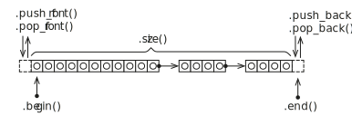

Data structures and algorithms
==============================

The C++ standard library contains many common data structures that are
useful when implementing your application. Most of the data structures
defined only support various basic functionality, instead algorithmic
functionality is instead implemented separately and can work mostly with
any data structures. Data structures are not type-specific and are
implemented as template classes, supporting all builtin and user-defined
data types.

The most common data structures in C++ are divided into the following
different types:

- Array type structures (T is the data type)

  - **std::vector<T>**
  - **std::array<T>**
  - **std::deque<T>**

- Linked list structures

  - **std::list<T>**

- Stacks and queues

  - **std::stack<T>**
  - **std::queue<T>**

- Associative containers

  - **std::map<Key, T>**
  - **std::multimap<Key, T>**
  - **std::set<Key>**
  - **std::multiset<Key>**

Data structures and iterators
-----------------------------

To access and move through data structures C++ uses the concepts of an
iterator. An iterator is a special type unique for each data structure
that provides a way of moving through the elements in the data
structure. It can be compared to the C++ pointer type, but with
additional functionality. The value located where the iterator is
positioned is accessed by dereferencing the iterator using the star
operator (\*).

Depending on the data structure the iterator can belong to different
categories:

- **InputIterator** - Can read and move forward. Only supports a single
  pass through the data structure.
- **ForwardIterator** - Can read, move forward supporting multiple
  passes.
- **BidirectionalIterator** - Can read, move forward and backwards.
- **RandomAccessIterator** - An iterator can access any element in any
  order.
- **OutputIterator** - Any of the above that support writing is
  considered a mutable iterator.

To get a starting point for an iterator all data structures have a
**.begin()** and **.end()** method. **.begin()** returns an iterator at
the beginning of the data structure. **.end()** returns an iterator
after the last item in the data structure. **.end()** is useful to be
able to stop an iteration through a data structure, comparing the
current iterator to the **.end()**-iterator.

To illustrate the use of iterators we use the **std::vector<T>** as an
example. **std::vector** is a data structure for storing values in a
dynamically resizable array. First we declare and initialise the data
structure.

.. code:: cpp

   std::vector<int> v = { 1, 2, 3, 4, 5, 6 };

This initializes the vector with some values. In the next step, we need
to declare an iterator so that we can loop through the vector.

.. code:: cpp

   std::vector<int>::iterator it;

Now we have all information to be able to iterate over the vector. To do
this we use a standard loop statement. At the start of the loop, we
initialize the iterator to the start iterator of the vector. We loop
until **it** encounters the end iterator of the vector. For each
iterator, we also need to move the iterator forward in the data
structure using the **++** operator.

.. code:: cpp

   for (it=v.begin; it!=v.end(); it++)

To access the actual value that corresponds to the current position of
the iterator we can use the star operator (\*).

.. code:: cpp

       std::println("{}", *it);

.. button-link:: https://godbolt.org/z/sbTMab6v7
    :color: primary
    :outline:

    Try example

If the data structure supports random access to the individual elements
it is also possible to access the individual elements using the
[]-operator or the **.at()**-method. The **.at()**-method also supports
bound checking.

.. code:: cpp

   std::println("{}", v[0]);    // random acces to element 0 without bounds check.
   std::println("{}", v.at(1)); // radnom access to element 1 with bounds check.

We can simplify the code a bit using some of the more modern features of
C++. First we don’t have to specify the type of the vector if the
element type can be deduced from the intialisation list.

.. code:: cpp

   std::vector v = { 1, 2, 3, 4, 5 };

We also don’t have to explicitly declare an iterator before the
**for**-statement. The **auto**-keyword can be used as the iterator type
can be deduced by the compiler.

.. code:: cpp

   for (auto it=v.begin(); it!=v.end(); it++)
   {
       std::println("{}", *it);
   }

.. button-link:: https://godbolt.org/z/rvYM6Yzzo
    :color: primary
    :outline:

    Try example

Range-based loops
-----------------

To make it even easier iterate over data structure a new loop construct
was introduced to the C++ language, the range-based loop. This construct
is very similar to the way you iterate over data structures in Python.
The syntax is simplifed:

::

   for (named-variable : range-expression)
       loop-body

The *name-variable* is a variable of the same type as declared in the
data structure to loop over. *range-expression* is the data structure
that we will iterate over. A simple example iterating over a vector.

.. code:: cpp

   std::vector vec = { 1, 2, 3, 4, 5 };

   for (auto value : vec)
       std::println("{}", value);

.. button-link:: https://godbolt.org/z/rMY87bEsq
    :color: primary
    :outline:

    Try example

As we can see in the above example there is no need to use any
iterators. In the following example **value** is copied from **vec**. If
you have larger values in your data structures it is not efficient to
copy the value in each iteration. To solve this the range-based loop can
also be implemented using the reference operator (&). The code then
becomes:

.. code:: cpp

   std::vector vec = { 1, 2, 3, 4, 5 };

   for (auto& value : vec)
       std::println("{}", value);

.. button-link:: https://godbolt.org/z/aMTh88one
    :color: primary
    :outline:

    Try example

In this implementation **value** is actually a reference to the value in
**vec**. It is also possible to change the actual values of **vec** by
assigning a value to **value**.

.. code:: cpp

   std::vector vec = { 1, 2, 3, 4, 5 };

   for (auto& value : vec)
       value = 0;

   for (auto& value : vec)
       std::println("{}", value);

.. button-link:: https://godbolt.org/z/G4GTh7cc1
    :color: primary
    :outline:

    Try example

.. note:: 
   To be able to use the range-based for loop in C++ the data structure that you iterate over need to support iterators as this is the inner mechanics for the range-base loop.

std::array<T, N>
----------------

If the size of an array is known at compile time, it is often more
effective to use a static array. However, the static C-based array in
C++ is often harder to use with built-in algorithms and range-based
loops as it lacks an easy way of querying the size of the array. To
overcome this the **std::array** was introduced. This data structure
combines the benefits of a C based static array with standard C++
container based data structure. To use the array we use the following
include:

.. code:: cpp

   #include <array>

To declare a **std::array** you have to specify a data type and the size
of the array:

.. code:: cpp

   std::array<float, 10> arr = { 1, 2, 3, 4, 5, 6, 7, 8, 9, 10 };

As this data structure is compatible with standard C++ containers it is
possible to use a range-based for loop to iterate over the values.

.. code:: cpp

   for (auto& value : arr)
       std::println("{}", value);

It is also possible to use C++ type deduction to automatically create an
array without specifying data type and size.

.. code:: cpp

   std::array arr = { 1.0f, 2.0f, 3.0f, 4.0f , 5.0f , 6.0f, 7.0f, 8.0f, 9.0f, 10.0f };

The size of an array can be queried using the **.size()** method.

.. code:: cpp

   std::println("array size = {}", arr.size());

.. button-link:: https://godbolt.org/z/Pr9KWKxoG
    :color: primary
    :outline:

    Try example

**std::array** can also be used exactly as a normal array using the
[]-operator.

.. code:: cpp

   for (auto i=0; i<arr.size(); i++)
       std::println("{}", arr[i]);

.. button-link:: https://godbolt.org/z/9faqKnPYP
    :color: primary
    :outline:

    Try example
    

Consider using **std::array** instead of static arrays whenever
possible. If a pointer to an array is required it is always possible to
use the **.data()** to get access to the pointer of the underlying
array.

.. code:: cpp

   auto* parr = arr.data();

   for (auto i=0; i<10; i++)
       std::println("{}", parr[i]);

.. button-link:: https://godbolt.org/z/b9nsqozfG
    :color: primary
    :outline:

    Try example

Another nice feature of the **std::array** is that you can use it with
range-based loops as shown in the following example:

.. code:: cpp

   for (auto &v : arr)
       std::println("{}", v);

Using range-based loops with arrays prevents errors where you access
your arrays outside their defined range (bound checking errors).

.. button-link:: https://godbolt.org/z/x34TcxvPd
    :color: primary
    :outline:

    Try example

std::vector
-----------

**std::vector** is a linear data structure that can expand when a
certain capacity is reached. It is very similar to the **std::array**
data structure, but the size is not fixed. The data structure can be
accessed with iterators as well as direct access using the []-operator.
Elements can be added by using the method **.push_back()**. The
efficiency of the the different operations are as follows:

- Directly accessing elements can be done in constant time - O(1).
- Adding or removing element can be done in amortized constant time
  O(1). That is on average the operation can be completed in O(1)
  complexity.
- Inserting or removing elements at a specific position can be done in
  O(n) operations.

Below is an example of an explicit declaration of a **std::vector**.

.. code:: cpp

   std::vector<int> vec = { 1, 2, 3, 4, 5 };

It is also possible to skip the data type and let the compiler decide
using deduction.

.. code:: cpp

   std::vector vec = { 1, 2, 3, 4, 5 };

Elements can be added using the **.push_back()** method.

.. code:: cpp

   vec.push_back(6);
   vec.push_back(7);

A new method was added in C++11, **.emplace_back()**, which can be used
if a new non-existent object should be added to the vector. This method
avoids unnecessary copying that could occur otherwise. For the built-in
data types, this difference is negligible, but for more complex data
types this can improve performance significantly.

The size of the array can be queried using the **.size()** method.

.. code:: cpp

   std::println("{}", vec.size());

We can iterate over the vector using both iterators and direct access
loops. Iterating using a loop variable.

::

   for (auto i=0; i<vec.size(); i++)
       std::print("{}, ", vec[i]);

   std::println("");

Iterating using iterator is shown below:

.. code:: cpp

   for (auto it=vec.begin(); it!=vec.end(); it++)
       std::print("{}, ", *it);

   std::println("");

Finally, we can use a range-based for-loop as well:

.. code:: cpp

   for (auto& v : vec)
       std::print("{}, ", v);

   std::println("");

.. button-link:: https://godbolt.org/z/43ajYMM3r
    :color: primary
    :outline:

    Try example

Removing items from a vector can be done using the **.erase()** method,
which takes an iterator as argument. The following code erases the first
element:

.. code:: cpp

   vec.erase(vec.begin());

In many cases you want to erase a specific element at a specific index.
This can be done by adding an index value to an iterator as in this code
which erases the second element.

.. code:: cpp

   vec.erase(vec.begin()+1);

It is also possible to insert elements using the **.insert()** method.
This methods takes an iterator as an argument for the position where the
value should be inserted and the value that should be inserted. The
following code inserts 42 at the third position in the list

.. code:: cpp

   vec.insert(vec.begin()+2, 42);

The size of the vector can be changed using the **.resize()** method. If
the new size is larger than the current size elements are added to the
vector. If the new size is smaller existing elements will be erased.

A **std::vector** is not resized on all calls to **.push_back()**,
usually the capacity is doubled every time capacity is exceeded. The
current number of allocated elements in a vector can be queried using
the **.capacity()** method. This value is often larger than **.size()**.

If you know that a vector should be at least a certain number of
elements it is possible to pre-allocate the number of elements using the
**.reserve()** method. Note that this method does not change the size of
the vector. There is also a special method for freeing up unused memory
**.shrink_to_fit()** in the vector.

The following figure illustrates how the **std::vector** works:

std::vector data structure

All elements in a **std::vector** can be cleared using the **.clear()**
method.

.. code:: cpp

   vec.clear();

A more complete example is shown below:

.. tabs::

   .. tab:: Example

      .. literalinclude:: ../../ch_data_structures/vector1.cpp

   .. tab:: Output

      .. code-block:: text

         12637
         6149
         30314
         32595
         9916
         7874
         3554
         5407
         13053
         27214

         12637
         6149
         30314
         32595
         9916
         7874
         3554
         5407
         13053
         27214

         20108
         3184
         14168
         23442
         18432
         24466
         2492
         25169
         5702
         14458

.. button-link:: https://godbolt.org/z/jqeqWe163
    :color: primary
    :outline:

    Try example

.. button-link:: https://en.cppreference.com/w/cpp/container/vector
    :color: primary
    :outline:

    More info on std::vector

std::deque
----------

**std::deque** is similar to **std::vector**, linearly ordered, but
supports efficiently adding and removing elements at the beginning and
end. Compared to the **std::vector** no guarantees are given that the
allocated data structure is contiguous. The advantage is that this data
structure avoids large reallocations.

The efficiency of the the different operations are as follows:

- Directly accessing elements can be done in constant time - O(1).
- Adding and removing elements at the beginning or end is achieved in
  constant time - O(1).
- Inserting or removing elements at a specific position can be done in
  linear O(n) operations.

The conceptual data structure of **std::dequeue** is shown in the
following figure:

std::deque data structure

**std::deque** adds some additional methods for adding and removing
items at the front and back of the datastructure:

- **.push_back(…)** - Adds an item at the end.
- **.pop_back(…)** - Removes an item from the end.
- **.push_front(…)** - Adds an item at the front.
- **.push_front(…)** - Remove an item at the front.

It is also possible to access the front and back elements using the
methods **.front()** and **.back()**. Removing elements from the front
and back can be done using the **.pop_front()** and **.pop_back()**. It
is also possible to access element directly as in **std::vector** using
the **[]**-operator and the **.as()**-method.

An example of how this is used is shown in the following code:

.. tabs::

   .. tab:: Example

      .. literalinclude:: ../../ch_data_structures/deque1.cpp

   .. tab:: Output

      .. code-block:: text

         9, 8, 7, 6, 5, 0, 1, 2, 3, 4, 

         9, 8, 7, 6, 5, 0, 1, 2, 3, 4, 
         q front = 9
         pop front
         q front = 8
         q back = 4
         pop back
         q back = 3
         q[3] = 5

.. button-link:: https://godbolt.org/z/4c6cGTGzP
   :color: primary
   :outline:
   
      Try example

std::list
---------

**std::list** is a linearly ordered data structure, implemented as a
linked list. The data structure is especially efficient at adding and
removing elements in the middle of the sequence. The disadvantage of
**std::list** is that there is no direct access to elements. You will
need to iterate through to access all elements. The data structure is
well-suited for sorting algorithms. The conceptual data structure is
shown in the figure below:

.. image:: images/list.svg
   :width: 80%
   :align: center

std::list data structure

Just as for the **std::deque** we have the following methods for adding
items to the list:

- **.push_back(…)** - Adds an item at the end.
- **.pop_back(…)** - Removes an item from the end.
- **.push_front(…)** - Adds an item at the front.
- **.push_front(…)** - Remove an item at the front.

However, we don’t have any []-operator or **.at()** method as this data
structure does not allow direct access to its members.

It is possible to add items to the list using the **.insert()** method.
However, this requires an iterator position. We can iterate and insert
at a certain position. Insert at the beginning is easy:

.. code:: cpp

   l.insert(l.begin(), 42);

Insert at a certain position in this case before the value is 9.

.. code:: cpp

   for (auto it = l.begin(); it != l.end(); it++)
   {
       if (*it == 9)
           l.insert(it, 43); 
   }

To remove items in the list we need to use an algorithm or use any of
the class methods **.erase()**, **.remove()** or **.remove_if()**.

Specific values in a list can be removed using the **.remove()** method:

.. code:: cpp

   l.remove(5); // removes all elements with the value 5

Removing a specific element in the list is again done by iteration. Here
we must be careful with the iterator so that we don’t lose track of
where to continue iteration. In the following example we delete all
values that are equal to 3. We use the **.erase()** method to remove the
iterator from the list, which moves and returns the iterator following
the removed item. If the condition is not fulfilled we just move the
iterator forward (++it).

.. code:: cpp

   for (auto it = l.begin(); it != l.end();)
   {
       if (*it == 3)
           it = l.erase(it); // Returns next iterator after erase.
       else
           ++it;
   }

.. note:: 
   Please note that we don't move the iterator forward in the **for**-statement to handle the situation when we remove the item from the list using the **.erase()** method.

A complete example of using the **std::list** is shown below:

.. tabs::

   .. tab:: Example

      .. literalinclude:: ../../ch_data_structures/list1.cpp

   .. tab:: Output

      .. code-block:: text

         42, 10, 43, 9, 8, 7, 6, 0, 1, 2, 3, 4, 5, 
         42, 10, 43, 9, 8, 7, 6, 0, 1, 2, 3, 4, 5, 
         l front = 42
         pop front
         l front = 10
         l back = 5
         pop back
         l back = 4
         10, 43, 9, 8, 7, 6, 0, 1, 2, 3, 4, 
         10, 43, 9, 8, 7, 6, 1, 2, 3, 4, 
         10, 43, 9, 8, 7, 6, 1, 2, 4, 

.. button-link:: https://godbolt.org/z/bn1zejqPE
   :color: primary
   :outline:

   Try example

std::map<Key, T>
----------------

In many applications it is desirable to store data associated with a
key. The key can for example be a phone number or a name. Using the key
it is possible to quickly access the data associated with the key. The
**std::map** data structure stores unique keys with a single value per
key.

To declare a **std::map** datatyep you have to specify 2 data types one
for the key and a second one for the value. In the following code we
specify a map, **m**, with a string key and an integer value type.

.. code:: cpp

   std::map<std::string, int> m;

Adding values to a map can be done by specifying a key using the
[]-operator and assigning a new value as shown below:

.. code:: cpp

   m["bob"] = 42;
   m["alice"] = 40;
   m["mike"] = 30;
   m["richard"] = 25;

If you assign to an already existing key the value is overwritten. It is
also possible to use the **.insert()** method to insert values into the
map:

.. code:: cpp

   m.insert({"john", 84});

It is also possible to insert multiple entries using **.insert()**

.. code:: cpp

   m.insert({"caroline", 94}, {"eva", 36});

One of the powerful aspect of a dictionary is the ability to quickly
check for the existence of a key in a dictionary. **std::map** provides
a method, **.find()**, that can query for a key. If a key is found an
iterator is returned positioned at the key. If no key was found the
method returns **.end()** iterator of the data structure. An example of
this is shown below:

.. code:: cpp

   it = m.find("carl");

   if (it != m.end())
       std::println("found: {}, {}", it->first, it->second);
   else
       std::println("Could not find Carl.");

I the example above you can also see how you access the key and value of
an iterator using the **->first** and **->second** accessors.

In the same way as the other data structures iteration over the elements
can be done using iterators. As shown in the following code:

.. code:: cpp

   for (auto it = m.begin(); it != m.end(); it++)
       std::println("{}, {}", it->first, it->second);

Using the new modern features of C++ we can also use the range based
for-loop to iterate over the **std::map**. In the following example we
use a single loop variable to access the key and values in the data
structure.

.. code:: cpp

   for (auto &item : m)
       std::println("{}, {}", item.first, item.second);

Please note that now can use the dot-operator to access the **first**
and **second** fields of the item variable.

It is also possible to assign loop-variables for both the key as well as
the value in a range-based loop.

.. code:: cpp

   for (auto &[key, value] : m)
       std::println("{}, {}", key, value);

This almost looks line the range-based loop in Python.

Algorithms
----------

Up until now, we have covered some of the data structures available in
the C++ standard library. These classes contain methods for moving
through the structure in different ways. However, they don’t provide any
algorithms for searching or querying the data structures. In C++ there
is a distinct separation between data structures and algorithms. This
gives you the freedom to use any algorithm on any data structure.
Algorithms in C++ are provided through **<algorithm>** header. The
functions in this library can work with any data structure that provides
**.first** and **.last** attributes.

Lambda functions
----------------

Many of the algorithms provided in the standard library require a
function to be provided for customising the behavior. To be able to use
them you need to implement a function in C++ for each time you need to
use the algorithm, which can be a bit complicated. To solve this problem
C++ 11 introduced the concept of lambda functions. A lambda function is
an anonymous function declaration that can be directly passed to a
function call, without having to declare a named function in your source
code. The simplified syntax is as follows:

   [capture clause] (parameters) -> return type { body }

The *capture clause* describes how the lambda functions should interact
with variables outside the lambda function. By default, no interaction
is specified. If an empty capture close is given, the lambda function
can’t interact with any variables. If an equal sign [=] is given the
lambda function can access all variables by value. If [&] is given all
variables are passed by reference to the lambda function. Specific
variables can be specified by name or by value using the normal
conventions in C++. The *parameters* section defines the input arguments
of a function. This works just like a normal function declaration in
C++. The *return type* is an optional part that can be left out, but it
can be specified to make it more explicit what the function returns. The
last part of the lambda function is the actual function *body* that
implements the function.

A lambda function can be passed directly to a function or declared
directly in the code. In the following example, a lambda function **f**
is declared using the **auto** directive. The lambda function can then
be called just like any other function:

.. code:: cpp

   auto f =  { return x * x; };
   std::println("{}", f(5));

The function in this example takes **int** x as input and returns and
**int**. The function can also be specified with a return type as shown
in the following example:

.. code:: cpp

   auto f =  -> int { return x * x; };
   std::println("{}", f(5));

In the next example, we declare a function **g** that has a capture
clause [=], which enables the function to access all variables outside
the lambda function by value.

.. code:: cpp

   int c = 42;

   auto g = [=](int x) { return x * x + c; };
   std::println("{}", g(5));

Accessing variables by references is achieved similarly in the following
example:

.. code:: cpp

   int c = 42;

   auto h = [&](int x) { return x * x + c; };
   std::println("{}", h(5));

If the lambda function should only access specific variables they can be
specified in explicetly in the capture clause as in this example:

.. code:: cpp

   int c = 42;

   auto p = [&c](int x) -> int { return x * x + c; };
   std::println("{}", p(5));

Here, the variable **c** is accessed by reference in the lambda
function.

Lambda functions in C++ are a very important concept that we will be
using extensively in the following sections on algorithms. They provide
a way of quickly providing additional functionality to the algorithms.

Sorting
-------

Sorting is a very common operation on data structures. C++ provides the
**std::sort()** function for sorting. The function takes an iterator for
the starting position and an iterator for the end position. By default
it sorts in ascending order compared with the less than operator (<),
but it is also possible to supply your own comparison function. It is in
this scenario where lambda functions provide a quick and easy way of
specifying a comparison function.

In the following example, we use the **std::sort()** function in C++ to
sort two arrays, providing our own comparison function as a named lambda
function and as an anonymous function directly in the call to
**std::sort()**. The requirement for comparison is a function that takes
two input variables and returns true or false depending on the result of
the comparison operation. Using this we can create our custom function
that determines the sorting order of the algorithm.

.. tabs::

    .. tab:: Example

        .. literalinclude:: ../../ch_data_structures/lambda2.cpp

    .. tab:: Output

        .. code-block:: text

            9 7 6 5 4 3 1 0
            0 1 3 4 5 6 7 9

.. button-link:: https://godbolt.org/z/z8fTPeW7T
    :color: primary
    :outline:

    Try example

Functions with functions as arguments
-------------------------------------

As with the provided algorithms in C++, it is also possible to implement
a function that takes a function as an argument. The classical way of
doing this is to declare a function that passes a function pointer.

.. code:: cpp

   void tabulate_c(double x_start, double x_end, double dx, double (*f)(double))

In this example f is pointer to a function that takes a double as
argument and returns a double value. If we have a declared function:

.. code:: cpp

   double q(double x)
   {
       return cos(x);
   }

We can call the **tabulate_c()** function as follows:

.. code:: cpp

   tabulate_c(-6.0, 6.0, 0.2, q);

It is also possible to pass a lambda-function to this function:

.. code:: cpp

   tabulate_c(-6.0, 6.0, 0.2,  -> double { return sin(x); });

The best way to declare a function argument is to use the
**std::function** declaration. This provides a way to describe any kind
of function call in C++ regardless of it being a lambda, function or
function object. The previous function can then be declared as follows:

.. code:: cpp

   void tabulate(double x_start, double x_end, double dx, std::function<double(double x)> const& f)

A complete example of this can be found in the following example:

.. tabs::

    .. tab:: Example

        .. literalinclude:: ../../ch_data_structures/lambda3.cpp

    .. tab:: Output

        .. code-block:: text

            9 7 6 5 4 3 1 0
            0 1 3 4 5 6 7 9

.. button-link:: https://godbolt.org/z/v419dorTh
    :color: primary
    :outline:

    Try example

Query functions
---------------

The C++ algorithm library contains many functions for querying data
structures. First, the standard library includes several logical
functions that return true or false depending on what a query function
returns for each element in the structure. The **std::all_of()**
function returns true if the query function returns true for all
elements. The query function in this case takes the values as input and
returns true if the condition is fulfilled for this value. In the
following example the function will return true if all elements are less
than 10.

.. code:: cpp

   std::vector v = { 6, 4, 7, 3, 9, 0, 1, 5 };

   if (std::all_of(v.begin(), v.end(),  { return i < 10; }))
       std::println("All values of v are less than 10.");

This will display:

::

   All values of v are less than 10.

The next similar function is **std::any_of()**. This function returns
true if any of the values in the data structure returns true in the
evaluation function.

.. code:: cpp

   std::vector v = { 6, 4, 7, 3, 9, 0, 1, 5 };

   if (std::any_of(v.begin(), v.end(),  { return i % 2 == 0; }))
       std::println("Some of the values are even.");

This will display:

::

   Some of the values are even.

Finally there is the **std::none_of()** function. This function returns
true no of the values return true in the evaluation function.

.. code:: cpp

   std::vector v = { 6, 4, 7, 3, 9, 0, 1, 5 };

   if (std::none_of(v.begin(), v.end(),  { return i < 0; }))
       std::println("No numbers are less than zero.");

This will display:

::

   No numbers are less than zero.

There are also function for counting the number of values that fulfill
certain criteria, **std::count()** and **std::count_if()**. The
**std::count()** counts the values that correspond to the last argument
of the function.

.. code:: cpp

   auto number_of_values = std::count(v.begin(), v.end(), 5);
   std::println("{} items with the value 5 in v2. ", number_of_values);

This will display:

::

   1 items with the value 5 in v2.

The **std::count_if()** function counts the number of values that return
true in the evaluation function.

.. code:: cpp

   auto even_numbers = std::count_if(v.begin(), v.end(),  {return i % 2 == 0; });
   std::println("{} even numbers in v2.", even_numbers);

This will display:

::

   3 even numbers in v2.

A complete interactive example is provided below:

.. tabs::

    .. tab:: Example

        .. literalinclude:: ../../ch_data_structures/lambda4.cpp

    .. tab:: Output

        .. code-block:: text

            All values of v are less than 10.
            Some of the values are even.
            No numbers are less than zero.
            All values of v are less than 10. (ranges)
            Some of the values are even. (ranges)
            No numbers are less than zero. (ranges)
            1 items with the value 5 in v2.
            1 items with the value 5 in v2.
            3 even numbers in v2.
            3 even numbers in v2 (ranges).

.. button-link:: https://godbolt.org/z/aE317G9o4
    :color: primary
    :outline:

    Try example

Iterating with for_each
-----------------------

Another useful function when working with data structure is
**std::for_each()**. This function will iterate over the items in the
data structure calling a provided function for each item. In the
following example a function is called printing out the value of the
current item.

.. code:: cpp

   std::vector v = { 6, 4, 7, 3, 9, 0, 1, 5 };

   std::for_each(v.begin(), v.end(),  { std::print("{} ", i); });
   std::println("");

This will display:

::

   6 4 7 3 9 0 1 5

The provided function is called with the current value as argument. It
is also possible to modify the current value by passing the current
value by references as shown in the example below:

.. code:: cpp

   std::vector v = { 6, 4, 7, 3, 9, 0, 1, 5 };

   std::for_each(v.begin(), v.end(),  { n++; });
   print_vector(v);

This will display:

::

   7 5 8 4 10 1 2 6

Using \**std::for_each() it is possible to quickly sum all elements in a
vector.

.. code:: cpp

   auto sum = 0;

   std::for_each(v.begin(), v.end(), [&sum](int n) { sum += n; });
   std::println("Them sum is {}", sum);

.. note:: 
   It is important to make sure that the closure includes the outside variable for the sum by reference (&).

A complete interactive example is provided below:

.. tabs::

    .. tab:: Example

        .. literalinclude:: ../../ch_data_structures/lambda5.cpp

    .. tab:: Output

        .. code-block:: text

            6 4 7 3 9 0 1 5
            6 4 7 3 9 0 1 5
            7 5 8 4 10 1 2 6
            8 6 9 5 11 2 3 7
            Them sum is 51
            Them sum is 51
            8 6 9 5 11 2 3 7

.. button-link:: https://godbolt.org/z/aE317G9o4
    :color: primary
    :outline:

    Try example

Copying
-------

Copying is a very common operation on data structures. The standard
library contains many functions for copying data between different data
structures. The first one is **std::copy()** which copies from a data
structure given by a starting and end iterator to a target data
structure given by the starting iterator. An example of this is shown
below:

.. code:: cpp

   std::vector v1 = { 6, 4, 7, 3, 9, 0, 1, 5 };
   std::vector v2 = { 0, 0, 0, 0, 0, 0, 0, 0 };

   std::copy(v1.begin(), v1.end(), v2.begin());

   print_vector(v2);

The resulting output will be:

::

   6 4 7 3 9 0 1 5

It is also possible to copy values from one data structure and inserting
them at the back or front of the target. To do this we need to use a
special function **std::back_inserter()** as shown in the example below:

.. code:: cpp

   std::copy(v1.begin(), v1.end(), std::back_inserter(v2));

   print_vector(v2);

which gives the following output:

::

   6 4 7 3 9 0 1 5 6 4 7 3 9 0 1 5

There is a second form of copy function, **std::copy_if()**, which works
like **std::copy()**, but where it is possible to supply a function that
returns **true** if the function should perform the copy. The function
takes the value of the data structure as input. An example of this is
shown below:

.. code:: cpp

   std::copy_if(v1.begin(), v1.end(), std::back_inserter(v3),  {return v % 2 == 0; });

   print_vector(v3);

Her we can see that **std::copy_if()** only copied even numbers.

::

   6 4 0

It is also possible to copy values from one data structure to the end of
another using the **std::copy_backward()**. This function takes the
start, end iterators of the source data structure and an end-iterator of
the data structure to copy from. The function will preserve the order of
the values in the source data structure when copying. An example of how
to use this function is shown in the following example:

.. code:: cpp

   std::vector v1 = { 6, 4, 7, 3, 9, 0, 1, 5 };
   std::vector<int> v4(20);

   std::copy_backward(v1.begin(), v1.end(), v4.end());

   print_vector(v4);

As shown in the output below

::

   0 0 0 0 0 0 0 0 0 0 0 0 6 4 7 3 9 0 1 5 

the values of **v1** is copied and placed at the end of **v4**.

A complete interactive example is provided below:

.. tabs::

    .. tab:: Example

        .. literalinclude:: ../../ch_data_structures/copy1.cpp

    .. tab:: Output

        .. code-block:: text

            6 4 7 3 9 0 1 5
            6 4 7 3 9 0 1 5 6 4 7 3 9 0 1 5
            6 4 0
            0 0 0 0 0 0 0 0 0 0 0 0 6 4 7 3 9 0 1 5

.. button-link:: https://godbolt.org/z/vErYPrcvd
    :color: primary
    :outline:

    Try example

Transforming / Replacing
------------------------

The C++ standard function **std::transform()** can be used to transform
existing values either to a different container or the source container.
The function does not guarantee that the operation will be applied in
order. If in-order execution is desired the **std::for_each()** function
is a better choice.

**std::transform()** takes start/end iterator, destination iterator and
a modification function as input. Please note that the methods
**cbegin()** and **cend()** methods must be used to get constant
iterators for the 2 first arguments. This is due to the fact that the
function is not allowed to modify the input value. In the following code
we apply a function to **v1** and modify **v1** in place.

.. code:: cpp

   std::vector v1 = { 6, 4, 7, 3, 9, 0, 1, 5 };

   std::transform(v1.cbegin(), v1.cend(), v1.begin(), {return v*v;});

   print_vector(v1);

This will give the following output:

::

   36 16 49 9 81 0 1 25

It is also possible to store the result in a different container:

.. code:: cpp

   std::vector<int> v2(8);

   std::transform(v1.cbegin(), v1.cend(), v2.begin(), {return v*v;});

   print_vector(v2);

Here we create an empty container, **v2**, which we will use to store
the transformed values, which gives the following result:

::

   1296 256 2401 81 6561 0 1 625

It is of course also possible to insert the items at the end of a
container using the **std::back_inserter()** function as shown below.

.. code:: cpp

   std::vector<int> v3;

   std::transform(v1.cbegin(), v1.cend(), std::back_inserter(v3), {return v*v;});

A complete interactive example is provided below:

.. tabs::

    .. tab:: Example

        .. literalinclude:: ../../ch_data_structures/transform1.cpp

    .. tab:: Output

        .. code-block:: text

            36 16 49 9 81 0 1 25
            1296 256 2401 81 6561 0 1 625
            1296 256 2401 81 6561 0 1 625

.. button-link:: https://godbolt.org/z/xanhdTa1P
    :color: primary
    :outline:

    Try example

Removing elements
-----------------

In previous chapters, we have used the built-in methods in the
containers to remove elements within the container. It is also possible
to remove elements from containers using the **std::remove()**,
**std::remove_if()** and **std::unique()** functions. These functions
work in combination with the **.erase()** methods of the specific
container.

The **std::remove()** method removes specific items that are equal to
the argument given in the call. An example of this is shown below:

.. code:: cpp

   std::vector v1 = { 6, 4, 7, 3, 9, 0, 1, 5 };

   auto removed_item = std::remove(v1.begin(), v1.end(), 9);

   if (removed_item != v1.end())
       v1.erase(removed_item, v1.end());

   print_vector(v1);

Which gives the following output:

::

   6 4 7 3 0 1 5

When **std::remove()** removes items by moving them to the end of the
container. The returned iterator points to the first element to be
erased in the container. This is the reason for giving a starting and an
end iterator for the **v1.erase()** call.

Using the **std::remove_if()** function it is possible to provide a
function for determining if a value in the container should be removed.
The function should return **true** if it should be removed. In the
following example, we use a function to remove all even values.

.. code:: cpp

   removed_item = std::remove_if(v1.begin(), v1.end(), 
       { return v % 2 == 0; });

   if (removed_item != v1.end())
       v1.erase(removed_item, v1.end());

   print_vector(v1);

Running this example with give the following output:

::

   7 3 1 5

Another function that can be useful is the **std::unique()** function.
This functions remove repeated values in a container. Combined with the
**std::sort()** function it is possible to extract the unique values in
a container as shown in the next example:

.. code:: cpp

   std::vector v2 = { 4, 5, 7, 4, 3, 3, 7, 7, 4, 5 };

   auto last = std::unique(v2.begin(), v2.end());
   v2.erase(last, v2.end());

   std::sort(v2.begin(), v2.end());

   last = std::unique(v2.begin(), v2.end());
   v2.erase(last, v2.end());

   print_vector(v2);

This gives the following output:

.. code:: cpp

   3 4 5 7

A complete interactive example is provided below:

.. tabs::

    .. tab:: Example

        .. literalinclude:: ../../ch_data_structures/remove1.cpp

    .. tab:: Output

        .. code-block:: text

            6 4 7 3 0 1 5
            7 3 1 5
            3 4 5 7

.. button-link:: https://godbolt.org/z/8Y6vbacPT
    :color: primary
    :outline:

    Try example

Numeric operations
------------------

The algorithm library also contains several functions for performing
numerical operations. The first function that can be useful is the
**std::iota()** function. This function can generate series of values in
a container. It is used by giving a start and end iterator and a
starting value as shown in the following example:

.. code:: cpp

   std::vector<double> v1(20);

   std::iota(v1.begin(), v1.end(), 1.0);

   print_vector(v1);

which prints

::

   1 2 3 4 5 6 7 8 9 10 11 12 13 14 15 16 17 18 19 20

Another function that can be useful for computational use is
**std::accumulate()**. This function takes accumulates values from a
given starting value with a specified operation, that can be given as a
built-in operation or a custom function. If no function is given the
total sum of the values will be calculated as shown below:

.. code:: cpp

   auto sum = std::accumulate(v1.begin(), v1.end(), 0.0);

   std::println("sum = {}", sum);

Which will display the following output

::

   sum = 210

If we instead want to compute the total product we can provide a
standard operation as an additional argument

.. code:: cpp

   auto prod = std::accumulate(v1.begin(), v1.end(), 1.0, std::multiplies<double>());

   std::println("prod = {}", prod);

this prints

::

   prod = 2.4329e+18

A complete interactive example is provided below:

.. tabs::

    .. tab:: Example

        .. literalinclude:: ../../ch_data_structures/numeric1.cpp

    .. tab:: Output

        .. code-block:: text

            1 2 3 4 5 6 7 8 9 10 11 12 13 14 15 16 17 18 19 20
            sum = 210
            prod = 2.4329e+18

.. button-link:: https://godbolt.org/z/TT6T15Efa
    :color: primary
    :outline:

    Try example

Constrained algorithms
----------------------

In C++20 new forms of functions were introduced to the algorithms
library which enables you to supply your container as an argument to the
function without iterators. This enables a more intuitive and
easy-to-understand syntax for many of the functions. As an example the
following **std::for_each()** call

.. code:: cpp

   std::for_each(v.begin(), v.end(),  { std::print("{} ", i); });
   std::println("");

can be converted to

.. code:: cpp

   std::ranges::for_each(v,  { std::print("{} ", i); });
   std::println("");

It is also possible to sort a container by a simple

.. code:: cpp

   std::ranges::sort(v);

All these functions are available in the **std::ranges** namespace.

Links to more information
-------------------------

This chapter only gives an overview of how containers and algorithms in
C++ can be used more information on available data structures and
algorithms can be found att cppreference.com here:

.. button-link:: https://en.cppreference.com/w/
    :color: primary
    :outline:

    cppreference.com