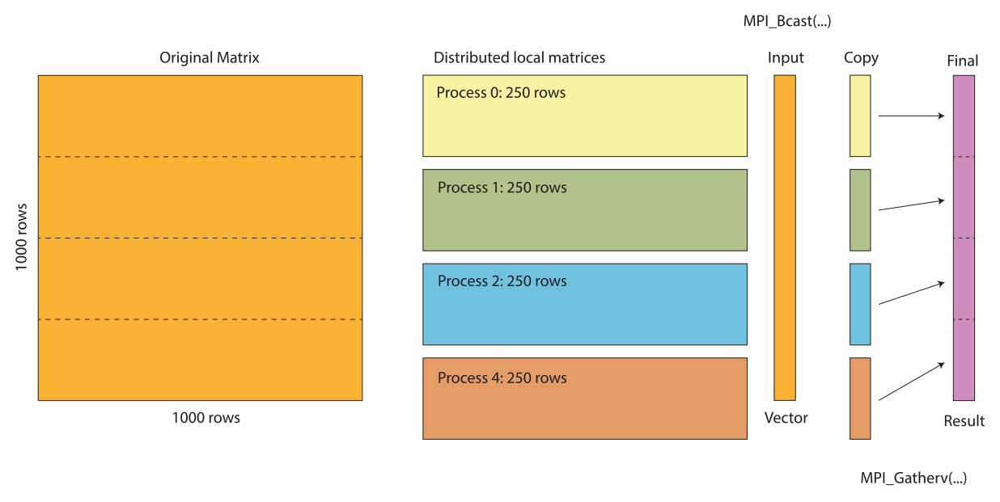

Array computing with Eigen
==========================

Introduction
------------

Arrays are an important part in any scientific computing applications. As C++ is an object oriented language it is sometimes tempting to implement your own matrix library. However, this is often not a good idea as there are many libraries available that are well tested and optimized. 

What is Eigen?
~~~~~~~~~~~~~~

One of the most popular libraries for linear algebra is Eigen. Eigen is a header only library that is easy to use and is very fast. Eigen also supports many of the optimised basic linear algebra packages such as BLAS and LAPACK, which really can speed up your computations. In this section we will cover the basics of Eigen and how to use it in your applications.

Setting up Eigen in your own project
~~~~~~~~~~~~~~~~~~~~~~~~~~~~~~~~~~~~

To use Eigen in your own application you first have to include the Eigen header file. Eigen is a header only library so you don’t have to link against any libraries. To include Eigen in your application you can use the following code:

.. code:: cpp

   #include <Eigen/Dense>

This includes the dense matrix module of Eigen. There are other modules, but we will cover them later. The ``Eigen/Dense`` module includes all the basic matrix operations and is the most commonly used module.

Matrix printing
~~~~~~~~~~~~~~~

The default method of outputting matrices in Eigen is by using the ``<<`` operator. However, the default output format is not very user friendly. The following code illustrates how to output a matrix using the default method:

.. code:: cpp

   #include <iostream>
   #include <Eigen/Dense>

   int main() {
       Eigen::Matrix3d A;
       A << 1, 2, 3,
            4, 5, 6,
            7, 8, 9;

       std::cout << A << "\n";

       return 0;
   }

This will output:

.. code:: text

   1 2 3
   4 5 6
   7 8 9

In modern C++ the use of cout is often replaced by the use of the ``std::print`` function from the C++20 standard library. However, Eigen does not yet support this method of outputting matrices. The examples in this book will use a special header-only library, ``egcpp/utils_pring.h``,  to make printing matrices easier. To use this library you have to include the header file:

.. code:: cpp

   #include <egcpp/utils_print.h>

The library adds support for a ``utils::print()`` function that can be used to print matrices in a more user friendly way. The following code illustrates how to use the ``utils::print()`` function: 

.. code:: cpp

   #include <print>
   #include <Eigen/Dense>
   #include <egcpp/utils_print.h>

   int main() 
   {
      Eigen::Matrix3d A;

      A << 1, 2, 3,
           4, 5, 6,
           7, 8, 9;

      utils::print("Matrix A:", A);

      return 0;
   }

This will output:

.. code:: text

   Matrix A:
   1 2 3
   4 5 6
   7 8 9

https://godbolt.org/z/zxvdeacqx

Working with Matrices and Vectors
---------------------------------

Eigen has several classes for different types of matrix and vector types. Most commonly used are Matrix and Vector classes. All Eigen classes are template classes and can be used with different data types. The most commonly used data types are ``float``, ``double`` and ``int``. All Eigen classes are defined in the ``Eigen`` namespace. This means that you have to use the ``Eigen::`` prefix when using Eigen classes. If you don't want to use the ``Eigen::`` prefix you can use the following code:

.. code:: cpp

   using namespace Eigen;

However, this is not recommended as it can lead to name clashes with other libraries. For smaller examples it is ok, but for larger projects it is recommended to use the ``Eigen::`` prefix. There is also a possibility to include only specific classes from the Eigen namespace. For example, to include only the Matrix and Vector classes you can use the following code:

.. code:: cpp

   using Eigen::Matrix;
   using Eigen::Vector;

A typical Matrix declaration of a 3 by 3 matrix of double values looks like this:

.. code:: cpp

   Eigen::Matrix<double, 3, 3> A;

To make it easier to work with Eigen also defines several typedefs for common matrix and vector types. For example, the following code declares also a declares a 3x3 matrix of double values:

.. code:: cpp

   Eigen::Matrix3d B;

Vector are used in similar ways:

.. code:: cpp

   Eigen::Vector<double, 3> v;

or

.. code:: cpp

   Eigen::Vector3d w;

Vectors are Matrices with with one column or row that is fixed to 1. This means that you can use the same operations on vectors as you can on matrices.

Declaring and initialising arrays
~~~~~~~~~~~~~~~~~~~~~~~~~~~~~~~~~

When you declare a matrices in Eigen they are not automatically set to zero. This means that the matrix will contain random values. In the following example we declare a 3x3 matrix and print it to the console:

.. code:: cpp

   Eigen::Matrix3d A;

   std::cout << A << "\n";

This will output:

.. code:: text

   -9.25596e+61 -9.25596e+61 -9.25596e+61
   -9.25596e+61 -9.25596e+61 -9.25596e+61
   -9.25596e+61 -9.25596e+61 -9.25596e+61

If you want to initialize the matrix to zero you can use the ``.setZero()`` method:

.. code:: cpp

   A.setZero();

This will initialise the matrix to zero. You can also use the ``.setOnes()`` method to initialise the matrix to one. There are many other methods available to initialize the matrix. You can find them in the Eigen documentation.

To initialise arrays with values you can use the ``<<`` operator. For example, to initialise a 3x3 matrix to the identity matrix you can use the following code:

.. code:: cpp

   Eigen::Matrix3d B;

   D << 1, 2, 3,
        4, 5, 6,
        7, 8, 9;

Please note that you only use the ``<<`` operator once followed by a comma separated list of values to be assigned. The values are inserted row by row. If you want to insert a column vector you can use the ``.col()`` method. For example, to insert a column vector you can use the following code:

.. code:: cpp

   D.col(0) << 1, 2, 3;
   D.col(1) << 4, 5, 6;
   D.col(2) << 7, 8, 9;

The matrix class also support inserting values by rows using the ``.row()`` method. For example, to insert a row vector you can use the following code:

.. code:: cpp

   D.row(0) << 1, 2, 3;
   D.row(1) << 4, 5, 6;
   D.row(2) << 7, 8, 9;

Fixed versus Dynamic size matrices
~~~~~~~~~~~~~~~~~~~~~~~~~~~~~~~~~~

In the previous section we used fixed size matrices. This means that the number of rows and columns are fixed at compile time. This is useful if you know the size of the matrix at compile time. However, if the problems is not known at compiler time you can use dynamic size matrices. Eigen supports dynamic size matrices using the ``Dynamic`` keyword. For example, to declare a dynamic size matrix you can use the following code:

.. code:: cpp

   Eigen::Matrix<double, Eigen::Dynamic, Eigen::Dynamic> F;

Before using this array it has to be given a size. This can be done either directy when declaring the array variable or later using the ``.resize()`` method. For example, to declare a 3x3 matrix you can use the following code:

.. code:: cpp

   Eigen::Matrix<double, Eigen::Dynamic, Eigen::Dynamic> G(3, 3);

or

.. code:: cpp

   Eigen::Matrix<double, Eigen::Dynamic, Eigen::Dynamic> H;
   H.resize(3, 3);

Just like the fixed size arrays the data in the array is not initialized. You can initialize the array using the initialisation methods mentioned above. If the resize operation does not change the number of elements in the array the data is preserved and the operation is very fast. If the number of elements is changed the data is lost and the operation is slower. The following example illustrates this:

.. code:: cpp

   Eigen::Matrix<double, Eigen::Dynamic, Eigen::Dynamic> A_dyn(3, 3); 
   // Equivalent to Eigen::MatrixXd A_dyn(3,3);

   A_dyn << 1, 2, 3,
            4, 5, 6,
            7, 8, 9; 

   cout << "Here is the matrix A_dyn:\n" << A_dyn << "\n";

   A_dyn.resize(1, 9); // No reallocation

   cout << "Here is the matrix A_dyn after resizing:\n" << A_dyn << "\n";

   A_dyn.resize(6, 6); // Reallocation.

   cout << "Here is the matrix A_dyn after resizing:\n" << A_dyn << "\n";

   A_dyn.setZero();

   cout << "Here is the matrix A_dyn after setting to zero:\n" << A_dyn << "\n";

This will output:

.. code:: text

   Here is the matrix A_dyn:
   1 2 3
   4 5 6
   7 8 9
   Here is the matrix A_dyn after resizing:
   1 4 7 2 5 8 3 6 9
   Here is the matrix A_dyn after resizing:
   -6.27744e+66 -6.27744e+66 -6.27744e+66 -6.27744e+66 -6.27744e+66 -6.27744e+66
   -6.27744e+66 -6.27744e+66 -6.27744e+66 -6.27744e+66 -6.27744e+66 -6.27744e+66
   -6.27744e+66 -6.27744e+66 -6.27744e+66 -6.27744e+66 -6.27744e+66 -6.27744e+66
   -6.27744e+66 -6.27744e+66 -6.27744e+66 -6.27744e+66 -6.27744e+66 -6.27744e+66
   -6.27744e+66 -6.27744e+66 -6.27744e+66 -6.27744e+66 -6.27744e+66 -6.27744e+66
   -6.27744e+66 -6.27744e+66 -6.27744e+66 -6.27744e+66 -6.27744e+66 -6.27744e+66
   Here is the matrix A_dyn after setting to zero:
   0 0 0 0 0 0
   0 0 0 0 0 0
   0 0 0 0 0 0
   0 0 0 0 0 0
   0 0 0 0 0 0
   0 0 0 0 0 0

As you can observe, as long as the number of elements in the array is not changed the data is preserved. If the number of elements is changed the data is lost and have to be reinitialized.

Vectors
~~~~~~~

Just like the Matrix class Eigen also has a Vector class. As mentioned before, the Vector class is a special case of the Matrix class where the number of rows or columns is fixed to 1. For example, to declare a 3x1 vector you can use the following code:

.. code:: cpp

   Eigen::Vector3d v;

Initialising values can be done by specifying values in the constructor.

.. code:: cpp

   Eigen::Vector3d v(1, 2, 3);

You can also use the ``<<`` operator to initialise the vector.

.. code:: cpp

   Eigen::Vector3d w;
   w << 1, 2, 3;

Intialisation is done using the same intialisation methods as the Matrix
class.

.. code:: cpp

   Eigen::Vector3d x;
   x.setZero();

The Vector classes are also based on the generic template type ``Vector<Type, Size>``. This means that the following code is equivalent to the previous code:

.. code:: cpp

   Eigen::Vector<double, 3> y;

The Vector class also supports dynamic sizes. This can be specified by using the ``Dynamic`` keyword instead of the size in the template type. For example, to declare a dynamic size vector you can use the following code:

.. code:: cpp

   Eigen::Vector<double, Eigen::Dynamic> z(3);

or

.. code:: cpp

   Eigen::Vector<double, Eigen::Dynamic> z;
   z.resize(3);

There is also a specialised version of the ``Vector`` class called ``RowVector``. This class is a special case of the ``Vector`` class where the number of rows is fixed to 1. For example, to declare a 1x3 row vector you can use the following code:

.. code:: cpp

   Eigen::RowVector3d r(1.0, 2.0, 3.0);
   std::cout << r << "\n";

   Eigen::Vector3d s(1.0, 2.0, 3.0);
   std::cout << s << "\n";

This will output:

.. code:: text

   1 2 3
   1
   2
   3

Matrix expressions and operations
~~~~~~~~~~~~~~~~~~~~~~~~~~~~~~~~~

In the Eigen Matrix classes most normal C++ operators are overloaded, so that you perform linear algebra operations in a natural way. For example, you can add two matrices using the ``+`` operator:

.. code:: cpp

   Eigen::Matrix3d A;

   A << 1, 2, 3,
        4, 5, 6,
        7, 8, 9;

   Eigen::Matrix3d B;

   B << 1, 2, 3,
        4, 5, 6,
        7, 8, 9;

   auto C = A + B;
   std::cout << C << "\n";

This outputs:

.. code:: text

    2  4  6
    8 10 12
   14 16 18

For matrix and vector classes you can only perform linear algebra expressions. This means that you can only add matrices of the same size or multiply a matrix with a vector of the correct size. You can also multiply matrices with each other. Multiplying a matrix with a scalar is also possible, but adding a scalar to a matrix is not possible. The following code illustrates some of these operations:

.. code:: cpp

   auto D = A * 3.0;
   cout << D << "\n";

   auto E = A * B;
   cout << E << "\n";

which produces the following output:

.. code:: text

    3  6  9
   12 15 18
   21 24 27
    30  36  42
    66  81  96
   102 126 150

If you want to add a scalar to all element you can use the following
code:

.. code:: cpp

   auto F = E + Eigen::Matrix3d::Constant(1.0);   
   cout << F << "\n";

This will add 1.0 to all elements in the matrix. The ``Constant()`` method is a static method that creates a matrix with all elements set to the specified value. The ``Array`` class is a special class that allows you to perform element wise operations. Elementwise addition of a scalar can be done using the following code:

.. code:: cpp

   Eigen::Matrix3d G = E.array() + 3.0;

Here we use the ``.array()`` method to convert the matrix to an array. This enables us to use element addition to a scalar. If we then assign the result to a matrix the result is a matrix with the same size as the original matrix.

It is also possible to initialise vectors using the ``.setLinSpaced()`` method. This method creates a vector with values linearly spaced between two values. The following code illustrates this:

.. code:: cpp

   Eigen::Vector3d v;
   v.setLinSpaced(3, 1, 2);

   cout << v << "\n";

This produces the following output:

.. code:: text

   1
   1.5
   2

In the example above the method ``.setLinSpaced()`` takes three arguments. The first argument is the number of elements in the vector. The second argument is the start value and the third argument is the end value.

The Vector class also has a ``.setRandom()`` method that can be used to initialise a vector with random values. The following code illustrates this:

.. code:: cpp

   Eigen::Vector3d w;
   w.setRandom();

   std::cout << w << "\n";

This produces the following output:

.. code:: text

   0.680375
   0.340187
   0.510281

The Vector classes also have special component wise operations. For example, you can compute the square root of all elements in the vector using the ``.cwiseSqrt()`` method. There are several other component wise operations available. The following code illustrates this:

.. code:: cpp

   Eigen::Vector3d x(1, 4, 9);

   auto y = x.cwiseSqrt();

   std::cout << y << "\n";

This produces the following output:

.. code:: text

   1
   2
   3

It is also possible to perform the same operations by usiing .array() method. The following code illustrates this:

.. code:: cpp

   Eigen::Vector3d z(1, 4, 9);

   auto w = z.array().sqrt();

   std::cout << w << "\n";
   
Eigen also has many special methods for matrices. For example, you can transpose a matrix using the ``.transpose()`` method. The following code illustrates this:

.. code:: cpp

   Matrix3d H;

   H << 1, 2, 3,
        4, 5, 6,
        7, 8, 9;

   std::cout << "H^T = " << "\n" << H.transpose() << "\n";

This produces the following output:

.. code:: text

   H^T =
   1 4 7
   2 5 8
   3 6 9

It is also possible to compute the dot product and cross product or matrices using the ``.dot()`` and ``.cross()`` methods. The following code illustrates this:

.. code:: cpp

   Eigen::Vector3d s(1, 2, 3);
   Eigen::Vector3d t(1, 0, 0);

   auto u = s.cross(t);
   auto p = s.dot(t);

   std::cout << u << "\n";
   std::cout << p << "\n";

This produces the following output:

.. code:: text

    0
    3
   -2
   1

It is also possible to compute the inverse of a matrix using the ``.inverse()`` method. The following code shows how this is done.

.. code:: cpp

   Eigen::Matrix3d J;

   J << 15, 42, 71,
        23, 52, 81,
        33, 63, 91;

   std::cout << J.inverse() << "\n";

This produces the following output:

.. code:: text

    2.29012 -4.01852  1.79012
   -3.58025  6.03704 -2.58025
    1.64815 -2.72222  1.14815

Some other useful function are reduction operations such as ``.sum()``, ``.mean()``, ``.minCoeff()``, ``.maxCoeff()`` and ``.norm()``. The following code illustrates how these functions are used:

.. code:: cpp

   Eigen::Matrix3d K;

   K << 1, 2, 3,
        4, 5, 6,
        7, 8, 9;

   std::cout << "K.sum()\n" << K.sum() << "\n";
   std::cout << "K.prod()\n" << K.prod() << "\n";
   std::cout << "K.mean()\n" << K.mean() << "\n";
   std::cout << "K.norm()\n" << K.norm() << "\n";
   std::cout << "K.maxCoeff()\n" << K.maxCoeff() << "\n";
   std::cout << "K.minCoeff()\n" << K.minCoeff() << "\n";
   std::cout << "K.trace()\n" << K.trace() << "\n";
   std::cout << "K.diagonal()\n" << K.diagonal() << "\n";
   std::cout << "K.determinant()\n" << K.determinant() << "\n";

This produces the following output:

.. code:: text

   K.sum()
   45
   K.prod()
   362880
   K.mean()
   5
   K.norm()
   16.8819
   K.maxCoeff()
   9
   K.minCoeff()
   1
   K.trace()
   15
   K.diagonal()
   1
   5
   9
   K.determinant()
   0

There are many more matrix methods available in Eigen. You can find them in the Eigen documentation.

Convenience typedefs for Eigen vectors and matrices
~~~~~~~~~~~~~~~~~~~~~~~~~~~~~~~~~~~~~~~~~~~~~~~~~~~

There are several convenience typedefs for fixed-size vectors and matrices. For example, ``Vector3d`` is a typedef for ``Vector<double, 3>`` and ``Matrix3d`` is a typedef for ``Matrix<double, 3, 3>``. These typedefs are available for sizes 1 to 4. For larger sizes you have to use the generic template type. Below are listed some of the most common typedefs:

.. code:: cpp

   typedef Eigen::Matrix<double, 2, 2> Matrix2d;
   typedef Eigen::Matrix<double, 3, 3> Matrix3d;
   typedef Eigen::Matrix<double, 4, 4> Matrix4d;
   typedef Eigen::Matrix<double, 6, 6> Matrix6d;
   typedef Eigen::Matrix<double, Dynamic, Dynamic> MatrixXd;

   typedef Eigen::Matrix<float, 2, 2> Matrix2f;
   typedef Eigen::Matrix<float, 3, 3> Matrix3f;
   typedef Eigen::Matrix<float, 4, 4> Matrix4f;
   typedef Eigen::Matrix<float, 6, 6> Matrix6f;
   typedef Eigen::Matrix<float, Dynamic, Dynamic> MatrixXf;

   typedef Eigen::Matrix<int, 2, 2> Matrix2i;
   typedef Eigen::Matrix<int, 3, 3> Matrix3i;
   typedef Eigen::Matrix<int, 4, 4> Matrix4i;
   typedef Eigen::Matrix<int, 6, 6> Matrix6i;
   typedef Eigen::Matrix<int, Dynamic, Dynamic> MatrixXi;

   typedef Eigen::Vector<double, 2> Vector2d;
   typedef Eigen::Vector<double, 3> Vector3d;
   typedef Eigen::Vector<double, 4> Vector4d;
   typedef Eigen::Vector<double, 6> Vector6d;
   typedef Eigen::Vector<double, Dynamic> VectorXd;

   typedef Eigen::Vector<float, 2> Vector2f;
   typedef Eigen::Vector<float, 3> Vector3f;
   typedef Eigen::Vector<float, 4> Vector4f;
   typedef Eigen::Vector<float, 6> Vector6f;
   typedef Eigen::Vector<float, Dynamic> VectorXf;

   typedef Eigen::Vector<int, 2> Vector2i;
   typedef Eigen::Vector<int, 3> Vector3i;
   typedef Eigen::Vector<int, 4> Vector4i;
   typedef Eigen::Vector<int, 6> Vector6i;
   typedef Eigen::Vector<int, Dynamic> VectorXi;

Advanced Matrix operations
--------------------------

This chapter covers some of the more advanced matrix operations that are available in Eigen. These operations are not commonly used, but can be useful for more complex oprations.

Reshaping matrices
~~~~~~~~~~~~~~~~~~

Some times existing matrices must be used in expressions where the current shape of the matrix is not suitable. In these cases it is possible to reshape the matrix using the ``.reshaped()`` method. The following code illustrates how this is done:

.. code:: cpp

   Eigen::Matrix3d A;

   A << 1, 2, 3,
       4, 5, 6,
       7, 8, 9;

   auto B = A.reshaped(1, 9);

   std::cout << B << "\n";

I this example we have a 3x3 matrix that we want to reshape into a 1x9 matrix. The ``.reshaped()`` method takes two arguments. The first argument is the number of rows and the second argument is the number of columns. The B variables in the above example is actually a special class Eigen::Reshaped<> that is a view into the original matrix. This means that the data is not copied and that the reshaped matrix is a view into the original matrix. This also means that if you change the reshaped matrix the original matrix is also changed.

Running the previous code produces the following output:

.. code:: text

   1 2 3 4 5 6 7 8 9

If we want to use the ``B`` matrix to assign a new matrix the matrix to be assigned needs to be of the ``MatrixXd`` type. In the following code we assign the reshaped matrix to a new matrix:

.. code:: cpp

   Eigen::MatrixXd C = B.reshaped(3, 3);

   std::cout << C << "\n";

This produces the following output:

.. code:: text

   1 2 3
   4 5 6
   7 8 9

We can also reshape the created matrix and transpose it. The following code illustrates this:

.. code:: cpp

   Eigen::MatrixXd D = C.reshaped(1, 9).transpose();

   std::cout << D << "\n";

This produces the following output:

.. code:: text

   1
   4
   7
   2
   5
   8
   3
   6
   9

Notice the ordering of numbers. This is due to the fact that matrices are stored in column major order in Eigen. This means that the first column is stored first, then the second column and so on. This is the opposite of row major order where the first row is stored first, then the second row and so on.

Assigning a reshaped matrix to itself is not allowed in Eigen. To solve this you can use the ``.eval()`` method. The ``.eval()`` method forces the reshaped matrix to be evaluated and copied to a new matrix. The following code illustrates this:

.. code:: cpp

   C = C.reshaped(1, 9).eval();

Slicing and indexing
~~~~~~~~~~~~~~~~~~~~

One of the more common operations in matrix computing is indexing and slicing. Eigen has several ways of doing this. The easiest way of accessing rows and columns of a matrix in Eigen is using the ``.row()`` and ``.col()`` methods. The methods can be both used to assign values to a row or assign other matrices the values of a row. The following code illustrates this:

.. code:: cpp

   Eigen::MatrixXd A(10, 10);
   A.setZero();

   A.row(3) << 1, 2, 3, 4, 5, 6, 7, 8, 9, 10;

   std::cout << A << "\n";
   std::cout << "\n";

   A.col(3) << 1, 2, 3, 4, 5, 6, 7, 8, 9, 10;

   std::cout << A << "\n";
   std::cout << "\n";

This produces the following output:

.. code:: text

    0  0  0  0  0  0  0  0  0  0
    0  0  0  0  0  0  0  0  0  0
    0  0  0  0  0  0  0  0  0  0
    1  2  3  4  5  6  7  8  9 10
    0  0  0  0  0  0  0  0  0  0
    0  0  0  0  0  0  0  0  0  0
    0  0  0  0  0  0  0  0  0  0
    0  0  0  0  0  0  0  0  0  0
    0  0  0  0  0  0  0  0  0  0
    0  0  0  0  0  0  0  0  0  0

    0  0  0  1  0  0  0  0  0  0
    0  0  0  2  0  0  0  0  0  0
    0  0  0  3  0  0  0  0  0  0
    1  2  3  4  5  6  7  8  9 10
    0  0  0  5  0  0  0  0  0  0
    0  0  0  6  0  0  0  0  0  0
    0  0  0  7  0  0  0  0  0  0
    0  0  0  8  0  0  0  0  0  0
    0  0  0  9  0  0  0  0  0  0
    0  0  0 10  0  0  0  0  0  0

In this example we used the ``<<`` operator to assign values to the rows.

It is also possible to assign multiple values at the same time using for example the .setConstant() or .setOnes() methods. The following code illustrates this:

.. code:: cpp

   A.col(1).setOnes();

   std::cout << A << "\n";
   std::cout << "\n";

This produces the following output:

.. code:: text

    0  1  0  1  0  0  0  0  0  0
    0  1  0  2  0  0  0  0  0  0
    0  1  0  3  0  0  0  0  0  0
    1  1  3  4  5  6  7  8  9 10
    0  1  0  5  0  0  0  0  0  0
    0  1  0  6  0  0  0  0  0  0
    0  1  0  7  0  0  0  0  0  0
    0  1  0  8  0  0  0  0  0  0
    0  1  0  9  0  0  0  0  0  0
    0  1  0 10  0  0  0  0  0  0

Indexing can also be done using the special function Eigen::seq(). In its simplest form it can be used to select a range of values. The following code illustrates this:

.. code:: cpp

   Eigen::MatrixXd B(10, 10);
   B.setZero();

   B(seq(3, 5), seq(3, 5)).setConstant(1);

   std::cout << B << "\n";

This produces the following output:

.. code:: text

   0 0 0 0 0 0 0 0 0 0
   0 0 0 0 0 0 0 0 0 0
   0 0 0 0 0 0 0 0 0 0
   0 0 0 1 1 1 0 0 0 0
   0 0 0 1 1 1 0 0 0 0
   0 0 0 1 1 1 0 0 0 0
   0 0 0 0 0 0 0 0 0 0
   0 0 0 0 0 0 0 0 0 0
   0 0 0 0 0 0 0 0 0 0
   0 0 0 0 0 0 0 0 0 0

It is also possible to use a step value in the ``seq()`` function, which is shown in the following code:

.. code:: cpp

   B(seq(0, 9, 2), seq(0, 9, 2)).setConstant(2);

   std::cout << B << "\n";

This produces the following output:

.. code:: text

   2 0 2 0 2 0 2 0 2 0
   0 0 0 0 0 0 0 0 0 0
   2 0 2 0 2 0 2 0 2 0
   0 0 0 1 1 1 0 0 0 0
   2 0 2 1 2 1 2 0 2 0
   0 0 0 1 1 1 0 0 0 0
   2 0 2 0 2 0 2 0 2 0
   0 0 0 0 0 0 0 0 0 0
   2 0 2 0 2 0 2 0 2 0
   0 0 0 0 0 0 0 0 0 0

There are also special selectors for selecting rows and columns. The ``all`` selector selects all rows or columns. The ``last`` selector selects the last column or row. The following code illustrates this:

.. code:: cpp

   B(all, last).setConstant(3);

   std::cout << B << "\n";
   std::cout << "\n";

   B(all, last - 1).setConstant(4);

   std::cout << B << "\n";

This produces the following output:

.. code:: text

   2 0 2 0 2 0 2 0 2 3
   0 0 0 0 0 0 0 0 0 3
   2 0 2 0 2 0 2 0 2 3
   0 0 0 1 1 1 0 0 0 3
   2 0 2 1 2 1 2 0 2 3
   0 0 0 1 1 1 0 0 0 3
   2 0 2 0 2 0 2 0 2 3
   0 0 0 0 0 0 0 0 0 3
   2 0 2 0 2 0 2 0 2 3
   0 0 0 0 0 0 0 0 0 3

   2 0 2 0 2 0 2 0 4 3
   0 0 0 0 0 0 0 0 4 3
   2 0 2 0 2 0 2 0 4 3
   0 0 0 1 1 1 0 0 4 3
   2 0 2 1 2 1 2 0 4 3
   0 0 0 1 1 1 0 0 4 3
   2 0 2 0 2 0 2 0 4 3
   0 0 0 0 0 0 0 0 4 3
   2 0 2 0 2 0 2 0 4 3
   0 0 0 0 0 0 0 0 4 3

It is also possible to use std::vector based indeces to select a submatrix from a matrix. This is shown in the following code:

.. code:: cpp

   std::vector<int> idx = { 1, 3, 4, 6, 7, 9 };

   std::cout << C(idx, idx) << "\n";
   std::cout << "\n";

   auto D = C(idx, idx);

This produces the following output:

.. code:: text

     1  11  21  31  41  51  61  71  81  91
     2  12  22  32  42  52  62  72  82  92
     3  13  23  33  43  53  63  73  83  93
     4  14  24  34  44  54  64  74  84  94
     5  15  25  35  45  55  65  75  85  95
     6  16  26  36  46  56  66  76  86  96
     7  17  27  37  47  57  67  77  87  97
     8  18  28  38  48  58  68  78  88  98
     9  19  29  39  49  59  69  79  89  99
    10  20  30  40  50  60  70  80  90 100

    12  32  42  62  72  92
    14  34  44  64  74  94
    15  35  45  65  75  95
    17  37  47  67  77  97
    18  38  48  68  78  98
    20  40  50  70  80 100

Linear System Solving
~~~~~~~~~~~~~~~~~~~~~

Eigen has a library of decomposition methods that can be used to solve linear systems of equations. For smaller matrices (up to 4x4) it is often better to use the ``.inverse()`` method. For larger matrices it is better to use the decomposition methods. The following code illustrates how to solve a linear system of equations using the ``.inverse()`` method:

.. code:: cpp

   int main()
   {
       Eigen::Matrix3d A;
       A.setRandom();

       Eigen::Vector3d b;

       b.setRandom();

       Eigen::Vector3d x = A.inverse() * b;

       std::cout << "The solution is:\n"
            << x << "\n";

       std::cout << "b is:\n"
            << b << "\n";

       std::cout << "A * x is:\n"
            << A * x << "\n";

       std::cout << "The error is:\n"
            << (A * x - b).norm() << "\n";
   }

This produces the following output:

.. code:: text

   The solution is:
    -1.36005
    -1.53203
   -0.275723
   b is:
     0.49321
   -0.651784
    0.717887
   A * x is:
     0.49321
   -0.651784
    0.717887
   The error is:
   0

Matrix Decompositions
~~~~~~~~~~~~~~~~~~~~~

For larger matrices it is better to use the decomposition methods. Which decomposition method to chose is determined by your specific problem. The following code illustrates how to solve a linear system of equations using the ``ColPivHouseholderQR`` decomposition:

.. code:: cpp

   int main()
   {
       Eigen::MatrixXd A(10, 10);
       A.setRandom();

       Eigen::VectorXd b(10);
       b.setRandom();

       Eigen::VectorXd x = A.colPivHouseholderQr().solve(b);

       std::cout << "The solution is:\n"
            << x << "\n";

       std::cout << "b is:\n"
            << b << "\n";

       std::cout << "A * x is:\n"
            << A * x << "\n";

       std::cout << "The error is:\n"
            << (A * x - b).norm() << "\n";
   }

The key is the line:

.. code:: cpp

   Eigen::VectorXd x = A.colPivHouseholderQr().solve(b);

When calling the ``.colPivHouseholderQr()`` method on the matrix it returns a ``ColPivHouseholderQR`` object. This object has a ``.solve()`` method that can be used to solve the linear system of equations. The ``.solve()`` method takes a vector as input and returns a vector as output.

.. note:: 
   
   The ``ColPivHouseholderQR`` decomposition is a good choice for    general matrices. For symmetric matrices the ``LDLT`` decomposition is a good choice.

It is of couse also possible to explicitely create a ``ColPivHouseholderQR`` object and use it to solve the linear system of equations, which is shown below:

.. code:: cpp

   std::FullPivLU<MatrixXd> ldlt(A);
   std::VectorXd x = ldlt.solve(b);

.. note:: 
   
   The ``FullPivLU`` decomposition is a good choice for general matrices. For symmetric matrices the ``LDLT`` decomposition is a good choice.

The advantage of separating the construction from solving the system is that the decomposition can be reused for multiple systems. The ``.solve()`` method can also be called with a matrix as input. This will solve the system for each column in the matrix. As the following code illustrates:

.. code:: cpp

   std::MatrixXd A(10, 10);
   A.setRandom();

   std::MatrixXd b(10, 10);
   b.setRandom();

   std::FullPivLU<MatrixXd> ldlt(A);
   MatrixXd x = ldlt.solve(b);

   std::cout << "The solution is:\n"
           << x << "\n";

This produces the following output:

.. code:: text

   The solution is:
      1.18453  -0.410319  -0.623361  -0.321932 -0.0895882  0.0497296  -0.648823   0.124508   0.493074   0.480588
     0.535632  0.0616908   -0.28512  -0.318507 0.00406816  0.0258458 -0.0848685  -0.477436    1.24756   0.838648
   -0.0107144  -0.367311   0.244476   0.137709  -0.815272  -0.280075  -0.628219   0.208019  -0.206337  -0.640611
     -2.13074    1.62113 -0.0941863       1.03   -0.03775    1.03846   0.293851    1.14827   -3.90631   -1.16682
     0.879087   0.477271   -1.28075    1.28879    2.52322    -1.4507    1.27269  -0.578986    0.24615    2.08061
    -0.732436  -0.704311    1.06786  -0.596086    -2.3671    1.43309   -1.39648  0.0979355  -0.356579   -1.55783
     0.127638  -0.668733  -0.507232 -0.0496553   0.521617   0.220945   -0.16289  -0.664471    1.69368   0.876999
    -0.569963 -0.0353519  -0.507716  0.0109401   0.415603   0.829978  -0.209561  0.0241958  -0.291877 -0.0407887
     -2.30094    1.32775  -0.272818   0.388941   -0.53578    1.08094   0.510719   0.903556   -4.88332   -1.75593
      1.01693   0.242351  -0.251851   -1.13456    0.28466  -0.149436   -0.17369   0.721883   0.108984  0.0144817

Best Practices and Integration
------------------------------

In many cases you will have to use Eigen together with other libraries and frameworks. This section will give some advice on how to do this.

Returning Matrices from functions
~~~~~~~~~~~~~~~~~~~~~~~~~~~~~~~~~

The preferred way of returning Eigen-arrays from functions is to return them by value. Eigen in combination with C++ return value optimisation will provide mechanism to avoid unnecessary copying of the returned matrix. An example of this is given below:

.. code:: cpp

   Eigen::MatrixXd foo()
   {
       Eigen::MatrixXd A(10, 10);
       A.setRandom();
       return A;
   }

   int main()
   {
       Eigen::MatrixXd B = foo();
       std::cout << B << "\n";
   }

Passing Matrices to functions
~~~~~~~~~~~~~~~~~~~~~~~~~~~~~

If you really want to make sure no copying is performed it is recommended to pass the Eigen-array as a parameter to the function. This is shown in the following example:

.. code:: cpp

   void bar(const Eigen::MatrixXd& A)
   {
       std::cout << A << "\n";
   }

   int main()
   {
       Eigen::MatrixXd B(10, 10);
       B.setRandom();
       bar(B);
   }

.. note:: 
   
   The ``const`` keyword is used to indicate that the matrix can not be modified in the function.

Implementing functions with Eigen
~~~~~~~~~~~~~~~~~~~~~~~~~~~~~~~~~

There are some considerations to think about when passing matrices and vector to methods and functions. The general rule is to always pass Eigen matrices and vectors by reference. The exception to this rule is when returning a matrix or vector from a function. In this case you should return the matrix or vector by value. In the following example we have a function that  eates a matrix given some non-matrix input:

.. tabs::

   .. tab:: Code

      .. code:: cpp

         enum TAnalysisType {PLANE_STRESS, PLANE_STRAIN};

         Eigen::MatrixXd hooke(TAnalysisType ptype, double E, double v)
         {
            Eigen::MatrixXd D;
            switch (ptype) {
               case PLANE_STRESS:
                     D.resize(3,3);
                     D << 1.0, v,   0.0,
                        v,   1.0, 0.0,
                        0.0, 0.0, (1.0-v)*0.5;
                     break;
               case PLANE_STRAIN:
                     D.resize(4,4);
                     D << 1.0-v, v    , v     , 0.0,
                        v    , 1.0-v, v     , 0.0,
                        v    , v    , 1.0-v , 0.0,
                        0.0  , 0.0  , 0.0   , 0.5*(1.0-2*v);
                     break;
               default:
                     break;
            }
            return D;
         }

         int main()
         {
            Eigen::MatrixXd Dpstress = hooke(PLANE_STRESS, 2.1e9, 0.35);
            Eigen::MatrixXd Dpstrain = hooke(PLANE_STRAIN, 2.1e9, 0.35);
            
            std::cout << "D,pstress = " << "\n";
            std::cout << Dpstress << "\n";
            std::cout << "D,pstrain = " << "\n";
            std::cout << Dpstrain << "\n";
         }

   .. tab:: Output

      .. code:: text

         D,pstress = 
            1  0.35     0
         0.35     1     0
            0     0 0.325
         D,pstrain = 
         0.65 0.35 0.35    0
         0.35 0.65 0.35    0
         0.35 0.35 0.65    0
            0    0    0 0.15

.. raw:: html

   <a href="https://godbolt.org/z/MffxaKs6b" class="sd-sphinx-override sd-btn sd-text-wrap sd-btn-outline-primary reference external" style="background-color: transparent;" target="_blank">Try example</a>    

In the next example we have a function that takes ``Vector<>`` as inputs
and returns a matrix.

.. tabs::

   .. tab:: Code

      .. code:: cpp

         Eigen::Matrix4d bar2e(const Eigen::Vector2d& ex, const Eigen::Vector2d& ey, const Eigen::Vector2d& ep)
         {
            double E = ep(0);
            double A = ep(1);
            double L = sqrt(pow(ex(1)-ex(0),2)+pow(ey(1)-ey(0),2));
            double C = E*A/L;
            
            Eigen::Matrix2d Ke_loc(2,2);

            Ke_loc <<  C, -C,
                     -C,  C;
            
            double nxx = (ex(1)-ex(0))/L;
            double nyx = (ey(1)-ey(0))/L;
            
            Eigen::MatrixXd G(2,4);
            
            G << nxx, nyx, 0.0, 0.0,
                  0.0, 0.0, nxx, nyx;
            
            Eigen::Matrix4d Ke = G.transpose()*Ke_loc*G;
            return Ke;
         }

         int main()
         {
            Eigen::VectorXd ex(2);
            Eigen::VectorXd ey(2);
            Eigen::VectorXd ep(2);
            
            ex << 0.0, 1.0;
            ey << 0.0, 1.0;
            ep << 1.0, 1.0;
            
            Eigen::MatrixXd Ke = bar2e(ex, ey, ep);
            
            cout << Ke << "\n";
         }

   .. tab:: Output
      
      .. code:: text

         0.353553  0.353553 -0.353553 -0.353553
         0.353553  0.353553 -0.353553 -0.353553
        -0.353553 -0.353553  0.353553  0.353553
        -0.353553 -0.353553  0.353553  0.353553   

.. raw:: html

   <a href="https://godbolt.org/z/4d5csPWTn" class="sd-sphinx-override sd-btn sd-text-wrap sd-btn-outline-primary reference external" style="background-color: transparent;" target="_blank">Try example</a>  

Accessing array raw data
~~~~~~~~~~~~~~~~~~~~~~~~

Some times you need to interact with other libraries that require don't support the Eigen-arrays. To solve this Eigen arrays provide a special method that will return a pointer to the raw data. The following code illustrates how this is done:

.. tabs::

   .. tab:: Code

      .. code:: cpp

         #include <Eigen/Dense>
         #include <iostream>

         int main()
         {
            Eigen::MatrixXd A(10, 10);
            A.setRandom();

            double* data = A.data();

            for (int i = 0; i < A.size(); i++)
            {
               std::cout << data[i] << " ";
            }
         }

   .. tab:: Output

      .. code:: text

         0.696235 0.205189 -0.414795 0.33421 -0.469531 0.927654 0.445064 -0.632501 0.0241114 0.0722581 0.432106 -0.046008 0.134119 -0.159573 -0.00985718 -0.498144 -0.727247 0.740165 -0.756752 0.740565 -0.216464 0.852317 0.834695 -0.833781 -0.77815 -0.757623 -0.711254 -0.467268 0.00720412 0.220277 0.858701 -0.316277 0.429178 -0.0105883 0.498262 -0.553856 -0.601805 -0.489601 -0.481724 0.0916964 0.915093 -0.605917 -0.469558 0.626704 -0.700028 0.534993 -0.430885 -0.709873 -0.357397 0.670719 -0.990484 -0.577336 -0.584678 -0.359399 0.609677 0.673726 0.0663685 0.728608 -0.00537724 0.134456 -0.797706 0.453268 -0.111835 -0.230297 0.0229337 0.671631 -0.442717 0.44016 0.0273544 0.906204 0.813056 -0.838199 0.647739 -0.523765 0.245723 0.936956 -0.719861 -0.780573 0.133617 -0.300931 0.429551 0.188999 -0.535005 -0.0405608 -0.29008 -0.870618 -0.554428 0.402401 -0.818408 -0.264327 0.489326 -0.124668 -0.937149 -0.0622315 -0.916112 0.353017 -0.99246 0.500271 0.171177 0.964884

.. raw:: html

   <a href="https://godbolt.org/z/zbGKhj75v" class="sd-sphinx-override sd-btn sd-text-wrap sd-btn-outline-primary reference external" style="background-color: transparent;" target="_blank">Try example</a>    

In the code above the 2D array is accessed as a 1D array and is accessed in the loop as a 1D array. If you want to access the 2D array as a C++ 2D array you need to do some reinterpretation of the data. All Eigen arrays are stored as a single 1D block in memory. A 2D C++ array is basically an array of pointers to 1D arrays. In the following code we construct a 2D array by creating pointer to raw data array. 

.. tabs::

   .. tab:: Code

      .. code:: cpp

         #include <Eigen/Dense>
         #include <iostream>
            
         int main()
         {
            Eigen::MatrixXd A(10, 10);
            A.setRandom();

            double* data = A.data();
            double** data2D = new double*[A.rows()];

            for (int i = 0; i < A.rows(); i++)
               data2D[i] = data + i * A.cols();

            for (int i = 0; i < A.rows(); i++)
            {
               for (int j = 0; j < A.cols(); j++)
                     std::cout << data2D[i][j] << " ";
               std::cout << "\n";
            }

            delete[] data2D;
         }

   .. tab:: Output

      .. code:: text

         0.696235 0.205189 -0.414795 0.33421 -0.469531 0.927654 0.445064 -0.632501 0.0241114 0.0722581 
         0.432106 -0.046008 0.134119 -0.159573 -0.00985718 -0.498144 -0.727247 0.740165 -0.756752 0.740565 
         -0.216464 0.852317 0.834695 -0.833781 -0.77815 -0.757623 -0.711254 -0.467268 0.00720412 0.220277 
         0.858701 -0.316277 0.429178 -0.0105883 0.498262 -0.553856 -0.601805 -0.489601 -0.481724 0.0916964 
         0.915093 -0.605917 -0.469558 0.626704 -0.700028 0.534993 -0.430885 -0.709873 -0.357397 0.670719 
         -0.990484 -0.577336 -0.584678 -0.359399 0.609677 0.673726 0.0663685 0.728608 -0.00537724 0.134456 
         -0.797706 0.453268 -0.111835 -0.230297 0.0229337 0.671631 -0.442717 0.44016 0.0273544 0.906204 
         0.813056 -0.838199 0.647739 -0.523765 0.245723 0.936956 -0.719861 -0.780573 0.133617 -0.300931 
         0.429551 0.188999 -0.535005 -0.0405608 -0.29008 -0.870618 -0.554428 0.402401 -0.818408 -0.264327 
         0.489326 -0.124668 -0.937149 -0.0622315 -0.916112 0.353017 -0.99246 0.500271 0.171177 0.964884      

.. raw:: html

   <a href="https://godbolt.org/z/9zWsY5WeY" class="sd-sphinx-override sd-btn sd-text-wrap sd-btn-outline-primary reference external" style="background-color: transparent;" target="_blank">Try example</a>    

.. note:: 
   
   In the above code the array data i still owned by the Eigen array. The data should not be deleted. The delete[] method only deletes the array of pointers.

Using Eigen with other libraries
~~~~~~~~~~~~~~~~~~~~~~~~~~~~~~~~

If you have a library that has functions that take two-dimensional C++ arrays as input you need to perform some additional steps to convert Eigen arrays to a 2D C++ array. It is not possible to just pass the Eigen data pointer to the function. First, we neeed to create a 2D array of pointers to the raw data. It is a pointer to this array that will be passed to the function. An example of this is shown in the code below:

.. tabs::

   .. tab:: Code

      .. code:: cpp

         #include <Eigen/Dense>
         #include <iostream>

         void foo(double** data, int rows, int cols)
         {
            for (int i = 0; i < rows; i++)
            {
               for (int j = 0; j < cols; j++)
                     std::cout << data[i][j] << " ";
               std::cout << "\n";
            }
         }

         int main()
         {
            Eigen::MatrixXd A(10, 10);
            A.setRandom();

            double* data = A.data();
            double** data2D = new double*[A.rows()];

            for (int i = 0; i < A.rows(); i++)
               data2D[i] = A.row(i).data();

            foo(data2D, A.rows(), A.cols());

            delete[] data2D;
         }

   .. tab:: Output

      .. code-block:: text

         0.696235 0.205189 -0.414795 0.33421 -0.469531 0.927654 0.445064 -0.632501 0.0241114 0.0722581 
         0.205189 -0.414795 0.33421 -0.469531 0.927654 0.445064 -0.632501 0.0241114 0.0722581 0.432106 
         -0.414795 0.33421 -0.469531 0.927654 0.445064 -0.632501 0.0241114 0.0722581 0.432106 -0.046008 
         0.33421 -0.469531 0.927654 0.445064 -0.632501 0.0241114 0.0722581 0.432106 -0.046008 0.134119 
         -0.469531 0.927654 0.445064 -0.632501 0.0241114 0.0722581 0.432106 -0.046008 0.134119 -0.159573 
         0.927654 0.445064 -0.632501 0.0241114 0.0722581 0.432106 -0.046008 0.134119 -0.159573 -0.00985718 
         0.445064 -0.632501 0.0241114 0.0722581 0.432106 -0.046008 0.134119 -0.159573 -0.00985718 -0.498144 
         -0.632501 0.0241114 0.0722581 0.432106 -0.046008 0.134119 -0.159573 -0.00985718 -0.498144 -0.727247 
         0.0241114 0.0722581 0.432106 -0.046008 0.134119 -0.159573 -0.00985718 -0.498144 -0.727247 0.740165 
         0.0722581 0.432106 -0.046008 0.134119 -0.159573 -0.00985718 -0.498144 -0.727247 0.740165 -0.756752 

.. raw:: html

   <a href="https://godbolt.org/z/6jh3bo7P4" class="sd-sphinx-override sd-btn sd-text-wrap sd-btn-outline-primary reference external" style="background-color: transparent;" target="_blank">Try example</a>

If you get warnings about buffer overruns in the line ``data2D[i] = A.row(i).data();`` you can tell the compiler to ignore the warning by adding the following line before the line:

.. code:: cpp

   data2D[i] = const_cast<double*>(A.row(i).data());

This will tell the compiler that the data is not modified in the function. If it is modified in the function you need to remove this cast.

Using Eigen in Parallel Applications
------------------------------------

Eigen is mainly an array library providing efficient array and vector data types. However, it will take advantage of underlying linear algebra libraries if available. The underlying array storage is often C++ array, which can be accessed through the ``.data()`` method providing ways of interfacing with other libraries. Some of the operations in the library can also use OpenMP for parallelization. In the following sections we will look at how to use Eigen in parallel applications.

Eigen and OpenMP applications
~~~~~~~~~~~~~~~~~~~~~~~~~~~~~ 

Eigen support parallelization in several ways. Some of the operations in Eigen use OpenMP for parallelization. According to the Eigen documentation the following operations uses OpenMP:

   * general dense matrix - matrix products
   * PartialPivLU
   * row-major-sparse * dense vector/matrix products
   * ConjugateGradient with Lower|Upper as the UpLo template parameter.
   * BiCGSTAB with a row-major sparse matrix format.
   * LeastSquaresConjugateGradient

The access methods have also been designed to be thread safe, so it is quite easy to use Eigen in parallel applications. 

Using Eigen with OpenMP is very easy if you are using the Eigen operations that take advantage of OpenMP. In the following example 2 matrices are multiplied in parallel and assigned to the result matrix C:

.. tabs:: 

   .. tab:: Code

      .. code:: cpp

         #include <iostream>
         #include <omp.h>
         #include <Eigen/Dense>

         int main()
         {
            const int n = 20000;
            
            Eigen::MatrixXd A(n, n);
            Eigen::MatrixXd B(n, n);

            A = Eigen::MatrixXd::Random(n, n);
            B = Eigen::MatrixXd::Random(n, n);

            Eigen::MatrixXd C(n, n);

            int threads[] = {1, 2, 4, 8, 12, 24, 48};

            for (int i=0; i<7; i++)
            {
               auto n_threads = threads[i];
               omp_set_num_threads(n_threads);

               double start = omp_get_wtime();
               C = A * B;
               double end = omp_get_wtime();

               std::cout << n_threads << ";" << end - start << "\n";
            }

            return 0;
         }

   .. tab:: Output

      .. code-block:: text

         1;870.111
         2;427.386
         4;217.594
         8;109.546
         12;74.3131
         24;40.5742
         48;22.6571

The output tab shows the scaling if running it with different number of threads and shows that even the common operations in Eigen can be parallelized with good performance using OpenMP.

It is of course also possible to use Eigen for array storage and implement the parallelization yourself. In the example below a matrix vector multiplication is implemented using OpenMP. To make the implementation more efficient we allocate the Eigen arrays in RowMajor order. By default Eigen stores the arrays in ColumnMajor order. 

.. code:: cpp

   using Matrix = Eigen::Matrix<double, Eigen::Dynamic, Eigen::Dynamic, Eigen::RowMajor>;
   using Vector = Eigen::VectorXd;

   Vector customMatVecMult(const Matrix& A, const Vector& x) {
    const int rows = A.rows();
    const int cols = A.cols();
    Vector result(rows);
    
    // Get raw pointers to the data
    const double* A_data = A.data();
    const double* x_data = x.data();
    double* result_data = result.data();
    
    #pragma omp parallel for schedule(static)
    for (int i = 0; i < rows; i++) {
        double sum = 0.0;
        const double* row = A_data + i * cols;  // Point to start of row i
        
        for (int j = 0; j < cols; j++) {
            sum += row[j] * x_data[j];
        }
        
        result_data[i] = sum;
    }
    
    return result;
   }

In this example the ``.data()`` is used to get access to the underlying array storage directly. Using this approach it is developer that is fully responsible for bounds checking and memory management. The ``#pragma omp parallel for`` directive is used to parallelize the loop. The ``schedule(static)`` is used to distribute the iterations evenly among the threads.

A complete example with a comparison with corresponding Eigen operation is shown below:

.. tabs::

   .. tab:: Code

      .. code:: cpp

         #include <iostream>
         #include <vector>
         #include <Eigen/Dense>
         #include <omp.h>
         #include <chrono>

         using Matrix = Eigen::Matrix<double, Eigen::Dynamic, Eigen::Dynamic, Eigen::RowMajor>;
         using Vector = Eigen::VectorXd;

         // Simple and efficient matrix-vector multiplication with OpenMP
         Vector customMatVecMult(const Matrix& A, const Vector& x) {
            const int rows = A.rows();
            const int cols = A.cols();
            Vector result(rows);
            
            // Get raw pointers to the data
            const double* A_data = A.data();
            const double* x_data = x.data();
            double* result_data = result.data();
            
            #pragma omp parallel for schedule(static)
            for (int i = 0; i < rows; i++) {
               double sum = 0.0;
               const double* row = A_data + i * cols;  // Point to start of row i
               
               for (int j = 0; j < cols; j++) {
                     sum += row[j] * x_data[j];
               }
               
               result_data[i] = sum;
            }
            
            return result;
         }

         int main() {
            // Set up test matrices of different sizes
            const std::vector<int> sizes = {40000};
            const int num_threads = 4;  // Adjust based on your system
            
            omp_set_num_threads(num_threads);
            
            for (int size : sizes) {
               // Initialize random matrix and vector
               Matrix A = Matrix::Random(size, size);
               Vector x = Vector::Random(size);
               
               // Timing custom OpenMP implementation
               auto start = std::chrono::high_resolution_clock::now();
               Vector result_omp = customMatVecMult(A, x);
               auto end = std::chrono::high_resolution_clock::now();
               auto duration_omp = std::chrono::duration_cast<std::chrono::milliseconds>(end - start);
               
               // Timing Eigen's built-in implementation
               start = std::chrono::high_resolution_clock::now();
               Vector result_eigen = A * x;
               end = std::chrono::high_resolution_clock::now();
               auto duration_eigen = std::chrono::duration_cast<std::chrono::milliseconds>(end - start);
               
               // Verify results
               double error = (result_omp - result_eigen).norm() / result_eigen.norm();
               
               std::cout << "Matrix size: " << size << "x" << size << "\n";
               std::cout << "OpenMP implementation time: " << duration_omp.count() << "ms" << "\n";
               std::cout << "Eigen implementation time: " << duration_eigen.count() << "ms" << "\n";
               std::cout << "Relative error: " << error << "\n";
               std::cout << "------------------------" << "\n";
            }
            
            return 0;
         }

      .. tab:: Output (48 cores)

         .. code:: text

            Matrix size: 40000x40000
            OpenMP implementation time: 352ms
            Eigen implementation time: 389ms
            Relative error: 7.35186e-15
            ------------------------

Using Eigen with MPI
~~~~~~~~~~~~~~~~~~~~

Using Eigen with MPI is quite straightforward. The main thing to remember is that the data is stored in a 1D array. This means that you need to take care of the data distribution yourself. To illustrate this we are going to implement a simple matrix vector multiplication using MPI. In the example we dividing up the matrix in rows and distribute the rows to the different processes. The following code illustrates this:

To implement the matrix vector multiplication we implement a special matrix class, ``MPIMatrix``, which will implement the distribution of the matrix and the multiplication. In the constructor of the class we query the rank and size from MPI and store these in the class attributes ``m_rank`` and ``m_size``. We then calculate the local matrix size based on the number of ranks. The local matrix and local result vector is then created using the ``.resize(...)`` method. Please not we don't initialise to zero here as we will do this in a separate method. In this way each rank will have its own local matrix and result vector. The class declaration and contructor is shown below:

.. code:: cpp

   class MPIMatrix {
   private:
      int m_rank;
      int m_size;
      int m_rows;
      int m_cols;

      Eigen::MatrixXd m_localMatrix;
      Eigen::VectorXd m_localResult;
      
   public:
      MPIMatrix(int r, int c) 
         : m_rank(0), m_size(1), m_rows(r), m_cols(c)  
      {
         MPI_Comm_rank(MPI_COMM_WORLD, &m_rank);
         MPI_Comm_size(MPI_COMM_WORLD, &m_size);
         
         // Calculate local matrix size

         int localRows = m_rows / m_size;

         if (m_rank < m_rows % m_size) {
               localRows++;
         }
         
         m_localMatrix.resize(localRows, m_cols);
         m_localResult.resize(localRows);
      }

Initialisation of the array is performed in the ``.randomize()`` method and each rank intialiases its own part of the array. The random seed is alos initialised separately for each rank. 

.. code:: cpp

   void randomize() 
   {
      srand(std::chrono::system_clock::now().time_since_epoch().count());

      m_localMatrix.setRandom();
   }

The actual matrix multiplication is implemented in the ``.multiply(...)`` methodm which takes the shared vector as input. The local matrix is then multiplied with the vector and the result is stored in the local result vector. 

.. code:: cpp

   void multiply(const Eigen::VectorXd& vec) 
   {
      // Local multiplication

      m_localResult = m_localMatrix * vec;
   }

To print the complete result vector we need to gather the local results vectors and combine them together before printing. This is done in the ``.printResult()`` method. The method first calculates the receive counts and displacements for the ``MPI_Gatherv()`` function. The local results are then gathered to the rank 0 process and printed.

.. code:: cpp

   void printResult() const 
   {
      // Gather results (only done to illustrate how to gather results for printing)

      std::vector<int> recvCounts(m_size);
      std::vector<int> displs(m_size);
      
      // Calculate receive counts and displacements

      int baseCount = m_rows / m_size;
      int remainder = m_rows % m_size;
      
      for (int i = 0; i < m_size; ++i) 
      {
         recvCounts[i] = baseCount + (i < remainder ? 1 : 0);
         displs[i] = (i > 0) ? displs[i-1] + recvCounts[i-1] : 0;
      }
      
      // Allocate space for complete result

      Eigen::VectorXd globalResult;

      if (m_rank == 0) 
         globalResult.resize(m_rows);
      
      // Gather all local results to rank 0

      MPI_Gatherv(m_localResult.data(), m_localResult.size(), MPI_DOUBLE,
                  globalResult.data(), recvCounts.data(), displs.data(),
                  MPI_DOUBLE, 0, MPI_COMM_WORLD);

      // Print result on rank 0

      if (m_rank == 0) 
      {
         std::cout << "First few elements of result: \n" << globalResult.head(5).transpose() << "\n";
      }
   }   

.. note:: 
   
   In this example we use ``MPI_Gatherv()`` function to display results from multiple nodes standard output. However a real world example would be to write results to a single output file. However, this is not recommended for large data sets as data could be larger than the memory on the rank 0 process. A better solution would be to write the data to separate files on each rank and then combine them later. Another approach would be to use a parallel I/O library like **HDF5** or use the MPI I/O functions.

I the main function we first initialise the MPI library and some required variables.

.. code:: cpp

   int main(int argc, char** argv) 
   {
      constexpr int MatrixSize = 10000;
      int rank;
      
      MPI_Init(&argc, &argv);
      MPI_Comm_rank(MPI_COMM_WORLD, &rank);

Next, we create our distributed matrix and randomize it. We also create a random vector, ``x``, and broadcast it to all processes usin the ``MPI_Bcast()`` function.

.. code:: cpp

      MPIMatrix distMatrix(MatrixSize, MatrixSize);
      distMatrix.randomize();

      // Create a random x vector

      Eigen::VectorXd x;

      if (rank == 0)
      { 
         // Generate random x vector on rank 0

         std::cout << "Generating random vector x...\n";
         x = Eigen::VectorXd::Random(MatrixSize);
      }
      else
      {
         // Just resize x on other ranks

         x.resize(MatrixSize);
      }

      // Broadcast x vector to all processes

      MPI_Bcast(x.data(), MatrixSize, MPI_DOUBLE, 0, MPI_COMM_WORLD);

Now we are ready to call our multiplication method and measure the time it takes to perform the multiplication. Here we can see the benefits of object-oriented programming as all the MPI details are hidden inthe MPIMatrix class. Finally, The results are then printed to the console on rank 0.

.. code:: cpp

      // Perform distributed matrix-vector multiplication

      auto startTime = std::chrono::high_resolution_clock::now();
      distMatrix.multiply(x);
      auto endTime = std::chrono::high_resolution_clock::now();

      if (rank == 0) 
      {
         auto duration = std::chrono::duration_cast<std::chrono::milliseconds>(
               endTime - startTime);

         std::cout << "Matrix size (rows x cols): " << MatrixSize << " x " << MatrixSize << "\n";
         std::cout << "Matrix memory size (MB): " << sizeof(double) * MatrixSize * MatrixSize / 1e6 << "\n";
         std::cout << "Matrix-vector multiplication completed in " << duration.count() << " ms\n";
      }
      
      distMatrix.printResult();

To summarise, using Eigen for array managment simplifies a lot of the tasks when working with MPI, such as memory allocation and data distribution. It still retains the ability to get to the underlying data storage when needed. In most cases the resulting code is shorter and easier to maintain.

The complete code is shown below:

.. code:: cpp

   #include <mpi.h>
   #include <Eigen/Dense>
   #include <iostream>
   #include <vector>
   #include <random>
   #include <chrono>

   class MPIMatrix {
   private:
      int m_rank;
      int m_size;
      int m_rows;
      int m_cols;

      MatrixXd m_localMatrix;
      VectorXd m_localResult;
      
   public:
      MPIMatrix(int r, int c) 
         : m_rank(0), m_size(1), m_rows(r), m_cols(c)  
      {
         MPI_Comm_rank(MPI_COMM_WORLD, &m_rank);
         MPI_Comm_size(MPI_COMM_WORLD, &m_size);
         
         // Calculate local matrix size

         int localRows = m_rows / m_size;

         if (m_rank < m_rows % m_size) {
               localRows++;
         }

         // Initialise local matrices
         
         m_localMatrix.resize(localRows, m_cols);
         m_localResult.resize(localRows);
      }
      
      void randomize() 
      {
         // Initialise random seed. Different seed for each process

         srand(std::chrono::system_clock::now().time_since_epoch().count());

         // Randomize local matrix

         m_localMatrix.setRandom();
      }
      
      void multiply(const Eigen::VectorXd& vec) 
      {
         // Local multiplication
      
         m_localResult = m_localMatrix * vec;
      }

      void printResult() const 
      {
         // Gather results (only done to illustrate how to gather results for printing)
      
         std::vector<int> recvCounts(m_size);
         std::vector<int> displs(m_size);
         
         // Calculate receive counts and displacements
      
         int baseCount = m_rows / m_size;
         int remainder = m_rows % m_size;
         
         for (int i = 0; i < m_size; ++i) 
         {
               recvCounts[i] = baseCount + (i < remainder ? 1 : 0);
               displs[i] = (i > 0) ? displs[i-1] + recvCounts[i-1] : 0;
         }
         
         // Allocate space for complete result

         Eigen::VectorXd globalResult;

         if (m_rank == 0) 
               globalResult.resize(m_rows);
         
         // Gather all local results to rank 0

         MPI_Gatherv(m_localResult.data(), m_localResult.size(), MPI_DOUBLE,
                     globalResult.data(), recvCounts.data(), displs.data(),
                     MPI_DOUBLE, 0, MPI_COMM_WORLD);

         // Print result on rank 0

         if (m_rank == 0) 
         {
               std::cout << "First few elements of result: \n" << globalResult.head(5).transpose() << "\n";
         }
      }
      
      const Eigen::MatrixXd& localMatrix() const {
         return m_localMatrix;
      }
   };

   int main(int argc, char** argv) 
   {
      constexpr int MatrixSize = 10000;
      int rank;

      
      MPI_Init(&argc, &argv);
      MPI_Comm_rank(MPI_COMM_WORLD, &rank);
      
      try 
      { 
         // Create distributed matrix

         MPIMatrix distMatrix(MatrixSize, MatrixSize);
         distMatrix.randomize();
         
         // Create a random x vector

         Eigen::VectorXd x;

         if (rank == 0)
         { 
               std::cout << "Generating random vector x...\n";
               x = Eigen::VectorXd::Random(MatrixSize);
         }
         else
         {
               x.resize(MatrixSize);
         }
         
         // Broadcast x vector to all processes

         MPI_Bcast(x.data(), MatrixSize, MPI_DOUBLE, 0, MPI_COMM_WORLD);
         
         // Perform distributed matrix-vector multiplication

         auto startTime = std::chrono::high_resolution_clock::now();
         distMatrix.multiply(x);
         auto endTime = std::chrono::high_resolution_clock::now();
         
         if (rank == 0) 
         {
               auto duration = std::chrono::duration_cast<std::chrono::milliseconds>(
                  endTime - startTime);

               std::cout << "Matrix size (rows x cols): " << MatrixSize << " x " << MatrixSize << "\n";
               std::cout << "Matrix memory size (MB): " << sizeof(double) * MatrixSize * MatrixSize / 1e6 << "\n";
               std::cout << "Matrix-vector multiplication completed in " << duration.count() << " ms\n";
         }
         distMatrix.printResult();
         
      } 
      catch (const std::exception& e) 
      {
         std::cerr << "Error on rank " << rank << ": " << e.what() << "\n";
         MPI_Abort(MPI_COMM_WORLD, 1);
      }
      
      MPI_Finalize();
      return 0;
   }