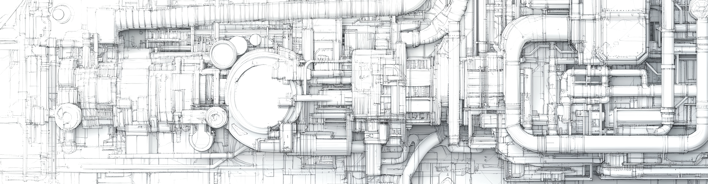

C++ for Scientists and Engineers
================================

This course is intended as an introduction to C++ for engineers or
researchers using the language to develop computational applications or
workflows requiring a high-performance language. The target audience are
existing users of Python, NumPy and Matplotlib.

The course gives a thorough introduction to C++ covering both classic as
well modern features of the language. The focus is on tools required to
develop computational codes using established libraries for array
computing (Eigen), user interface design (Qt) and visualization (VTK).

The course focuses a lot on complete examples of code that are ready to
run. In addition, the course documentation is complemented with a
complete source code tree on GitHub with all of the examples described
in the course.

Jonas Lindemann, 2024

.. note::

   This online C++ book is a work in progress and not yet complete. Chapters will be added as they are written and implemented.

.. toctree::
   :maxdepth: 1
   :hidden:
   :caption: Contents:

   history
   build_and_run
   language
   data_structures_algorithms
   input_output
   eigen
   oop
   code_org
   debugging
   mixed_language
   build_examples
   
