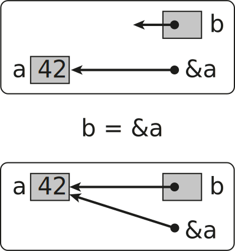
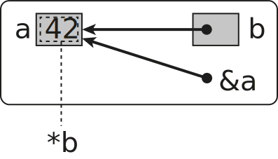

.. role:: raw-latex(raw)
   :format: latex
..

The C++ Language
================

This chapter will go through the language elements of C++. To understand
the language we will start with the fundamentals and transition to more
modern features as we continue through this book.

Example of C++ code
-------------------

An example of a simple C++ program is shown in the following example.

.. tabs::

   .. tab:: Code

      .. code-block:: cpp

         #include <iostream>
         using namespace std;

         int main() {
             for (int i = 0; i < 10; i++) {
                 cout << i << endl;
             }
             cout << "Hello, C++" << endl;
             return 0;
         }

   .. tab:: Output

      .. code-block:: text

         0
         1
         2
         3
         4
         5
         6
         7
         8
         9
         Hello, C++

The example starts by including the **iostream** header, which provide
means to output text in the terminal. The **using namespace std**
statement just tells the compiler that the default namespace for the C++
standard library, **std**, will be used as the default, making it
possible to omit the **std::**-prefix in front of all functions and
objects. Namespaces will be covered later in the course.

**int main()** is the C++ main function, which will be called when the
application starts. It is sometimes also called the application entry
point.

**cout** is a special predefined object in C++ that can be used to
output text and variables to the terminal. The **<<**-operator is used
to send data to the **cout** object which will be sent to standard
output for display in the terminal.

Variables
---------

Variables are references to data stored in memory and give you a way of
referencing the data using a name instead of an address. Care should be
given when assigning variable names so that they are self-explanatory.

A naming convention that is often used in C++ is CamelCase. In this
convention, names are formed by combining multiple words into single
names, capitalizing the first letter of each word. Variables start with
a lower case letter. Class names are all upper case. Examples can be:

.. code:: cpp

   class EquationSolver; // Classes are nouns. Start with upper case.
   double length;        // variables start with lower case.
   int totalNumber;      // variable with two words with camel case.
   void myFunction();    // Functions and methods lower case CamelCase.

Variable names
~~~~~~~~~~~~~~

The C++ language also defines some rules regarding variable naming.
Variables in C++ should consist of:

- Letters a-z, A-Z (not Å, Ä, Ö)
- Numbers 0-9
- Underscore \_
- First character must be a letter or an underscore.
- Lower case letters are not equivalent with upper case letters. Case
  sensitive language.

The following variable names are correct:

.. code:: cpp

   int i, j;
   double x, y;
   double z0;
   bool correct_answer;

The following variable names are not correct:

.. code:: cpp

   int 0i;
   double å0;

Declaring variables
~~~~~~~~~~~~~~~~~~~

C++ is a strongly type language and all variables needs to be declared
with a type. A variable is declared by specifying the type followed by
the variable name as shown in the following example:

.. code:: cpp

   int a;
   double c;
   float x;

In this example, an integer variable a, a double variable c and a float
variable x is declared.

.. note::
   Values of declared undefined until they have been initialized.  

Variable initialisation
~~~~~~~~~~~~~~~~~~~~~~~

Before a variable is used it should be initialized, that is given a
value. There are 2 ways of initialising a variable in C++. As C++
inherits a lot from C, variables can be initialised just like in C by
assigning a value when the variable is declared using the equal (=)
operator. In the following example we initialise variables at the same
time as they are created using C style initialisation.

.. code:: cpp

   int i = 0;
   float x = 0.0;

Another way of initializing variables is using constructor-based
initialization, which is specific to the C++ language. In this method,
the variable is initialized by specifying the initial value in
parenthesis:

.. code:: cpp

   int i(0);
   float x(0.0);

The final way of initializing values is using uniform initialization.
This is also specific to the C++ language and uses curly brackets to
assign initial values to variables.

.. code:: cpp

   int i{0};
   float x{0.0};

It is also possible to leave out the value of the initialisation. This
initialises the variable to its default value.

.. code:: cpp

   int i{};
   float x{};

All these ways of initializing variables are equivalent. You will see
some different ways of initializing variables in this book. Which type
of initialization is chosen depends on the situation. In certain
situations, one method can be more efficient than others. In other cases
the code can be more readable using a certain example.

Variable types
~~~~~~~~~~~~~~

In C++ there are 7 fundamental datatypes that can be used.

- Character types - **char**, **char16_t**, **char32_t**, **wchar_t**
- Signed integer types - **short**, **int**, **long**, **long long**
- Unsigned integer type - **unsigned short**, **unsigned int**,
  **unsigned long**, **unsigned long long**.
- Floating point types - **float**, **double**, **long double**
- Boolean type - **bool**
- void type - **void**
- nullptr - **decltype(nullptr)**

Sizes of variables types depend on platform and compiler. C++ only
specifies sizes relative to other types with at least number of bits.

In the following chapters we will cover these datatypes in more details.

Integer types
~~~~~~~~~~~~~

Integer datatypes come in two flavors signed and unsigned. The basic
signed integer type is **int**, which corresponds to **signed int**. The
corresponding unsigned variable type is **unsigned int**. Unsigned
variables always require the prefix **unsigned**. The available
datatypes with increasing size:

- **signed char** / **unsigned char**
- **short int** / **unsigned short int**
- **int** / **unsigned int**
- **long int** / **unsigned long**

.. note::   
   Don't use unsigned to prevent negative values. This can lead to conversion errors later on.

Unsigned integers can be used to represent bit patterns.

The following code shows how different integer types are delcared and
assigned. Please note what happens if you assign a negative value to an
unsigned integer.

.. tabs::

   .. tab:: Code

      .. literalinclude:: ../../ch_variables/int_types1.cpp
         :language: C++
         :linenos:         

   .. tab:: Output

      .. code-block:: text

         a = -1
         b = 4294967295
         c = -1
         d = 18446744073709551615

The size of an integer depends on the compiler and platform. C++ just
provides relative guarantees between the different datatypes. The actual
size of a datatype can be queried using the **std::sizeof()** function.
This function returns the size in multiples of sizeof(char)=1. The
relationship between the integer datatypes are:

   1 = sizeof(char) ≤ sizeof(short) ≤ sizeof(int) ≤ sizeof(long)

In the code below the **std::sizeof()** to query the exact size of the
datatypes on the current platform.

.. tabs::

   .. tab:: Code

      .. literalinclude:: ../../ch_variables/int_types2.cpp

   .. tab:: Output

      .. code-block:: text

         a = -1, sizeof(a) = 4
         b = 4294967295, sizeof(b) = 4
         c = -1, sizeof(c) = 8
         d = 18446744073709551615, sizeof(d) = 8
       

Character types
~~~~~~~~~~~~~~~

Character types contain values that correspond to the values from a
character set. Character sets are guaranteed to contain numeric
characters, 26 letters of the english alphabet and common delimiters.
The smallest character type is **char**, which should be at least 8 bits
(0..255). This can vary from different systems. The default type,
**char**, is unsigned. There is also a signed version (-128..127). To
support additional character sets there are alos additional character
types:

- **char16_t** - at least 16 bits
- **char32_t** - at least 32 bits
- **wchar_t** - supporting the largest character set

It is possible to convert from **char** to integer using the **int()**
function.

.. tabs::

   .. tab:: Code

         .. literalinclude:: ../../ch_variables/char_types1.cpp

   .. tab:: Output

      .. code-block:: text

         c = a int(c) = 97 sizeof(c) = 1
         uc = ª int(uc) = 170 sizeof(c) = 1
         sc = ‚ int(sc) = -126 sizeof(c) = 1
         c16 = b int(c16) = 98 sizeof(c16) = 2
         c32 = c int(c32) = 99 sizeof(c32) = 2
         w32 = d int(w32) = 100 sizeof(w32) = 2

.. note::
   **cout** does not support unicode characters or **char16_t** or **char32_t**, which requires us to use the **wcout** operator instead and make a conversion to **wchar_t** instead.

Floating point types
~~~~~~~~~~~~~~~~~~~~

Floating point datatypes are the essential buildingblocks of
compuational codes. C++ support 3 floating point types:

- **float** - single precision
- **double** - double precision. Higher precision than float.
- **long double** - extended precision. Higher precision that double.

If your computational relies on precision use **double**. The actual
size of the types is compiler dependent. Usually the **long double** can
be inefficient as this datatype is often not implemented in the
processor architecture and the compiler will have to generate special
CPU code for working with this datatype.

.. tabs::

   .. tab:: Code

         .. literalinclude:: ../../ch_variables/double_types1.cpp

   .. tab:: Output

      .. code-block:: text

         f = 3.14159274101257
         d = 3.14159265358979
         ld = 3.14159265358979

Floating point literals
~~~~~~~~~~~~~~~~~~~~~~~

When assigning values to variables in C++ in can sometimes be
required/benficial to specify the datatype of the scalar value specified
in the source code (floating point literal). This can be done using
suffixes on the value in the code. If no suffix is given on a value the
datatype is assumed to be **double**. The following example illustrates
the use of suffixes when specifying floating point literals:

.. code:: cpp

   float a = 1.0f;       // 1.0f is float
   double b = 1.0;       // 1.0 is assumed to be double
   long double c = 1.0l; // 1.0l is long double

It is also possible to use literals with suffixes for literals in
scientific notation:

.. code:: cpp

   float d = 1e300f;          // float
   double e = 1e-300;         // double
   long double f = 42.0e-40l; // long double

Numerical limits
~~~~~~~~~~~~~~~~

To query the capabilites of datatypes, C++ provides functions for this
in the **** include file. Using the functions in this module it is
possible to query max and min ranges for any standard data types. To
query the largest value of a datatype use the
**std::numeric_limits<[datatype]>::max()** function. In the same way
query the lowest value using the
**std::numeric_limits<[datatype]>::min()** function. It is also possible
to check if a datatype is signed using the
**std::numeric_limits<[datatype]>::is_signed** flag. The follwing
example show how the functions are used:

.. tabs::

   .. tab:: Code

         .. literalinclude:: ../../ch_variables/numerical_limits.cpp

   .. tab:: Output

      .. code-block:: text

         Max, char 127
         Min, char -128
         Is char signed 1
         Max, unsigned char 255
         Min, unsigned char 0
         Max, short 32767
         Min, short -32768
         Max, int 2147483647
         Min, int -2147483648
         Max, long 9223372036854775807
         Min, long -9223372036854775808
         Max, float 3.40282e+38
         Min, float 1.17549e-38
         Max, double 1.79769e+308
         Min, double 2.22507e-308
         Max, long double 1.18973e+4932
         Min, long double 3.3621e-4932

Enumeration types
~~~~~~~~~~~~~~~~~

Another important datatype in C++ is the enumeration type. Enumerations
are similar to integers, but only have a limited set of predefined
constants that can be assigned to an enumeration variable. Enumeration
constant can also map to integer values. Which integer value that is
mapped to a constant is determined by the order in which the constants
are defined. It is also possible to assign specific values to the
constants if that is desired. Enumerations can also be defined as
distinct datatypes. If used in integer expressions they are converted to
integers.

A simple enumeration is shown in the following example:

.. code:: cpp

   enum { Low, Medium, High };

   int level = Medium;

We can also define an enumeration as a datatype in a similar way:

.. code:: cpp

   enum Level { Low, Medium, High };

   Level level = Medium;

As said before enum constants can be assigned specific integer values as
well:

.. code:: cpp

   enum Level { Low = -1, Medium = 0, High = 1 };

   Level level = Medium;

A more complete example of how to use enums is shown below:

.. tabs::

   .. tab:: Code

         .. literalinclude:: ../../ch_variables/enum_types.cpp

   .. tab:: Output

      .. code-block:: text

         RED = 0
         GREEN = 1
         BLUE = 2
         YELLOW = 3
         selectedFlavor = 2
         currentStatus = 15

Class enumerations
~~~~~~~~~~~~~~~~~~

The standard enum type in C++ can be error-prone due to its direct
mapping to integers. In C++ 11 the enum class was introduced to solve
these problems. Enum class names are local to the enum and can’t be
converted implicitly to other datatypes. Also, a name in a standard enum
can’t be reused in the same scope.

A class enum is declared with the **enum class** keyword. The name must
also be specified using the enum class name as a prefix, as shown below:

.. code:: cpp

   enum class Fruit = { Banana, Orange, Apple };

   Fruit selectedFruit = Fruit::Banana;

A complete example is shown below.

.. tabs::

   .. tab:: Code

         .. literalinclude:: ../../ch_variables/class_enum.cpp

   .. tab:: Output

      .. code-block:: text

         Color is Cyan

Arrays
~~~~~~

Arrays are collections of elements with a shared datatype. Elements in
the array are accessed using an index 0 … n-1, where n is the size of
the array. Indices are given in brackets. A simple array is declared as
follows:

.. code:: cpp

   int a[10];

In this example an array, **a**, with 10 integer elements is declared. A
value in the array can be accessed by specifying an index in a bracket
as shown in the following code:

.. code:: cpp

   cout << a[4] << endl;

Here the value in position 5 of the array is printed on the screen.

Accessing an array outside its defined range can lead to undefined
behavior and ultimately crash the program.

An array can be initialised with values using initialiser lists or by
direct assignment of values specifying its index. Initialiser assignment
is shown below:

.. code:: cpp

   a = { 0, 1, 2, 3, 4, 5, 6, 7, 8, 9 };

Direct assignment using indices is shown below:

.. code:: cpp

   for (int i=0; i<10; i++)
       a[i] = i;

Values of an unassigned array is considered to be undefined and can
contain any values that corresponds to the values in the memory location
of the variable.

If an array is initialised with a initialiser list, the size of the
array can be omitted.

.. code:: cpp

   int c[] = { 7, 6, 5, 4, 3, 2, 1 }; // equivalent to int c[7]

Multidimensional arrays can also be created by specifying 2 or more
dimensions when declaring the array:

.. code:: cpp

   int b[2][2] = { { 1, 2 }, { 3, 4 } };

.. note::
   Contigous multidimensional arrays are not directly supported in C++. It however possible to create a similar datatype using some tricks, but this is covered in later sections.

.. tabs::

   .. tab:: Code

         .. literalinclude:: ../../ch_variables/array_types1.cpp

   .. tab:: Output

      .. code-block:: text

         1, 2
         1, 2, 3, 42

C Strings
~~~~~~~~~

As C++ is a superset of C it supports the creation of C based strings. A
C string is very similar to an array and is declared in the same way:

   char name[size]

Size is the number of characters the string can have. It is important
that strings in C are terminated with a null character #0 or
“`\n`”. You should always declare a string length with one
more the required length.

Intialising C strings can be done either directly at creation or using
an assignment later in the code.

The easiest assignment is when declaring the variable:

.. code:: cpp

   char myString[] = "This is my string.";

Just like arrays we don’t have to specify the size if the variable is
initialised directly. When initialising like this an null character is
automatically added. It is also possible to declare a string with a
specified length.

.. code:: cpp

   char myString[50] = "This is my string.";

Here storage space for 50 characters is allocated and initialised with a
predefined string. This string can now be reassigned strings up to 50
characters.

For international support there are also additional character types
available in the standard such as **char16_t**, **char32_t** and
**wchar_t** which has been mentioned before.

We will not go too deep into C strings as C++ has a built-in string
type, **std::string**, which is much easier and safer to use.

Pointers
~~~~~~~~

Pointers are variables that store memory references to locations in
memory. Pointer in C++ can be both typed and untyped. A pointer variable
is declared with a star operator (\*). The syntax for a pointer
declaration is:

   [datatype]\* name;

The following code shows a typical pointer declaration:

.. code:: cpp

   int* a;

**a** is pointer to a memory location containing an integer.

To get a pointer to a non-pointer variable the **&** operator can be
used. In the following example we assigne the memory location of **b**
to the pointer variable **a**.

.. code:: cpp

   int* a;
   int b;

   a = &b; // a now points to the memory location of b

If we want to get the value of the memory location the pointer variable
references we can use the star (\*) operator dereference the pointer.

.. code:: cpp

   int* a;
   int b = 42;

   a = &b;

   cout << *a << "\n"; // Dereferencing pointer a,
                       // Displaying the value a points to

In this example the value of **a** is printed, which actually is value
of b.

In C++ we can also declare an untyped pointer using the void datatype.
This pointer can be assigned any typed pointer. However assigning a
non-typed pointer to a typed pointer requires a type cast.

.. code:: cpp

   int* a;
   int b = 42;
   void* c;

   a = &b;
   c = a;  // OK assigning a typed pointer to a non-typed.

   a = static_cast<int*>(c); // Assigning a non-typed pointer to 
                             // an typed pointer requires a cast.

.. tabs::

   .. tab:: Code

         .. literalinclude:: ../../ch_variables/pointers1.cpp

   .. tab:: Output

      .. code-block:: text

         a = 42
         b = 0x291bfffb4c
         &a = 0x291bfffb4c
         *b = 42
         c = 0x291bfffb4c

The following figures illustrate how pointers are assigned in the
previous code example:

Assigning pointer b with the & operator

\*b is the value stored at memory location b

Array pointer duality
~~~~~~~~~~~~~~~~~~~~~

Arrays and pointers are very closely related in C++. Pointer types can
be accessed using array notation and arrays can be accessed with
pointers. This enables both flexibility as well as increasing the risk
for errors. The concept is best illustrated with an example.

First we declare an array **a** with some values.

.. code:: cpp

   int a[] = {0, 1, 2, 3};

Next we declare a pointer variable **b**.

.. code:: cpp

   int* b;

An array variable can be directly assigned to a pointer variable of the
same datatype like this:

.. code:: cpp

   b = a;

The pointer variable **b** now points to the first element of the **a**
array. If we print out these variables we get:

.. code:: cpp

   cout << "a = " << a << "\n";
   cout << "b = " << b << "\n";

::

   a = 0x7fff5fbff6a0
   b = 0x7fff5fbff6a0

Both the array **a** and the pointer variable **b** point to the same
address. Also, **a** when printing does not print the array but the
memory address. This is the C++ array/pointer duality.

Both **a** and **b** can accessed using array notation. Printing
**a[0]** and **b[0]** should give the same values.

.. code:: cpp

   cout << "a[0] = " << a[0] << "\n";
   cout << "b[0] = " << b[0] << "\n";

::

   a[0] = 0
   b[0] = 0

So array and pointer declarations are equivalent except that an is
allocated a memory location for the provided values.

It is also possible to get a pointer to a specific element of an array
using a combination of the **&** operator and array notation.

.. code:: cpp

   int* c;

   c = &a[2];

**c** now stores a pointer to the third value of the **a** array. We can
also use some pointer arithmetic to do the same thing by using the **+**
operator on a pointer variable.

.. code:: cpp

   int* d;

   d = b + 2;

**d** now points to a location 2 integers from the memory location of
**b**. **c** and **b** points to the same locations.

.. code:: cpp

   c = &a[2];

   cout << "c = " << c << "\n";
   cout << "*c = " << *c << "\n";

   d = b + 2;

   cout << "d = " << d << "\n";
   cout << "*d = " << *d << "\n";

::

   c = 0x156bdff8a8
   *c = 2
   d = 0x156bdff8a8
   *d = 2

Pointer variables can be modified using the **++**, **–**, **+** and
**-** operators. Increments are done in multiples of the size of the
actual datatype.

.. note::
   It is important to make sure that the location a pointer variable references is a valid memory location. Dereferencing a memory location that has not been allocated memory often leads to crashes and undefined behavior.

Below is the complete example in this section.

.. tabs::

   .. tab:: Code

      .. literalinclude:: ../../ch_variables/pointers2.cpp

   .. tab:: Output

      .. code-block:: text

         a = 0x7fff5fbff6a0
         b = 0x7fff5fbff6a0
         a[0] = 0
         b[0] = 0
         *b = 0
         *a = 0
         c = 0x7fff5fbff6a8
         *c = 2

Pointer operations in the previous example is illustrated in the following figure.

.. image:: images/pointers1-3.svg
   :width: 40%
   :align: center
   

References
~~~~~~~~~~

References are alternative names for variables of the same data type. It
is mainly used for return parameters in functions, but can also be used
as variables. A reference variable defined by using the **&** operator
after the datatype declaration. The syntax is:

   [data type]& name

A reference variable must be initialised and can’t be declared without
an initialisation. The following code shows an example of how a
reference variable can be declared.

.. code:: cpp

   int a = 42;
   int& b = a;

In this code **b** is a reference to **a** and can be used just like the
**a** variable.

We will look more on this when declaring functions.

A complete example on how references are used is shown below:

.. tabs::

   .. tab:: Code

      .. literalinclude:: ../../ch_variables/reference_type.cpp

   .. tab:: Output

      .. code-block:: text

         a = 42
         b = 42
         &a = 0x7fff5fbff6bc
         &b = 0x7fff5fbff6bc

Constants
~~~~~~~~~

Constants can be seen as read-only variables that can’t be changed
during program execution. Can be used to replace numeric constants in
the source code, making code more easily updatable by placing these
values in a single place.

Constants can also be used to precompute expressions at compile time,
preventing it to be calculated at run-time, to save computations.

A constant is declared with the **const** keyword with the following
syntax:

   const [datatype] name = value

An example of this can be:

.. code:: cpp

   const int v = 42;

This declares a constant **v** with the value 42.

In later versions of C++ the notion of constants have been expanded, so
that the compiler can execute functions and generate code at compile
time using the **constexpr**-keyword.

A complete example of how to use constants is given below:

.. literalinclude:: ../../ch_variables/const_types.cpp

Structured data types
~~~~~~~~~~~~~~~~~~~~~

In many application it can be beneficial to combine several datatypes
into a custom data type. In C++ this can be achieved using the
**struct** datatype. In a struct a set of fields of different datatypes
can be combined into a structured datatype. I it similar to a records in
a database. In the followin code a number of fields are combined into an
**Employee** **struct**.

.. code:: cpp

   struct Employee {
       char[15] firstName;
       char[15] lastName;
       char[30] address;
   }

The defined **Employee** struct can now be declared and used like any
other datatype in C++. A **svea** Employee variable is declared

.. code:: cpp

   Employee svea;

To assign values to the inner records dot-notation can be used.

.. code:: cpp

   svea.firstName = "Svea";
   svea.lastName = "Svensson";
   svea.address = "Unknown";

It is also possible to create arrays of structs.

.. code:: cpp

   Employee employees[10];

Access to the individual records is done using the following code:

.. code:: cpp

   employee[0].firstName = "Fredrik";

If the **Employee** variable is dynamically allocated individual records
needs to be accessed using the **->** operator.

.. code:: cpp

   svea->firstName = "Dynamo";

.. tabs::

   .. tab:: Code

      .. literalinclude:: ../../ch_variables/structured_type.cpp

   .. tab:: Output

      .. code-block:: text

         c1.x = 0, c1.y = 0
         c2.x = 1, c2.y = 1
         sizeof(c1) = 16

Type deduction and the auto keyword
~~~~~~~~~~~~~~~~~~~~~~~~~~~~~~~~~~~

In C++ all variables must be declared with a type, which can lead to
long declarations and make the code unreadable. In many cases, the
compiler can automatically deduce which data type should be used. In
those cases, we can use the **auto** keyword to tell the compiler to
figure out the data type for us automatically. Consider the following
example:

.. code:: cpp

   int a = 42;

A string literal in C++ (a constant value in the source code) is
represented by the data type it fits, starting with **int** followed by
**long int** and **long long int**. In the above example fits in a
**int** variable and is stored as an **int** the compiled code. If we
are not interested in the actual data type we can let the compiler
decide the statement above then becomes:

.. code:: cpp

   auto a = 42;

We can validate using the **** include in the standard library using the
following code.

.. code:: cpp

   cout << typeid(a).name() << endl;

This will print out

::

   i

**i** is GCC:s type name for an **int**. Other variable declarations can
also be deduced by the string literal assigned to the **auto** declared
variable.

.. code:: cpp

   auto b = 42l;   // type suffix for a long data type
   auto c = 42.0;  // no suffix denotes a double
   auto d = 42.0f; // f suffix denotes a float

   cout << typeid(b).name() << endl;
   cout << typeid(c).name() << endl;
   cout << typeid(d).name() << endl;

Which gives the following output:

::

   l
   d
   f

The complete example is given below:

.. tabs::

   .. tab:: Example

      .. literalinclude:: ../../ch_variables/auto1.cpp

   .. tab:: Output

      .. code-block:: text

         i
         l
         d
         f

`:fontawesome-solid-gears: Try
example <https://godbolt.org/z/xns1z4G5d>`__\ { .md-button
.target=“\_blank”}

A good use of the **auto** keyword is to use it as the data type for
loop variables. The compiler will then automatically select the correct
data type depending on the size of the loop range. An **auto** declared
loop is shown in the following example:

.. tabs::

   .. tab:: Example

      .. literalinclude:: ../../ch_variables/auto2.cpp

   .. tab:: Output

      .. code-block:: text

         99999999, i

`:fontawesome-solid-gears: Try
example <https://godbolt.org/z/1YsE9joT5>`__\ { .md-button
.target=“\_blank”}

Increase the range of the loop in the example and see how the datatype
changes.

The **auto** keyword becomes more interesting when working with data
structures and algorithm by reducing the complexity of the required
declarations.

Strings
-------

To overcome many of the limitations of the C based string, C++ provides
its own string type, **std::string**. This is a very flexible string
type that also provides more safety. The string type also provides
compatibility with the C string by providing a special method for
passing it as character string using the **.c_str()** method.

To use the C++ string type we need to add the following include:

.. code:: cpp

   #include <string>

A **std::string** is declared just like any normal C++ datatype.

.. code:: cpp

   std::string s1 = "My first string.";
   std::string s2{"My second string."};

A more complete example is given below:

.. tabs::

   .. tab:: Example

      .. literalinclude:: ../../ch_strings/strings1.cpp

   .. tab:: Output

      .. code-block:: text

         a = 'hello'

.. note::
   `std::string` is the real variable type as it is part of the :`std` namespace. 

String operations
~~~~~~~~~~~~~~~~~

The benefits of using **std::string** is how you can use it with
standard C++ operators to create new strings.

.. code:: cpp

   std::string s1 = "C++";
   std::string s2 = "is";
   std::string s3 = "fun";
   std::string fun = s1 + " " + s2 + " " + s3;

In the above example 3 strings are combined together to a new string,
**fun**, which is automatically resized to the size of all strings and
spaces.

The length of a string can be queried using the **.length()** method.

.. code:: cpp

   cout << fun.lentgth() << "\n"; // Prints the string length

Individual string characters can be accessed using the bracket operator
or using the **.at()** method.

.. code:: cpp

   cout << fun[0] << "\n";    // Prints first character
   cout << fun.at(1) << "\n"; // Prints second character

The following example illustrates more string operations.

.. tabs::

   .. tab:: Example

      .. literalinclude:: ../../ch_strings/strings2.cpp

   .. tab:: Output

      .. code-block:: text

         s3 = 'hello, world'
         s3.length() = 12
         s3[7] = w
         s3.at(7) = w

C++ String methods
~~~~~~~~~~~~~~~~~~

**std::string** is an class that has many methods for interacting with
the string. The **.length()** method was mentioned in previous sections,
but there are many more methods available. The
**.append(string)**-method appends a string to an existing string.
Corresponds to the + operator. It is also possible to use
**.replace(pos, n, string)**-method to replace *n* characters at
position *pos* with *string*. The **.insert(pos, string)**-method
inserts *string* at position *pos* in the string. Finally the
**.substr(pos, n)**-method extract *n* characters from position *pos*.

In the following example these methods are illustrated.

.. tabs::

   .. tab:: Example
   
      .. literalinclude:: ../../ch_strings/strings3.cpp

   .. tab:: Output

      .. code-block:: text

         s3 = hello, world. Strings in C++ are great!
         s3 = hello, world. Strings in C++ are nice! 
         s3 = hello, world. Strings in C++ are great and nice! 
         s4 = great 

`:fontawesome-solid-gears: Try
example <https://godbolt.org/z/qP9WdGf7x>`__\ { .md-button
.target=“\_blank”}

Searching C++ strings
~~~~~~~~~~~~~~~~~~~~~

A very common tasks when using string is searching for specific
characters or substrings in a string. In **std::string** the
**.find()**-method can be used for this purpose. The first version of
this method **.find(string)** finds the first occurrence of *string* and
returns the position in the string. In the second version of this method
**.find(string, startpos)** the search is performed from the *startpos*
position and the next occurrence is returned. If *string* is not found
the method returns **std::string::npos**. The use of this method is
shown in the following example:

.. tabs::

   .. tab:: Example

      .. literalinclude:: ../../ch_strings/strings4.cpp

   .. tab:: Output

      .. code-block:: text

         The first 'o' is at position 12
         The next 'o' is at position 17

`:fontawesome-solid-gears: Try
example <https://godbolt.org/z/hzferG7d3>`__\ { .md-button
.target=“\_blank”}

Compatibility with C strings (char\*)
~~~~~~~~~~~~~~~~~~~~~~~~~~~~~~~~~~~~~

In many cases, it is required to interface with existing C code or call
APIs that require a C-based string (char\*). A **std::string** is not
directly compatible with a C-string, but can be easily interfaced with
them. A **std::string** can be assigned a C-string directly as shown in
the following example:

.. code:: cpp

   char cstr[] = "This is a C-string";
   std::string s = cstr;

The opposite is not directly possible. However, **std::string** provides
a special method, **.c_str()**, that return a C-string (char\*) that can
be used to copy it to a C-string or given to a call to a function that
requires it. In the following example we create a C++ string which we
copy to a C-string using the **strcpy()** function which is available in
the **``#include <cstring>``** header.

.. code:: cpp

   string s = "This is a C++ string.";
   char cstr[255] = "";
   strcpy(cstr, s.c_str());

A more complete example of the use of **.c_str()** is given below:

.. tabs::

   .. tab:: Example

      .. literalinclude:: ../../ch_strings/strings5.cpp

   .. tab:: Output

      .. code-block:: text

         cString = Hello, world!
         cString2 = Hello, world!

!!! note

::

   Allow for an extra position for the #0 character in the `strncpy` call.  

!!! note

::

   `strncpy` is a overflow safe version of the C `strcpy` function. 

Expressions and operators
-------------------------

In C++ expressions can be created using the many available operators.
For the basic data types in C++ the operators work just like in any
other language. Operators can also be used with other datatypes,
however, the operations can be quite different from those defined for
the basic data types. The order of precedence is as follows:

1. Increment operators a++, a–
2. Increment operators ++a, –a
3. Unary sign operators +a, -a
4. Multiplication a \* b
5. Division a / b
6. Modulus a % b
7. Addition a + b
8. Subtraction a - b

Arithmetic operators
~~~~~~~~~~~~~~~~~~~~

The arithmetic operators are defined in the following table in order of
precedence:

======== ===================
Operator Description
======== ===================
(+/-)x   Unary sign operator
\*       Multiplication
/        Division
%        Modulo
+        Addition
-        Subtraction
======== ===================

Relational operators
~~~~~~~~~~~~~~~~~~~~

Relational operators are used to compare different variables or values.
They return either *true* or *false*. They are typically used in
**if**-statements or similar, which are described in the following
sections.

======== ===================== ======
Operator Meaning               Python
======== ===================== ======
<        less than             <
<        less than or equal    <=
==       equal                 ==
!=       not equal             !=
>=       greater than or equal >=
======== ===================== ======

Logical operators
~~~~~~~~~~~~~~~~~

Logical operators are used for logical comparisons of boolean
expressions. The operators take either *true* or *false as input and
return either* true\* or *false*. They are also typically used in
**if**-statements or similar, which are described in the following
sections.

======== ======= ======
Operator Meaning Python
======== ======= ======
&&       and     and
\|\|     or      or
!        not     not
======== ======= ======

Compound assignment operators
~~~~~~~~~~~~~~~~~~~~~~~~~~~~~

Compound assignment operators simplify some operations to reduce the
complexity of an expression as well as increase efficiency.

======== =========== =============
Operator Description Equivalent to
======== =========== =============
+=       a += b      a = a + b
-=       a -= b      a = a - b
/=       a /= b      a = a / b
\*=      a \*= b     a = a \* b
%=       a %= b      a = a % b
======== =========== =============

The following code shows the usage of a compound assignment operator.

.. tabs::

   .. tab:: Code

      .. literalinclude:: ../../ch_operators/operators1.cpp

   .. tab:: Output

      .. code-block:: text

         a = 68

Increment and decrement operators (++/–)
~~~~~~~~~~~~~~~~~~~~~~~~~~~~~~~~~~~~~~~~

A common operation on basic data types is to increment or decrement a
variable by 1. C++ defines special increment (++) and decrement (–)
operators for this purpoose. The operators exist in 2 versions, a prefix
(++a/–a) and a postfix (a++/a–) version. The difference is that the
prefix version will return the updated value when evaluated in an
expression. The postfix version will return the existing value when
evaluated in an expression.

In the following example, **b**, will be assigned the value of **a**
after it has been updated by the increment operator, giving it the value
of **43**. **c** will be assigned the value of **a** before it is
updated by the increment operator, giving it the value of **43**. The
final value of **a** will be **44**.

.. tabs::

   .. tab:: Code

      .. literalinclude:: ../../ch_operators/operators2.cpp

   .. tab:: Output

      .. code-block:: text

         b = 43
         c = 43

Conditional operator ?
~~~~~~~~~~~~~~~~~~~~~~

There is also a special operator that can return different values
depending on a given condition. The syntax is as follows:

   condition ? result_if_true : result_if_false

If *condition* is true the result of the expression will be
*result_if_true* otherwise *result_if_false*.

!!! warning

::

   This operator should be used with caution as it can lead to code that is difficult to read.

The following example shows how the operator can be used. The user is
asked for a number, *number*. The *outValue* variable is assigned **42**
if *number* is greater than or equal to 50 otherwise it is assigned
**21**.

.. tabs::

   .. tab:: Example

      .. literalinclude:: ../../ch_operators/operators3.cpp

   .. tab:: Output

      .. code-block:: text

         Enter a number : 45
         outValue = 21

         Enter a number : 55
         outValue = 42

Expressions
~~~~~~~~~~~

To illustrate the precedence rules the following example

.. code:: cpp

   -a + b + c1

is evaluated from left to right as.

.. code:: cpp

   ((-a) + b) + c

The expression

.. code:: cpp

   -a + b * c 

is evaluates from left to right as

.. code:: cpp

   (-a) + (b * c)

.. note::
   If uncertain it is never wrong to add a parenthesis. 

.. note::
   If functions are used in expressions they are evaluated before any other operators.

Mixed-mode expressions
~~~~~~~~~~~~~~~~~~~~~~

If expressions are constructed with operands of many different
datatypes, weaker datatypes are coerced to the stronger one. Results
will be of the stronger type. This is illustrated in the following
example where the **i** integer variable is coerced to **double**.

.. code:: cpp

   double a;
   int i;
   double b;

   b = a * i // i is coerced to double_types1

Statements and code structure
-----------------------------

Code in C++ consists of statements that form the code of an application
or a library. There are two types of statements in C++, normal
statements separated by semicolons (;) and compound statements grouped
with curly brackets { }. The below code consists of normal statements:

.. code:: cpp

   int a = 42;    // statement 1
   int b = 21;    // statement 2
   int c = a + b; // statement 3

Compound statements or code blocks are mostly used in function/class
definitions, conditional expressions and iteration structures. All
variables declared in a compound statement will be automatically removed
when execution exits the statement. The following code illustrates this:

.. code:: cpp

   int main() 
   {  
      int a = 0; // normal statement

      // compound statement

      {              
         int b = 1;
         int c = 2;
      }

      int d = b;     // Error, b is not available here    

      return 0; 
   }

Standalone compound statements can be used to force the automatic cleanup of variables and dereference shared pointers, which is described later in this book. However, their main use is to define the structure of your application by defining functions and logical statements of the application.

In the following sections, we will go through the basic building blocks that define the behavior of your code.

Control structures
------------------

Control structures are constructs that control the flow of your application. It can be constructs for iterating code, taking different routes depending on the state of variables (branching) or defining reusable parts of code (functions). 

iteration
~~~~~~~~~

One of the more important control structures is for repeating some code several times or until a specific condition is met (iteration). There are 3 major iteration statements in C++

   * **while** – Condition before iteration statements
   * **do** – Condition after iteration statements
   * **for** – Compact version of the while-statement

All iterations statements are controlled using the same methods. The **break**-statement can be used to exit an iteration statement. The **continue**-statement can be used to continue to the next iteration. A **return**-statement will also exit a loop, but also a function. The **exit()**-statement will also terminal a loop and the entire application.

The following example uses a **for**-statement to illustrate the use of **break** and **continue** to control the flow in an iteration statement.

.. tabs::

   .. tab:: Example

      .. code-block:: cpp
         :linenos:
         :emphasize-lines: 10,13

         #include <iostream>

         using namespace std;

         int main()
         {
               for (auto i=0; i<20; i++)
               {
                  if (i==6)
                     continue;

                  if (i==10)
                     break;

                  cout << i << "\n";
               }
         }    

   .. tab:: Output

      .. code-block:: text

         0
         1
         2
         3
         4
         5
         7
         8
         9

In line 10 the iteration will continue and no output will be printed. In line 13 the iteration will stop and the **for**-loop exited.

Try it yourself below:

.. button-link:: https://godbolt.org/z/1aGzsWM69
    :color: primary
    :outline:
    

    Try example

while-statement
~~~~~~~~~~~~~~~

The **while**-statement iterates a statement until a certain expression is false. In the folowing code we defined the variable *counter*, which we initalise to 0. We will use *counter* in the expression in the **while**-statement. In the example we will loop until *counter* is less than or equal to 10. In the code block for the **while**-statement the value of the counter is printed and increased by 1. 

.. tabs::

   .. tab:: Example

      .. literalinclude:: ../../ch_iterating/while_statement.cpp

   .. tab:: Output

      .. code-block:: text

         counter = 1
         counter = 2
         counter = 3
         counter = 4
         counter = 5
         counter = 7
         counter = 8
         counter = 9
         counter = 10

.. note::
   In a **while**-statement it is our responsibility to make sure any variables used in the expression are initialised. If not the code can get stuck in an endless iteration. The same situation can happen if the variables in the expression are not updated in the code block for the **while**-statement.

.. button-link:: https://godbolt.org/z/K1b5WGGx6
    :color: primary
    :outline:

    Try example

do-statement
~~~~~~~~~~~~	

In the **while**-statement the statements in the code block are not executed if the expression evaluated to false. If the statements should be executed at least once, the **do**-statement can be used instead. In this construct the conditional expression is evaluated after the the first iteration.

.. tabs::

   .. tab:: Example

      .. literalinclude:: ../../ch_iterating/do_statement.cpp

   .. tab:: Output

      .. code-block:: text

         counter = 1
         counter = 2
         counter = 3
         counter = 4
         counter = 5
         counter = 7
         counter = 8
         counter = 9
         counter = 10

In this example *counter* is initalised and the first iteration of the **do**-statement is entered regardless of the value of the *counter* variable. If *counter* would have been set to **20**, the value would still have been printed in the first iteration.

.. button-link:: https://godbolt.org/z/fd813v1od
    :color: primary
    :outline:
    

    Try example

for-statement
~~~~~~~~~~~~~

To create a shorter version of the **do/while**-statements which also can initialise and update a loop variable we can use the **for**-statement instead. The syntax of this statement is as follows:

> for([start statements]; [conditional expression]; [step statements])
      statements

The *start expression* is executed before the iteration. *conditional expression* is evaluated to determine if the iteration should continue. *step statements* is executed after each iteration. A typical **for**-statement is shown below:

.. code:: cpp

   for (int i=0; i<10; i++)
         cout << i << "\n";

In this loop *i* is initialised to **0** before the iteration. The
iteration continues if *i* is less than 10. On every iteration *i* is
incremented by 1.

If we want to iterate starting from one we can use the following
**for**-statement instead:

.. code:: cpp

   for (int i=1; i<=10; i++)
       cout << i << "\n";

Using the **for**-statement makes it unnessecary to declare a special
loop variable outside the iteration statement and creates a single
statement containing initalisation, conditional expression and loop
variable update.

.. note::
   The loop variable declared in the **for**-statement is not available outside the code block of the loop. 

The parameters in the **for**-statement are not required. If give an
empty parameters we get an endless loop as in the following example:

.. code:: cpp

   for (;;)
   {
       // endless loop
   }

An example of using a **for**-statement to update the counter as in the
previous examples is shown

.. tabs::

   .. tab:: Example

      .. literalinclude:: ../../ch_iterating/for_statement.cpp

   .. tab:: Output

      .. code-block:: text

         counter = 1
         counter = 2
         counter = 3
         counter = 4
         counter = 5
         counter = 7
         counter = 8
         counter = 9
         counter = 10

.. button-link:: https://godbolt.org/z/35ecerj5n
    :color: primary
    :outline:

    Try example

In the following example, we use the iteration update step to calculate
a sum.

.. tabs::

   .. tab:: Example

      .. literalinclude:: ../../ch_iterating/for_statement2.cpp

   .. tab:: Output

      .. code-block:: text

         sum = 50015001

.. button-link:: https://godbolt.org/z/TzT78fWcj
    :color: primary
    :outline:

    Try example

Conditional statements
~~~~~~~~~~~~~~~~~~~~~~

There are 2 main conditional statements in C++, the **if**-statement and
the **switch**-statement. The **if**-statement takes single or multiple
conditions as input and executes the code block if the conditions
evaluate to *true*. It is also possible to add a code block that is
executed when the condition is *false*. This is done by adding an
**else**-section to the **if**-statement.

The **switch**-statement is used to select multiple paths depending on
the condition.

if-statement
~~~~~~~~~~~~

The **if**-statement in its simplest form has the following syntax:

::

   if (condition) statement

or

::

   if (condition)
       statement
   else
       statement

if *condition* returns true *statement* is executed. An example of this
is shown below:

.. code:: cpp

   if (answer==42) cout << "The answer was 42.\n";

It is also possible to use **else** to execute statements if the
*condition* is false as in the following example:

.. code:: cpp

   if (answer==42)
       cout << "The answer was 42.\n";
   else
       cout << "The answer was not 42.\n";

.. note::
   No semicolon (;) is required after **else** as this belongs to the **if**-statement.

If more statements are required to be executed a code block can be added
to the **if**-statement as shown in the following example:

.. code:: cpp

   if (answer>42)
   {
       cout << "The answer was greater than 42.\n";
       cout << "This requires a more thorough explanation.\n";
   }
   else
   {
       cout << "The answer could have been 42. You never know?\n";
   }

Multiple conditions can be combined using relational and logical
operators. It is important to use parenthesis to separate the relational
and logical operations. In the following example we use an
**if**-statement to determine if *x* is inside a certain interval.

.. code:: cpp

   if ((x>=-1.0)&&(x<1.0))
       cout << "x is in the interval -1.0 <= x < 1.0\n";

In the following example, we use an **if**-statement to output when the
loop counter, *i*, is 5.

.. tabs::

   .. tab:: Example

      .. literalinclude:: ../../ch_control_structures/if_statement1.cpp

   .. tab:: Output

      .. code-block:: text

         i = 1
         i = 2
         i = 3
         i = 4
         i = 5
         i == 5
         i = 6
         i = 7
         i = 8
         i = 9
         i = 10

In this example, the else statement is used.

.. tabs::

   .. tab:: Example

      .. literalinclude:: ../../ch_control_structures/if_statement2.cpp

   .. tab:: Output

      .. code-block:: text

         i != 5
         i != 5
         i != 5
         i != 5
         i != 5
         i == 5
         i != 5
         i != 5
         i != 5
         i != 5
         i != 5

In this example, we use a nested **for**-statement.

.. tabs::

   .. tab:: Example

      .. literalinclude:: ../../ch_control_structures/if_statement3.cpp

   .. tab:: Output

      .. code-block:: text

         i = 1: -
         i = 2: 2 <= i <= 3
         i = 3: 2 <= i <= 3
         i = 4: -
         i = 5: i == 5
         i = 6: -
         i = 7: -
         i = 8: -
         i = 9: -
         i = 10: -

switch-statement
~~~~~~~~~~~~~~~~

A **switch**-statement is suitable when a lot of options needs to be
evaluated from a single expression. The syntax is:

::

   switch (condition)
   {
       case expression: 
           statement

       default:
           statement
   }

If the *condition* evaluates to one of the case expressions, code jumps
to this case expression. Execution then continues through the following
case expressions. If conditions does not evaluate to any of the case
expressions execution continues after the **switch**-statement or
executes the code in the **default** label. The following code shows an
example of this:

.. code:: cpp

   switch (state) 
   {
       case 0:
           cout << "state = 0\n";
       case 1: 
           cout << "state = 1\n";
       default:
           cout << "state is not 0 or 1\n";
   }

If *state* is **0** output will be:

::

   state = 0
   state = 1
   state is not 0 or 1

if *state* is **1** code execution jumps to the **case 1:** label and
the output will be:

::

   state = 1
   state is not 0 or 1

If *state* is not any of the case expressions the **default** section
will be executed producing the output:

::

   state is not 0 or 1

If we only want one of the case expressions to be evaluated for a given
*state* we have to add a **break** after each case expression as in the
following code:

.. code:: cpp

   switch (state) 
   {
       case 0:
           cout << "state = 0\n";
           break;
       case 1: 
           cout << "state = 1\n";
           break;
       default:
           cout << "state is not 0 or 1\n";
           break;
   }

The **break** statement will exit the **switch**-statement. The above
code with *state* set to **0** will produce the following output:

::

   state = 0

**switch**-statements are very suitable when comparing enumerations as
the following example illustrates:

.. tabs::

   .. tab:: Example

      .. literalinclude:: ../../ch_control_structures/switch_statement.cpp

   .. tab:: Output

      .. code-block:: text

         Color is green.
         Color is either BLUE, YELLOW or ORANGE.
         Color is either BLUE, YELLOW or ORANGE.
         Color is red.

Functions
---------

Functions are the main building blocks of your code. A function is a
named block of code performing a certain task of your application. A
function can have input arguments and optionally also return a value.
The simplified syntax of a function is:

::

   [return type] [name]([arguments])
   {
       statements
   }

If the function does not return anything the **void** data type must be
given. Arguments to the function are also optional. No arguments are
indicated with an empty parenthesis. A very simple funtion with no
return value and no arguments then becomes:

.. code:: cpp

   void simple_func()
   {
       cout << "This function just prints this message...\n";
   }

The return value is returned using the **return**-statement as shown in
this function:

.. code:: cpp

   int meaning_of_life()
   {
       return 42;
   }

Calling a function that doesn’t return a value is done by simply giving
the name of the function and its argument (empty for the above
functions) list:

.. code:: cpp

   simple_func()

To call a function that returns a value we must declare a variable to
receive the returned value:

.. code:: cpp

   int meaning{0};

   meaning = meaning_of_life();

Alternatively we can declare and assign the value in a single statement:

.. code:: cpp

   int meaning = meaning_of_life();

Variables declared in the function code block are local to the function
and are not available outside the function.

The following example shows how a function is declared and called from a
main program.

.. tabs::

   .. tab:: Example

      .. literalinclude:: ../../ch_functions/functions1.cpp

   .. tab:: Output

      .. code-block:: text

         Hello, from function!

Function arguments
~~~~~~~~~~~~~~~~~~

The function arguments are a way of giving input as well as receiving
output from a function. By default all values to a function are passed
by value, that is the value of an argument is copied over to the
function. Passing by value also means that the input argument can’t
change anything in the code calling the function.

Function arguments are declared in the parenthesis of the function using
the datatype of the argument and the name of the argument. Multiple
arguments can be specified separating them with commas. Below is a
simple function with a single integer argument:

.. code:: cpp

   void myfunc(int a)
   {
       cout << a << "\n";
   }

The function just prints out the value of **a**. It is possible to use
the argument as a variable in the function code block.

.. code:: cpp

   void myfunc(int a)
   {
       cout << a << "\n";
       a = 42;
       cout << a << "\n";
   }

As the argument **a** is passed by value the assignment of **a** in the
function will not affect the any variables in the code calling the
function. A complete example of a function with an argument called from
a main program is shown below:

.. tabs::

   .. tab:: Example

      .. literalinclude:: ../../ch_functions/functions2.cpp

   .. tab:: Output

      .. code-block:: text

         The value of a = 42

In the following example, this behavior is illustrated by printing the
address of the variables in the main program as well as in the function
using the reference operator (&).

.. tabs::

   .. tab:: Example

      .. literalinclude:: ../../ch_functions/functions3.cpp

   .. tab:: Output

      .. code-block:: text

         The value of a = 42
         &a = 0x7fff5fbff69c
         &a = 0x7fff5fbff6bc

Passing output arguments
~~~~~~~~~~~~~~~~~~~~~~~~

In most functions we are also interested in getting data out from the
function. This can be done in a couple of ways. One way is to pass a
pointer over to the function. The pointer itself is passed by value, but
the pointer itself points to the address of the variable that should
receive the value. The assign a value to the incoming argument we need
to dereference the pointer. In the following function we declare an
integer pointer for the outgoing argument that we want the function to
modify we use the star operator to dereference the pointer, so that we
can assign the value of the variable passed in to the function:

.. code:: cpp

   void simple(int* a)
   {
       cout << "The value of a = " << a << endl;
       cout << "*a = " << *a << endl;
       *a = 43;
   }

In the main program we declare the variable we want to pass to the
function. We can’t pass this variable directly to the function as the
function requires a pointer as input. To solve this we use the reference
operator (&) to pass the address of **a** to the function:

.. code:: cpp

   int main()
   {
       int a = 42;
       simple(&a);
       cout << "The value of a = " << a << endl;    
   }

Passing pointer gives us the ability to pass a variable into a function
and let the function modify it’s value. The complete example is shown
below:

.. tabs::

   .. tab:: Example

      .. literalinclude:: ../../ch_functions/functions4.cpp

   .. tab:: Output

      .. code-block:: text

         The value of a = 0x7fff5fbff6bc
         *a = 42

The syntax for scalar values using pointers is a bit clumsy to use.
However, there is a better way using reference operators in the argument
list. To do this we declare the arguments that will be modified by the
function using the reference operator. The previous function then
becomes:

.. code:: cpp

   void simple(int& a)
   {
       cout << "The value of a = " << a << endl;    
       a = 43;
   }

Using the reference operator in the declaration the variable can be used
without a star operator just like any other variable. Assigning a value
in the function will also change the variable in the code calling the
function.

.. code:: cpp

   int main()
   {
       int a = 42;
       simple(a);
       cout << "The value of a = " << a << endl;    
   }

Running the above code will print out **43** as the function has
assigned 43 to the reference variable **a** in the function.

=== “Example”

.. tabs::

   .. tab:: Code

      .. literalinclude:: ../../ch_functions/functions5.cpp

   .. tab:: Output

      .. code-block:: text

         Before function call: a = 42
         After function call : a = 43

Passing arrays
~~~~~~~~~~~~~~

Because there is a duality between pointer and arrays, it is possible to
pass arrays using pointers or using the index operator. A function with
an array as input can be defined as

.. code:: cpp

   void print_array(char* a)
   {
       for (int i=0; i<4; i++)
           cout << a[i] << ", ";
       cout << endl    
   }

or

.. code:: cpp

   void print_array(char a[])
   {
       for (int i=0; i<4; i++)
           cout << a[i] << ", ";
       cout << endl    
   }

The following example shows a complete example with both methods.

.. tabs::

   .. tab:: Example

      .. literalinclude:: ../../ch_functions/functions7.cpp

   .. tab:: Output

      .. code-block:: text

         1, 2, 3, 4, 

It is also possible to modify the array in the function as shown below.

.. tabs::

   .. tab:: Code

      .. literalinclude:: ../../ch_functions/functions8.cpp

   .. tab:: Output

      .. code-block:: text

         1, 2, 3, 4, 

Preventing accidental modification of arguments (const)
~~~~~~~~~~~~~~~~~~~~~~~~~~~~~~~~~~~~~~~~~~~~~~~~~~~~~~~

Passing by reference and pointers also means that they can be modified
in the functions. If this is not desired it is possible to use the
**const** modifier to tell the compiler that the function arguments are
not allowed to be modified in the function. We still get the benefits of
directly being able to access the incoming argument. In the following
declaration we pass a **float** variable by reference, but prefix it
with the **const** modifier. Trying to modify the variable in the
function will give a compiler error.

.. code:: cpp

   float add(const float& a, const float& b)
   {
       // a = 42; // Uncomment this line will generate a compiler error.
       return a + b;
   }

Try this yourself in the following example:

.. button-link:: https://godbolt.org/z/1MK6dWYxf
    :color: primary
    :outline:
    

    Try example

Using **const** for basic types in C++ is not really required. It makes
more sense when more complicated data types are used such as string,
vectors and other classes. In the following example we pass 2 strings by
reference to a function using the **const** modifier. This prevents them
to be modified in the function. It is also more efficient to pass
strings by reference as the string does not have to be copied.

.. code:: cpp

   void log_output(const std::string& context, const std::string& message)
   {
       cout << context << ": " << message << "\n";
   }

Try this yourself in the following example:

.. button-link:: https://godbolt.org/z/o3zh75jE6
    :color: primary
    :outline:
    

    Try example

**const** can also be used with arrays to prevent them to be
accidentally modified in a function:

.. code:: cpp

   void print_array(const int* a)
   {
       for (int i=0; i<4; i++)
           cout << a[i] << ", ";
       cout << endl    
   }

This is the array example from previous sections using the **const**
modifier.

.. button-link:: https://godbolt.org/z/MdqeWbxsx
    :color: primary
    :outline:
    

    Try example

.. note::
   Consider declaring as many input arguments as possible using the **const** modifier. This prevents accidental modification of arguments as well as give important hints to the compiler so it can generate more efficient code.

Memory allocation
-----------------

In C++, memory allocation can be broadly classified into two types:
stack-based memory allocation and heap-based memory allocation.

Stack-based memory allocation is automatic and is utilized for all local
variables defined in the main program, functions, and code blocks. When
a stack-based variable goes out of scope, meaning the execution leaves
the corresponding code block, the memory occupied by that variable is
automatically freed. The name “stack” comes from the way memory is
managed for these variables - they are pushed onto the stack when
defined in the code block and popped off the stack when the code block
execution is completed.

.. note::
   Please note that in stack-based memory allocation, the size of the memory allocated to a variable is fixed and determined at compile time. This means that the memory for variables is allocated and deallocated in a last-in, first-out (LIFO) manner, following the order of variable declaration and scope.

The other kind of memory allocation is heap-based memory allocation. The
heap is an area that is managed by the operating system and allocating
memory on the heap requires a call to the operating system, which can be
costly. However, in many cases the amount of memory required can’t
always be determined at compile time, then we have to use heap-based
allocation.

When we allocate on the heap we will receive a memory address from the
operating system which we assign to a pointer variable. It is also
important to note that it is the developer’s responsibility to release
allocated heap memory when it is not needed anymore.

In the following sections, we will cover how memory on the heap is
allocated using the builtin methods for this in C++

Memory allocation in C++
~~~~~~~~~~~~~~~~~~~~~~~~

In C++ allocation on the heap is using the **new** operator. The **new**
operator has the following syntax:

.. code:: cpp

   new type initialiser

new returns a pointer to the allocated type. In the following example we
allocate a single floating point value.

.. code:: cpp

   float* pvalue = nullptr;
   pvalue = new float;

To access and assign a value to the newly created memory we need to
dereference the pointer.

.. code:: cpp

   *pvalue = 42.0f;
   cout << *pvalue << "\n";

When we are done using the allocated memory we need to release it again
to the operating system. If we don’t release the memory we have created
a memory leak in our program and if memory is allocated continuously
during the lifetime of your application the application will at some
point have consumed all memory in your computer, which can lead to
crashes and your computer slowing down. To release memory allocated on
the heap the **delete** operator is used. The syntax is:

.. code:: cpp

   delete pointer-variable;

To delete our previously allocated memory the code becomes.

.. code:: cpp

   delete pvalue;

The allocated memory has now been release back to the operating system.
We will discuss in the coming chapters how we can avoid creating memory
leaks by using smart pointers, that handle the deallocation of memory
automatically.

Allocating arrays
~~~~~~~~~~~~~~~~~

Allocating basic scalar types in C++ is overkill. The real benefits of
heap memory allocation is to allocate large arrays of different
datatypes. C++ has special versions of the **new** and **delete**
functions for allocating arrays.

To allocate an array in C++ we add a bracket with the size of the array
when we allocate memory for the array.

.. code:: cpp

   float* arr = nullptr;

   arr = new float[100];

or in a single statement.

.. code:: cpp

   float* arr = new float[100];

As pointers can be used using array notation by default an array created
with **new** can doesn’t have to be dereferenced as with the basic
types.

.. code:: cpp

   for (int i=0; i<100; i++)
       arr[i] = 0.0f;

When the array is no longer needed it has to be released with
**delete**. However, we need to use a special version of **delete** on
arrays, **delete []**.

.. code:: cpp

   delete [] arr;

Two-dimensional arrays C++ Style
~~~~~~~~~~~~~~~~~~~~~~~~~~~~~~~~

C++ has no direct support for dynamically allocated two-dimensional
arrays. However, we can create arrays of pointers to arrays to simulate
this kind of an array. The idea is to create an array of pointers for
each row in the array. These pointers will point to arrays with size of
the number of columns of the array. First we declare our main array,
which will contain *rows* pointers of **int**. These pointers we will
allocated in the inner loop

.. code:: cpp

   const int rows = 4;
   const int cols = 8;

   int** array = new int*[rows];

Next we loop over the main array, allocating an array for each row with
the size *cols*.

.. code:: cpp

   for (auto i=0; i<rows; i++)
   {
       array[i] = new int[cols];
       
       for (auto j=0; j<cols; j++)
           array[i][j] = 0;
   }

We now have an allocated two-dimensional array, which we can used like
any other array in C++. Assigning the second row and second column can
be done like this:

.. code:: cpp

   array[1][1] = 42;

To delete the allocated memory for this array we first need to delete
the memory for our *rows* and finally delete the outer array of
pointers.

.. code:: cpp

   // Deleting row arrays

   for (auto i=0; i<rows; i++)
       delete [] array[i];

   // Delete main array.

   delete [] array;

The best way of handling the creation and destruction of these arrays is
to create one function for creating the array and another one for
destroying the array, see following sections.

A complete example of this is shown below:

.. tabs::

   .. tab:: Code

      .. literalinclude:: ../../ch_arrays/array_2d.cpp

   .. tab:: Output

      .. code-block:: text

         0, 1, 2, 3, 4, 5, 6, 7, 
         8, 9, 10, 11, 12, 13, 14, 15, 
         16, 17, 18, 19, 20, 21, 22, 23, 
         24, 25, 26, 27, 28, 29, 30, 31, 

.. button-link:: https://godbolt.org/z/MY4Pxanoj
    :color: primary
    :outline:
    

    Try example

Two-dimensional array Fortran Style
~~~~~~~~~~~~~~~~~~~~~~~~~~~~~~~~~~~

The method using an array of pointers is not a very efficient data
structure in computational codes as it creates as it allocates many
smaller memory blocks. To solve this we can use the same approach as in
Fortran and allocate a single memory block and access it like a
two-dimensional array with some tricks.

First we create the same array of pointer as in the previous example.

.. code:: cpp

   int** array = new int*[rows];

We then allocate a single array that contains all elements of the array
and assign the first pointer in **array**.

.. code:: cpp

   array[0] = new int[rows*cols];

To be able to access the **array** just like any other array we need to
assign pointers to different positions in the array where the different
rows start.

.. code:: cpp

   for (int i=0; i<rows; i++) { array[i] = &array[0][i*cols];
      for (int j=0; j<cols; j++)
         array[i][j] = counter++;

.. note::
   The trick is on line 5. Here we retrieve the address (&) where each row starts and assign it to the correct row of the pointer array. Destroying the array is done almost in the same way except we don't have to loop over the outer array.

.. code:: cpp

   delete [] array[0];
   delete [] array;

A complete example is available below:

.. tabs::

   .. tab:: Example

      .. literalinclude:: ../../ch_arrays/cont_array_2d.cpp

   .. tab:: Output

      .. code-block:: text

         0, 1, 2, 3, 4, 5, 6, 7, 
         8, 9, 10, 11, 12, 13, 14, 15, 
         16, 17, 18, 19, 20, 21, 22, 23, 
         24, 25, 26, 27, 28, 29, 30, 31, 

.. button-link:: https://godbolt.org/z/Mabv41aKe
    :color: primary
    :outline:
    

    Try example

Functions for 2D arrays
~~~~~~~~~~~~~~~~~~~~~~~

To make it easier to used two-dimensional arrays in C++ we will
implement three functions for this purpose:

1. A function for creating an array of a given size.
2. A function for initialising the array with a given value.
3. A function for destroying the allocated array.

The function for creating an array will need to have an output argument
for the allocated array (int*\*) and input argument for the number of
rows and columns. We use the reference operator (&) for passing the
allocated pointer out from the function. The finished function becomes:

.. code:: cpp

   void createArray(int** &array, int rows, int cols)
   {
       array = new int*[rows];
       array[0] = new int[rows*cols];    

       for (auto i=0; i<rows; i++)
           array[i] = &array[0][i*cols];
   }

The function does not initialise the values of the array. An example of
this is shown in the following function:

.. code:: cpp

   void zeroArray(int** &array, int rows, int cols)
   {
       for (auto i=0; i<rows; i++)
           for (auto j=0; j<cols; j++)
               array[i][j] = 0;
   }

As we pass by reference **array** can be used just as if it was a normal
variable.

Finally implement a function for destroying the allocated array:

.. code:: cpp

   void deleteArray(int** &array)
   {
       delete[] array[0];
       delete[] array;
       array = nullptr;
   }

.. note::
   To enable checking if the array has been allocated or destroyed we assign the array the special value nullptr to indicate that the variable is destroyed.

To use the functions we first declare our array and assign it the
**nullptr** as value.

.. code:: cpp

   int** array = nullptr;

Next we call the **createArray()** function to allocate our array.

.. code:: cpp

   createArray(array, 4, 8);

Next, we initialize our array with zeros using the **zeroArray()**
function.

.. code:: cpp

   zeroArray(array, 4, 8);

We can now use the array just like in our previous examples.

.. code:: cpp

   for (auto i=0; i<4; i++)
   {
       for (auto j=0; j<8; j++)
           cout << array[i][j] << ", ";
       
       cout << endl;
   }

Finally we destroy the array with:

.. code:: cpp

   deleteArray(array);

A complete example of this is shown below:

.. tabs::

   .. tab:: Example

      .. literalinclude:: ../../ch_arrays/cont_array_2d_2.cpp

   .. tab:: Output

      .. code-block:: text

         0, 0, 0, 0, 0, 0, 0, 0, 
         0, 0, 0, 0, 0, 0, 0, 0, 
         0, 0, 0, 0, 0, 0, 0, 0, 
         0, 0, 0, 0, 0, 0, 0, 0, 

.. button-link:: https://godbolt.org/z/vj4Ydfrn1
    :color: primary
    :outline:
    

    Try example

Dynamic arrays of struct
~~~~~~~~~~~~~~~~~~~~~~~~

Just as it is possible to create arrays of the basic variable types it
is also possible to create arrays of defined datatypes with the
**struct** datatype. In principle it is done mostly just like normal
arrays. In the following example we will define a struct, **coord3D**,
for storing the position of a coordinate in space.

.. code:: cpp

   struct coord3D {
       double x;
       double y;
       double z;
   };

Next, we allocate an array of 10 coordinates.

.. code:: cpp

   coord3D* coords = new coord3D[10];

We can now use the array to initialise the coordinates. Accessing the
individual elements of the **coord3D** struct is done using dot notation
as shown in the code below.

.. code:: cpp

   double counter = 0.0;

   for (auto i=0; i<10; i++)
   {
       coords[i].x = counter++;
       coords[i].y = counter++;
       coords[i].z = counter++;
   }

Printing the values is done in a similar way.

.. code:: cpp

   for (auto i=0; i<10; i++)
       cout << coords[i].x << ", " << coords[i].y << ", " << coords[i].z << endl;

As this is a dynamically allocated array we need to delete it using the
**delete []** statement.

.. code:: cpp

   delete [] coords;

The complete example can found below:

.. tabs::

   .. tab:: Code

      .. literalinclude:: ../../ch_arrays/struct_array.cpp

   .. tab:: Output

      .. code-block:: text

         0, 1, 2
         3, 4, 5
         6, 7, 8
         9, 10, 11
         12, 13, 14
         15, 16, 17
         18, 19, 20
         21, 22, 23
         24, 25, 26
         27, 28, 29

.. button-link:: https://godbolt.org/z/fo4nvvj7G
    :color: primary
    :outline:
    

    Try example

Dynamic arrays of struct pointers
~~~~~~~~~~~~~~~~~~~~~~~~~~~~~~~~~

In some cases it can be required to allocate the individual structs
themself dynamically. To do this we allocate an array of pointers to the
struct.

.. code:: cpp

   coord3D** coords = new coord3D*[10];

Before we can use this array we need to initialise the pointers of the
array. In this case we need to allocate each element of the array using
a **new** statement.

.. code:: cpp

   double counter = 0.0;

   for (auto i=0; i<10; i++)
   {
       coords[i] = new coord3D;
       coords[i]->x = counter++;
       coords[i]->y = counter++;
       coords[i]->z = counter++;
   }

Accessing the individual element of the struct must now be done using
the arrow operator (->).

.. code:: cpp

   for (auto i=0; i<10; i++)
       cout << coords[i]->x << ", " << coords[i]->y << ", " << coords[i]->z << endl;

To delete the array the individual structs must be deleted before we
delete the outer pointer array.

.. code:: cpp

   for (auto i=0; i<10; i++)
       delete coords[i];

Finally the pointer array is deleted.

.. code:: cpp

   delete [] coords;

The complete example is shown below:

.. tabs::

   .. tab:: Example

      .. literalinclude:: ../../ch_arrays/struct_array2.cpp

   .. tab:: Output

      .. code-block:: text

         0, 1, 2
         3, 4, 5
         6, 7, 8
         9, 10, 11
         12, 13, 14
         15, 16, 17
         18, 19, 20
         21, 22, 23
         24, 25, 26
         27, 28, 29

.. button-link:: https://godbolt.org/z/7KvYos4x7
    :color: primary
    :outline:
    

    Try example

