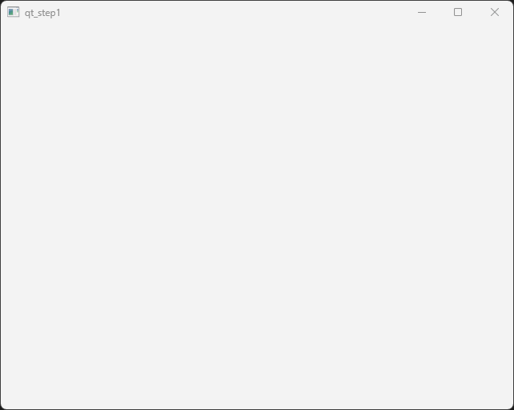

User interfaces with Qt
=======================

Qt is a user interface framework that is widely used for developing GUI applications. It is a cross-platform framework that is available for Windows, Linux, and macOS. It is a C++ library that provides a wide range of functionality for implementing user interfaces. It includes a set of widgets that can be used to create windows, buttons, menus, and other GUI elements. Qt also provides support for event handling, graphics, and multimedia.

Qt is a good example of how object-oriented can be used to simplify and make it easier to develop  applications with complex user interfaces. The framework also abstracts the lower lever details of implemeting user interfaces on different platforms. This means that you can write your application once and run it on different platforms without having to make changes to the code.

In the following chapters we will go through the steps of how a Qt application is implemented. We will start with simple examples and then gradually build up to more complex examples. When we have gone through the we will also describe how we can use the built-in tools in Qt Creator to design the user interface graphically instead of creating the user interface manually in code.

In the final chapters we will go more complete examples of real-world applications that use Qt for the user interface. These examples will show how to use Qt in combination with other libraries such as Eigen and VTK to create applications that use both numerical computations and visualization.

Event based programming
-----------------------

Up until now the applications we have been implemetning has had a linear flow of execution, usually starting in the main function calling functions, executing loops and then finally returning from the main function. This is a typical way of writing programs that are executed from start to finish.

Qt applications are event based, which means that the flow of execution is controlled by events that are generated by the user or the system. Events can be mouse clicks, keyboard presses, resizing of windows or closing of a window. Instead of executing from start to finish a Qt application wait for events in a so called event loop. When an event is received the event loop will dispatch the event to an event handler. The event handler is usually a function that is called in response to the event. Qt in it self responds to many of these events automatically, but will also delegate functionality to your application, so that the functionality of your application is executed in response to the events. 

The mechanism for handling events in Qt is called signals and slots. A signal is emitted when an event occurs and a slot is a function or method that is called in response to the signal. A slot is connected to a signal using the **connect()** method. The signal and slot mechanism is very powerful and allows for a very flexible way of handling events in a Qt application. Signals can be connected to multiple slots. 

To implement the signal and slot mechanism in a Qt application you need to inherit from the **QObject** class. The **QObject** class is the base class for all Qt objects. It provides the functionality for signals and slots. In addition to signals and slots the **QObject** class also provides functionality for memory management, object properties and object introspection. 

As the signal and slot mechanism is a complex feature that is not directly supported in the C++ language, the developers of Qt have implemented a special pre-processor that generates the necessary code for the signal and slot mechanism. This pre-processor is called the **moc** (meta object compiler). The **moc** is run as a pre-build step in the build process of a Qt application. The **moc** generates the necessary code for the signal and slot mechanism and adds this code to the source code of the application.

A first Qt application
----------------------

In this first application we are going to create a simple window without any content and show it on the screen. This will illustrate how a basic Qt application is structured and which classes are used involved. 

The first thing we must do is to include the necessary header files for the Qt classes we are going to use. The main header file for Qt is **QApplication**. This class is the main class for a Qt application and is responsible for handling the application's control flow and main settings. To display the window we are going to use the **QWidget** class. This is the base class for all user interface objects in Qt. If we create a QWidget without a parent it will be displayed as a window on the screen.

The code for the first application is shown below:

.. code:: cpp

    #include <QApplication>
    #include <QWidget>

    int main(int argc, char *argv[])
    {
        QApplication application(argc, argv);

        QWidget window;
        window.show();

        return application.exec();
    }

The first thing we do in the application is to instantiate a **QApplication** instance, **application**. This class is responsible for handling the application's control flow and main settings. An application can only have one application instance and you can't instantiate multiple application objects as it is a singleton. A Qt application supports a number of command line arguments, so the **argc** and **argv** parameters from the main function is pass along to the application instance. 

Next, we need to create our window. This is done by instantiating a **QWidget** object, **window**. To make it appear on the screen we also need to call the **.show()** method of the **QWidget** instance. 

Finally, we call the **.exec()** method of the **QApplication** instance. This method starts the event loop of the application and waits for events to occur. The **.exec()** method only returns when the application is terminated.

Running the application will show an empty window on the screen. The window will have a title bar and a close button. The window can be resized and moved around on the screen. 

Creating our own window
-----------------------

In the previous example we created a windows by instantiating a **QWidget** object. This will make it hard for us to create our own application window. In the next example we will create our own window class derived from **QWidget**. This will make it easier for us to add functionality to the window and to customize the window to our needs.

To accomplish we will have to create a new class **MainWindow** that is derived from **QWidget**. We will also have to implement a constructor for the **MainWindow** class. In the constructor we will set the size of the window and the title of the window. The header file for our new class is shown below:

.. code:: cpp

    #pragma once

    #include <QWidget>

    class MainWindow : public QWidget
    {
        Q_OBJECT

    public:
        explicit MainWindow(QWidget* parent = 0);

    public slots:

    private:

    };

In the above code we can see som new things. The **Q_OBJECT** macro is used to enable the signal and slot mechanism in the class. This macro is necessary for the **moc** pre-processor to generate the necessary code for the signal and slot mechanism. The **Q_OBJECT** macro must be placed in the class definition and the class must inherit from **QObject**. Further down in the class we also see a special section called **public slots**. This is where we define the slots that can be connected to signals. It is only methods defined in this section that can be connected to signals.

In the following code we can see the implementation of the **MainWindow** class:

.. code:: cpp

    #include "mainwindow.h"

    #include <QLabel>
    #include <QVBoxLayout>
    #include <QPushButton>

    MainWindow::MainWindow(QWidget* parent) :
        QWidget(parent)
    {
        // Set the window title
        setWindowTitle("My First Qt Application");
        setGeometry(100, 100, 800, 600);
    }

The constructor calls the **QWidget** constructor with the **parent** parameter. This is necessary to make the **MainWindow** class a proper Qt object. In the constructor we give the window a title and set the size of the window.

To use our new window we have to modify our **main** function to create an instance of the **MainWindow** class instead of a **QWidget** instance. The modified **main** function is shown below:

.. code:: cpp

    #include "mainwindow.h"
    #include <QApplication>

    int main(int argc, char *argv[])
    {
        QApplication application(argc, argv);

        MainWindow window;
        window.show();

        return application.exec();
    }
