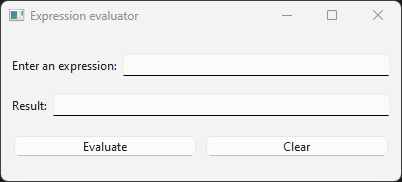
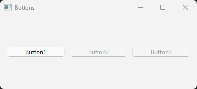

User interfaces with Qt
=======================

Qt is a user interface framework that is widely used for developing GUI applications. It is a cross-platform framework that is available for Windows, Linux, and macOS. It is a C++ library that provides a wide range of functionality for implementing user interfaces. It includes a set of widgets that can be used to create windows, buttons, menus, and other GUI elements. Qt also provides support for event handling, graphics, and multimedia.

Qt is a good example of how object-oriented can be used to simplify and make it easier to develop  applications with complex user interfaces. The framework also abstracts the lower lever details of implemeting user interfaces on different platforms. This means that you can write your application once and run it on different platforms without having to make changes to the code.

In the following chapters we will go through the steps of how a Qt application is implemented. We will start with simple examples and then gradually build up to more complex examples. When we have gone through the we will also describe how we can use the built-in tools in Qt Creator to design the user interface graphically instead of creating the user interface manually in code.

In the final chapters we will go more complete examples of real-world applications that use Qt for the user interface. These examples will show how to use Qt in combination with other libraries such as Eigen and VTK to create applications that use both numerical computations and visualization.

Event based programming
-----------------------

Up until now the applications we have been implemetning has had a linear flow of execution, usually starting in the main function calling functions, executing loops and then finally returning from the main function. This is a typical way of writing programs that are executed from start to finish.

Qt applications are event based, which means that the flow of execution is controlled by events that are generated by the user or the system. Events can be mouse clicks, keyboard presses, resizing of windows or closing of a window. Instead of executing from start to finish a Qt application wait for events in a so called event loop. When an event is received the event loop will dispatch the event to an event handler. The event handler is usually a function that is called in response to the event. Qt in it self responds to many of these events automatically, but will also delegate functionality to your application, so that the functionality of your application is executed in response to the events. 

The mechanism for handling events in Qt is called signals and slots. A signal is emitted when an event occurs and a slot is a function or method that is called in response to the signal. A slot is connected to a signal using the **connect()** method. The signal and slot mechanism is very powerful and allows for a very flexible way of handling events in a Qt application. Signals can be connected to multiple slots. 

To implement the signal and slot mechanism in a Qt application you need to inherit from the **QObject** class. The **QObject** class is the base class for all Qt objects. It provides the functionality for signals and slots. In addition to signals and slots the **QObject** class also provides functionality for memory management, object properties and object introspection. 

As the signal and slot mechanism is a complex feature that is not directly supported in the C++ language, the developers of Qt have implemented a special pre-processor that generates the necessary code for the signal and slot mechanism. This pre-processor is called the **moc** (meta object compiler). The **moc** is run as a pre-build step in the build process of a Qt application. The **moc** generates the necessary code for the signal and slot mechanism and adds this code to the source code of the application.

A first Qt application
----------------------

In this first application we are going to create a simple window without any content and show it on the screen. This will illustrate how a basic Qt application is structured and which classes are used involved. 

The first thing we must do is to include the necessary header files for the Qt classes we are going to use. The main header file for Qt is **QApplication**. This class is the main class for a Qt application and is responsible for handling the application's control flow and main settings. To display the window we are going to use the **QWidget** class. This is the base class for all user interface objects in Qt. If we create a QWidget without a parent it will be displayed as a window on the screen.

The code for the first application is shown below:

.. code:: cpp

    #include <QApplication>
    #include <QWidget>

    int main(int argc, char *argv[])
    {
        QApplication application(argc, argv);

        QWidget window;
        window.show();

        return application.exec();
    }

The first thing we do in the application is to instantiate a **QApplication** instance, **application**. This class is responsible for handling the application's control flow and main settings. An application can only have one application instance and you can't instantiate multiple application objects as it is a singleton. A Qt application supports a number of command line arguments, so the **argc** and **argv** parameters from the main function is pass along to the application instance. 

Next, we need to create our window. This is done by instantiating a **QWidget** object, **window**. To make it appear on the screen we also need to call the **.show()** method of the **QWidget** instance. 

Finally, we call the **.exec()** method of the **QApplication** instance. This method starts the event loop of the application and waits for events to occur. The **.exec()** method only returns when the application is terminated.

Running the application will show an empty window on the screen. The window will have a title bar and a close button. The window can be resized and moved around on the screen. 

.. image:: images/qt_step1.png
    :align: center
    :width: 70.0%

Creating our own window
-----------------------

In the previous example we created a windows by instantiating a **QWidget** object. This will make it hard for us to create our own application window. In the next example we will create our own window class derived from **QWidget**. This will make it easier for us to add functionality to the window and to customize the window to our needs.

To accomplish we will have to create a new class **MainWindow** that is derived from **QWidget**. We will also have to implement a constructor for the **MainWindow** class. In the constructor we will set the size of the window and the title of the window. The header file for our new class is shown below:

.. code:: cpp

    #pragma once

    #include <QWidget>

    class MainWindow : public QWidget
    {
        Q_OBJECT

    public:
        explicit MainWindow(QWidget* parent = 0);

    public slots:

    private:

    };

In the above code we can see som new things. The **Q_OBJECT** macro is used to enable the signal and slot mechanism in the class. This macro is necessary for the **moc** pre-processor to generate the necessary code for the signal and slot mechanism. The **Q_OBJECT** macro must be placed in the class definition and the class must inherit from **QObject**. Further down in the class we also see a special section called **public slots**. This is where we define the slots that can be connected to signals. It is only methods defined in this section that can be connected to signals.

In the following code we can see the implementation of the **MainWindow** class:

.. code:: cpp

    #include "mainwindow.h"

    #include <QLabel>
    #include <QVBoxLayout>
    #include <QPushButton>

    MainWindow::MainWindow(QWidget* parent) :
        QWidget(parent)
    {
        // Set the window title
        setWindowTitle("My First Qt Application");
        setGeometry(100, 100, 800, 600);
    }

The constructor calls the **QWidget** constructor with the **parent** parameter. This is necessary to make the **MainWindow** class a proper Qt object. In the constructor we give the window a title and set the size of the window.

To use our new window we have to modify our **main** function to create an instance of the **MainWindow** class instead of a **QWidget** instance. The modified **main** function is shown below:

.. code:: cpp

    #include "mainwindow.h"
    #include <QApplication>

    int main(int argc, char *argv[])
    {
        QApplication application(argc, argv);

        MainWindow window;
        window.show();

        return application.exec();
    }

Running the application will show a window with the title "My First Qt Application" on the screen with the geometry we specified in the constructor. The window can be resized and moved around on the screen. Moving and resizing a windows is automatically handled by the **QWidget** class built-in functionality. The finished windows is shown below:

Adding widgets to the window
----------------------------

In the next example we are going to add widgets to the window which we can interact with. We are going to add a **QLineEdit** widget where a user can enter text and a **QPushButton** widget that can be clicked. When the button is clicked we will display the contents of the edit control in a message box.

To be able to reference the **QLineEdit** control in an event handler we need to make it a member variable of the **MainWindow** class. We also need to create a slot, **onButtonClicked**, that is called when the button is clicked. The header file for the updated **MainWindow** class is shown below:

.. code:: cpp

    #pragma once

    #include <QLineEdit>

    class MainWindow : public QWidget {
        Q_OBJECT

    public:
        explicit MainWindow(QWidget *parent = 0);

    public slots:
        void onButtonClicked();

    private:
        QLineEdit *m_lineEdit;
    };

In the implementation of the **MainWindow** class we need to create the **QLineEdit** and **QPushButton** widgets and add them to the window. We also need to connect the **clicked()** signal of the button to the **onButtonClicked()** slot. The implementation of the **MainWindow** class is shown below:

.. code:: cpp

    #include "mainwindow.h"

    #include <QLabel>
    #include <QLineEdit>
    #include <QMessageBox>
    #include <QPushButton>

    MainWindow::MainWindow(QWidget *parent) : QWidget(parent), m_lineEdit(nullptr)
    {
        // Set the window title

        setWindowTitle("My First Qt Application");
        setGeometry(100, 100, 400, 300);

        // Create a text edit control

        m_lineEdit = new QLineEdit(this);
        m_lineEdit->setGeometry(10, 10, 150, 24);

        // Create a button

        auto button = new QPushButton("Click Me", this);
        button->setGeometry(10, 40, 150, 30);

        // Connect the button click signal to the onButtonClicked slot

        connect(button, &QPushButton::clicked, this, &MainWindow::onButtonClicked);
    }

    void MainWindow::onButtonClicked()
    {
        QMessageBox::information(this, "Text in edit box", m_lineEdit->text());
    }

In the constructor we create the **QLineEdit** and **QPushButton** widgets and set their geometry on the window. In the current application we can create the **QPushButton** object without a reference in the **MainWindow** class, as we don't need to reference it in the **onButtonClicked()** slot. If we need access to the button objects further in the the development we can always add a reference to it in the **MainWindow** class.

To connect the button to our **onButtonClicked** event we use the **connect()** method to connect the signal **clicked** to the event methods. The **connect()** method takes four parameters. The first parameter is the object that emits the signal, the second parameter is the signal that is emitted, the third parameter is the object that has the slot that should receive the signal and the fourth parameter is the method that is called when the signal is emitted.

Running the applications will show a window with a text edit control and a button. When the button is clicked a message box will be displayed with the text that was entered in the text edit control. The finished window is shown below:

Placing controls with layouts
-----------------------------

In the previous example we placed the controls on the window by setting the geometry of the controls manually. This is not a good way to place controls on a window as it makes it hard to create a window that can be resized. In the next example we are going to use layouts to place the controls on the window. Layouts are used to automatically place controls on a window and to make sure that the controls are placed correctly when the window is resized.

The example we are going to implement is a simple expression evaluator. The user interface will consist of 2 labels and 2 line edits. In the first line edit the user can enter the expression that should be evaluated. The second line edit will be read-only and contain the result of the evaluated expression. The user interface will look like this:

To layout the user interface we will use the **QHBoxLayout** and **QVBoxLayout** classes. These classes are used to layout controls horizontally and vertically. We will use a **QVBoxLayout** to layout the controls vertically and a **QHBoxLayout** to layout the controls horizontally. 

Before we write any code it could be a good idea to identify vertical or horisontal groups of controls that should be placed in a layout. In our case we have two groups of controls that should be placed vertically. The first group is the expression label and the expression line edit. The second group is the result label and the result line edit. The buttons for evaluating and clearing are also contained in a horizontal layout. All of these horisontal layouts in turn will be added to a vertical layout for the entire user interface. The figure below shows these layouts.

First we need to update our main class declaration to include the new controls. The updated header file is shown below:

.. code:: cpp

    #pragma once

    #include <QLineEdit>

    class MainWindow : public QWidget {
        Q_OBJECT

    public:
        explicit MainWindow(QWidget *parent = 0);

    public slots:
        void onCalcClicked();
        void onClearClicked();

    private:
        QLineEdit *m_expressionEdit;
        QLineEdit *m_resultEdit;
    };

In the next step we need to update the constructor of the **MainWindow** class to create the new controls and add them to a layout. Also, all calls to absolute positioning of the controls should be removed. First we create the label controls:

.. code:: cpp

    auto labelExpression = new QLabel("Enter an expression:", this);
    auto labelResult = new QLabel("Result:", this);

We use auto here as we don't need to reference these controls from anywhere else in the class. Next, we create the **QLineEdit** controls:

.. code:: cpp

    m_expressionEdit = new QLineEdit(this);
    m_resultEdit = new QLineEdit(this);
    m_resultEdit->setReadOnly(true);

The **setReadOnly** method prevents the user from modifying the text of the contro, but can still mark the text to be able to copy it from the application. Next we create the button controls.

.. code:: cpp

    auto calcButton = new QPushButton("Evaluate", this);
    auto clearButton = new QPushButton("Clear", this);

Now it is time to create our layout. We start by working from the outside and in. First we create the vertical layout that will contain the entire user interface:

.. code:: cpp

    auto verticalLayout = new QVBoxLayout(this);

Next we create the horizontal layouts for the expression, result and buttons. We add the controls to the layouts as we create them:

.. code:: cpp

    auto expressionLayout = new QHBoxLayout(this);
    expressionLayout->addWidget(labelExpression);
    expressionLayout->addWidget(m_expressionEdit);

    auto resultLayout = new QHBoxLayout(this);
    resultLayout->addWidget(labelResult);
    resultLayout->addWidget(m_resultEdit);

    auto buttonLayout = new QHBoxLayout(this);
    buttonLayout->addWidget(calcButton);
    buttonLayout->addWidget(clearButton);

Finally we add the horizontal layouts to the vertical layout:

.. code:: cpp

    verticalLayout->addLayout(expressionLayout);
    verticalLayout->addLayout(resultLayout);
    verticalLayout->addLayout(buttonLayout);

The final step in the layout process is to assigng the layout to our window, using the **setLayout()** method. As the **verticalLayout** the outermost layout, we assign this layout to the window:

.. code:: cpp

    setLayout(verticalLayout);

Finally we need to connect the buttons to the slots that will handle the button clicks. The **connect()** method is used to connect the **clicked()** signal of the buttons to the slots:

.. code:: cpp

    connect(calcButton, &QPushButton::clicked, this, &MainWindow::onCalcClicked);
    connect(clearButton, &QPushButton::clicked, this, &MainWindow::onClearClicked);

We will keep the event methods empty for now as shown below:

.. code:: cpp

    void MainWindow::onCalcClicked()
    {
    }

    void MainWindow::onClearClicked()
    {
    }

Running the application will show a window with the expression evaluator user interface. The window can be resized and the controls will be placed correctly when the window is resized. The finished window is shown below:

Ok, what happened here? It doesn't look like our previous sketch. The reason for this is that by default the layout managers will scale all controls to fill out the entire window, which is not what we want. To solve this we need to update the code somewhat. There are two ways to solve this. The first way is to set the size policy of the controls to **QSizePolicy::Fixed**. This will make the layout manager not scale the controls. The second way is to add springs or stretch between the  controls in the layout. This will make the layout manager distribute the space between the controls. We will use the second approach in this example.

First we make sure the text boxes have a fixed size and we also add a placeholder text to the expression edit control:

.. code:: cpp

    m_expressionEdit->setPlaceholderText("Enter an expression");
    m_expressionEdit->setMinimumWidth(200);

    m_resultEdit = new QLineEdit(this);
    m_resultEdit->setReadOnly(true);
    m_resultEdit->setMinimumWidth(200);

Next we add a stretch between the controls in the horizontal layouts. For the label and text controls we add a stretch/spring before the label control.

.. code:: cpp

    auto expressionLayout = new QHBoxLayout(this);
    expressionLayout->addStretch();
    expressionLayout->addWidget(labelExpression);
    expressionLayout->addWidget(m_expressionEdit);

    auto resultLayout = new QHBoxLayout(this);
    resultLayout->addStretch();
    resultLayout->addWidget(labelResult);
    resultLayout->addWidget(m_resultEdit);

For the buttons we add a stretch/spring before the buttons and after the buttons. This will center them in the layout.

.. code:: cpp

    auto buttonLayout = new QHBoxLayout(this);
    buttonLayout->addStretch();
    buttonLayout->addWidget(calcButton);
    buttonLayout->addWidget(clearButton);
    buttonLayout->addStretch();

Finally we will also add a stretch/spring between before the buttons in the vertical controls, so that the calc buttons stays at the bottom of the window.

.. code:: cpp

    verticalLayout->addLayout(expressionLayout);
    verticalLayout->addLayout(resultLayout);
    verticalLayout->addStretch();
    verticalLayout->addLayout(buttonLayout);

Running the application will now show the following window:

This looks much better. Now we can continue by connecting our buttons to the event handlers. The **onCalcClicked()** method should evaluate the expression in the expression edit control and display the result in the result edit control. The **onClearClicked()** method should clear the text in the expression and result edit controls. The implementation of the event handlers is shown below:

.. code:: cpp

    MainWindow::MainWindow(QWidget *parent) : QWidget(parent), m_expressionEdit(nullptr), m_resultEdit(nullptr)
    {    
        // ... //

        // Connect the button click signal to the onButtonClicked slot

        connect(calcButton, &QPushButton::clicked, this, &MainWindow::onCalcClicked);
        connect(clearButton, &QPushButton::clicked, this, &MainWindow::onClearClicked);
    }

    void MainWindow::onCalcClicked()
    {

    }

    void MainWindow::onClearClicked()
    {
        m_expressionEdit->clear();
        m_resultEdit->clear();
    }

Implementing an expression evaluator
~~~~~~~~~~~~~~~~~~~~~~~~~~~~~~~~~~~~

Ok, we now have a skeleton of a working application. Next we will implement the expression evaluator. We will use a header only library **exprtk** to evaluate the expression. The **exprtk** library is a simple expression parser that can evaluate mathematical expressions. The library is a single header file that can be included in the project. 

First we extract the string from the **m_expressionEdit** control. 

.. code:: cpp

    auto expressionString = m_expressionEdit->text().toStdString();

As exprtk uses **std::string** we need to convert the **QString** to a **std::string** using the **.toStdString()**-method of the **QString** class.

We can now setup **extrtk**-parser and evaluate the expression. The code for this is shown below:

.. code:: cpp

    exprtk::symbol_table<double> symbolTable;
    exprtk::expression<double> expression;
    exprtk::parser<double> parser;

    symbolTable.add_constants();
    expression.register_symbol_table(symbolTable);
    parser.compile(expressionString, expression);

    double result = expression.value();

Finally we assign the **m_resultEdit** control the result of the expression:

.. code:: cpp

    m_resultEdit->setText(QString::number(result));

The complete **onCalcClicked()** method is shown below:

.. code:: cpp

    void MainWindow::onCalcClicked()
    {
        // Read the expression from the text edit control

        auto expressionString = m_expressionEdit->text().toStdString();

        // Evaluate the expression using the exprtk library

        exprtk::symbol_table<double> symbolTable;
        exprtk::expression<double> expression;
        exprtk::parser<double> parser;

        symbolTable.add_constants();
        expression.register_symbol_table(symbolTable);
        parser.compile(expressionString, expression);

        // Display the result in the result text edit control

        double result = expression.value();
        m_resultEdit->setText(QString::number(result));
    }  

We have now implemented a complete expression evaluator. Running the application will show a window where you can enter a mathematical expression and evaluate it. The result will be displayed in the result text edit control. The finished window is shown below:

This example shows the basic concepts of user interfaces design in Qt and how to use layouts to place controls on a window. Creating controls and placing them in layouts as we have done in this application is not feasible for more complex user interfaces. In the chapter "User interface design with Qt Designer" we will show how to use the Qt Designer tool to design user interfaces graphically and how to generate the necessary code for the user interface.

Controls in Qt
--------------

In this chapter we will go through the most common controls that are used in Qt applications. We will show how to create the controls and how to use them in a user interface. We will also show how to connect the controls to signals and slots to handle events.

Buttons
~~~~~~~

Buttons in Qt are implemented using the **QPushButton** class. The button control is one of the more important controls to enable user interaction with your application. As with all controls buttons can be enabled and disables as well as hidden and shown. The main signal used with buttons is the **clicked()** signal. This signal is emitted when the button is clicked. 

To illustrate how buttons can be used we will create a simple application with three buttons. The first button will disable and enable the other 2 buttons and the second button will hide and show the third button. The header file for the **MainWindow** class is shown below:

.. code:: cpp

    #pragma once

    #include <QPushButton>

    class MainWindow : public QWidget {
        Q_OBJECT

    public:
        explicit MainWindow(QWidget *parent = 0);

    public slots:
        void onButton1Clicked();
        void onButton2Clicked();
        void onButton3Clicked();

    private:
        QPushButton *m_button1;
        QPushButton *m_button2;
        QPushButton *m_button3;
    };

As we are going to reference the buttons in the event handlers we need to make them member variables of the **MainWindow** class. We also create three event methods to connect the buttons to the signals. 

In the constructor we first create three buttons controls.

.. code:: cpp

    m_button1 = new QPushButton("Button 1", this);
    m_button2 = new QPushButton("Button 2", this);
    m_button3 = new QPushButton("Button 3", this);

Next we create a horisontal layout to place the buttons in. We add the buttons to the layout and set the layout to the window.

.. code:: cpp

    auto layout = new QHBoxLayout(this);

    layout->addWidget(m_button1);
    layout->addWidget(m_button2);
    layout->addWidget(m_button3);

    setLayout(layout);

Finally we connect the buttons to the event handlers.

.. code:: cpp

    connect(m_button1, SIGNAL(clicked()), this, SLOT(onButton1Clicked()));
    connect(m_button2, SIGNAL(clicked()), this, SLOT(onButton2Clicked()));
    connect(m_button3, SIGNAL(clicked()), this, SLOT(onButton3Clicked()));

In the **onButton1Clicked()** method we disable and enable the other two buttons using the **.setEnabled()** method. We can query the state of the button using the **.isEnabled()** method.

.. code:: cpp

    void MainWindow::onButton1Clicked()
    {
        if (m_button2->isEnabled())
        {
            m_button2->setEnabled(false);
            m_button3->setEnabled(false);
        }
        else
        {
            m_button2->setEnabled(true);
            m_button3->setEnabled(true);
        }
    }

In the **onButton2Clicked()** method we hide and show the third button using the **.hide()** and **.show()** methods. We can query the state of the button using the **.isHidden()** method.

.. code:: cpp

    void MainWindow::onButton2Clicked()
    {
        if (m_button3->isVisible())
            m_button3->setVisible(false);
        else
            m_button3->setVisible(true);
    }

The **onButton3Clicked()** method is empty we just add a message box to show that the button was clicked.

.. code:: cpp

    void MainWindow::onButton3Clicked()
    {
        QMessageBox::information(this, "Button3", "Button3 clicked");
    }

Running the application will show a window with three buttons. The first button will disable and enable the other two buttons. The second button will hide and show the third button. The third button will show a message box when clicked. The finished window is shown below:

.. image:: images/qt_buttons_1.png
    :align: center
    :width: 60.0%

When clicking on "Button 1" the other two buttons will be disabled. Disabling controls will still show them, but they will can't be interacted with. By disabling controls we signal to the user that the control is available, but not usable. 

Clicking on "Button 2" will hide the third button. Hiding a button will also trigger the layout to rearrange the controls. When the button is shown again the layout will rearrange the controls again.

Radio buttons and Checkboxes
~~~~~~~~~~~~~~~~~~~~~~~~~~~~

Radio and check buttons a are a specialised form of buttons that have state. Radio buttons are used to select one option from a group of options, where only one could be selected at a time. Checkboxes can be used to selection multiple options at the same time. There are no relations between the options. 

State is set by using the **.setChecked()** method. The state of the button can be queried using the **.isChecked()** method. When a state is changed the control sends out the **.toggled()** signal.  

To illustrate the use of the controls we will create an example applications consisting of 2 **QRadioButton** controls and a single **QCheckBox** control. We also add 2 buttons for setting the state of the controls manually from the code. As we need to query the state of the controls we declare them as attributes of the **MainWindow** class. We also add event methods for the controls. The header file for the **MainWindow** class is shown below:

.. code:: cpp

    #pragma once

    #include <QCheckBox>
    #include <QPushButton>
    #include <QRadioButton>

    class MainWindow : public QWidget {
        Q_OBJECT

    public:
        explicit MainWindow(QWidget *parent = 0);

    public slots:
        void onRadioButton1Toggled(bool checked);
        void onRadioButton2Toggled(bool checked);
        void onCheckBoxToggled(bool checked);
        void onCheckButtonClicked();
        void onChangeRadioButtonClicked();

    private:
        QRadioButton *m_radioButton1;
        QRadioButton *m_radioButton2;
        QCheckBox *m_checkBox;
        QPushButton *m_checkButton;
        QPushButton *m_changeRadioButton;
    };

In the constructor we first create the instances of the controls:

.. code:: cpp

    m_radioButton1 = new QRadioButton("Option 1", this);
    m_radioButton2 = new QRadioButton("Option 2", this);

    m_checkBox = new QCheckBox("Check 1", this);

    m_checkButton = new QPushButton("Check Button", this);
    m_changeRadioButton = new QPushButton("Change Radio Button", this);

The lauyout will consist of a top level horisontal layout with to vertical layouts for the controls. The first vertical layout will be the radio and check buttons. The second column will be the buttons for setting the state of the controls. The layout is created with the following code in the constructor:

.. code:: cpp

    auto layout = new QHBoxLayout(this);

    auto buttonLayout = new QVBoxLayout(this);

    buttonLayout->addWidget(m_checkButton);
    buttonLayout->addWidget(m_changeRadioButton);

    auto radioChecklayout = new QVBoxLayout(this);

    radioChecklayout->addWidget(m_radioButton1);
    radioChecklayout->addWidget(m_radioButton2);
    radioChecklayout->addWidget(m_checkBox);

    layout->addLayout(radioChecklayout);
    layout->addLayout(buttonLayout);

    setLayout(layout);

Finally we connect the signals to our event methods.

.. code:: cpp

    connect(m_radioButton1, &QRadioButton::toggled, this, &MainWindow::onRadioButton1Toggled);
    connect(m_radioButton2, &QRadioButton::toggled, this, &MainWindow::onRadioButton2Toggled);
    connect(m_checkBox, &QCheckBox::toggled, this, &MainWindow::onCheckBoxToggled);
    connect(m_checkButton, &QPushButton::clicked, this, &MainWindow::onCheckButtonClicked);
    connect(m_changeRadioButton, &QPushButton::clicked, this, &MainWindow::onChangeRadioButtonClicked);

.. note::

    The **toggled()** signal and not **clicked()** is emitted when the state of the control is changed. The event have a **bool** parameter to indicate the new state of the control.

For the **toggled()** event methods we just show a message indicating a selected state. 

.. code:: cpp

    void MainWindow::onRadioButton1Toggled(bool checked)
    {
        if (checked)
            QMessageBox::information(this, "Option 1", "Option 1 is selected");
    }

    void MainWindow::onRadioButton2Toggled(bool checked)
    {
        if (checked)
            QMessageBox::information(this, "Option 2", "Option 2 is selected");
    }

    void MainWindow::onCheckBoxToggled(bool checked)
    {
        if (checked)
            QMessageBox::information(this, "Check 1", "Check 1 is selected");
    }

For the **onCheckButtonClicked()** method we check or uncheck the state of the checkbox.

.. code:: cpp

    void MainWindow::onCheckButtonClicked()
    {
        if (m_checkBox->isChecked())
            m_checkBox->setChecked(false);
        else
            m_checkBox->setChecked(true);
    }

For the **onChangeRadioButtonClicked()** method we change the state of the radio buttons.

.. code:: cpp

    void MainWindow::onChangeRadioButtonClicked()
    {
        if (m_radioButton1->isChecked())
            m_radioButton2->setChecked(true);
        else
            m_radioButton1->setChecked(true);
    }

.. note::

    The **setChecked()** method will trigger the **toggled()** signal, so the event methods will be called when the state is changed.

The finished window is shown below:

When clicking on the radio buttons or the check box a message box will be shown indicating the state of the control. Clicking on the "Check Button" will toggle the state of the check box. Clicking on the "Change Radio Button" will change the state of the radio buttons. The finished window is shown below:

To have multiple groups of radio buttons they have to be added to groups. This is done by creating a **QButtonGroup** object and adding the radio buttons to the group. The radio buttons in the group will then be mutually exclusive. If the radio buttons are not added to a group they will not be independent of each other.

.. code:: cpp

    auto group = new QButtonGroup(this);
    group->addButton(rb1);
    group->addButton(rb2);
    group->addButton(rb3);

    layout2->addWidget(rb1);
    layout2->addWidget(rb2);
    layout2->addWidget(rb3);
    layout2->

The **QButtonGroup** is not a widget in itself, but defined the groups of related radio buttons. Another option is to use a **QGroupBox**, which also works as a **QWidget** container. The **QGroupBox** can be used to group related controls together. The **QGroupBox** can also have a title that is displayed in the group box.   

In the code below we create a group box with a title and add the radio buttons to the group box:

.. code:: cpp

    auto layout2 = new QVBoxLayout(this);

    auto group = new QGroupBox("Group box");

    layout2->addWidget(rb1);
    layout2->addWidget(rb2);
    layout2->addWidget(rb3);

    group->setLayout(layout2);

    layout->addLayout(radioChecklayout);
    layout->addLayout(buttonLayout);
    layout->addWidget(group);

The finished window is shown below:

List- and combo boxes
~~~~~~~~~~~~~~~~~~~~~

List boxes are used to display a list of items that the user can select from. The items in the list box are usually strings. The user can select one or multiple items from the list, depending on the configuration of the control. The **QListWidget** class is used to create list boxes in Qt. The **QListWidget** class is a container for items that can be selected. The **QListWidgetItem** class is used to create items in the list box.

To illustrate the use we are going to create a simple application that displays a list box and a combobox where you can add remove and clear items. The layout will consist of two columns. The first column will contain a line edit, listbox and a combobox. The second column will contain buttons for adding, removing and clearing items. First we add the controls that needs to be references and any event methods to our MainWindow class:

.. code:: cpp

    #pragma once

    #include <QComboBox>
    #include <QLineEdit>
    #include <QListWidget>
    #include <QPushButton>

    class MainWindow : public QWidget {
        Q_OBJECT

    public:
        explicit MainWindow(QWidget *parent = 0);

    public slots:
        void onAddButtonClicked();
        void onRemoveButtonClicked();
        void onClearButtonClicked();
        void onItemSelectionChanged();
        void onComboCurrentTextChanged();

    private:
        QListWidget *m_listWidget;
        QLineEdit *m_lineEdit;
        QComboBox *m_comboBox;
    };

In the constructor we first create our controls:

.. code:: cpp

    m_listWidget = new QListWidget(this);
    m_lineEdit = new QLineEdit(this);
    m_comboBox = new QComboBox(this);

    auto addButton = new QPushButton("Add", this);
    auto removeButton = new QPushButton("Remove", this);
    auto clearButton = new QPushButton("Clear", this);

As we don't need to modify the buttons we can create them without attributes in the **MainClass** class. Next we create the layout for the controls. The layout will consist of two columns. The first column will contain the list box, line edit and combobox. The second column will contain the buttons. The layout is created with the following code in the constructor:

.. code:: cpp

    auto mainLayout = new QHBoxLayout(this);
    auto leftLayout = new QVBoxLayout(this);
    auto rightLayout = new QVBoxLayout(this);

    leftLayout->addWidget(m_lineEdit);
    leftLayout->addWidget(m_listWidget);
    leftLayout->addWidget(m_comboBox);

    rightLayout->addWidget(addButton);
    rightLayout->addWidget(removeButton);
    rightLayout->addWidget(clearButton);
    rightLayout->addStretch();

    mainLayout->addLayout(leftLayout);
    mainLayout->addLayout(rightLayout);

    setLayout(mainLayout);

Finally we connect the signals to the event methods:

.. code:: cpp

    connect(addButton, &QPushButton::clicked, this, &MainWindow::onAddButtonClicked);
    connect(removeButton, &QPushButton::clicked, this, &MainWindow::onRemoveButtonClicked);
    connect(clearButton, &QPushButton::clicked, this, &MainWindow::onClearButtonClicked);
    connect(m_listWidget, &QListWidget::itemSelectionChanged, this, &MainWindow::onItemSelectionChanged);
    connect(m_comboBox, &QComboBox::currentTextChanged, this, &MainWindow::onComboCurrentTextChanged);

For the list box we connect the **.itemSelectionChanged()** signal to handle the selection of items. For the combobox we connect the **.currentTextChanged()** signal to handle the selection of items.

Next we implement the event methods for the buttons. First we implement the **onAddButtonClicked()** method. This method will add the text from the line edit control to the list box and combobox. Here we use the **text()** method to retrieve the text in the line edit control. If the text is empty we show a message box to the user, otherwise we add the text to the list box and combobox using the **addItem()** methods.

.. code:: cpp

    void MainWindow::onAddButtonClicked()
    {
        // Get the text from the line edit

        QString text = m_lineEdit->text();

        // Check if the text is empty

        if (text.isEmpty())
        {
            QMessageBox::warning(this, "Error", "Please enter some text");
            return;
        }

        // Add the text to the list widget

        m_listWidget->addItem(text);
        m_comboBox->addItem(text);
    }

For the remove button we will use the **currentItem()** method to get the currently selected item. If the item return in **nullptr** nothing was selected by the user and we exit by displaying a message, otherwise we remove the item from the list box by deleting the item. This works as the item destructor will remove the item from the list box. The complete code for the event method is shown below:

.. code:: cpp

    void MainWindow::onRemoveButtonClicked()
    {
        // Get the selected item

        auto item = m_listWidget->currentItem();

        // Check if an item is selected

        if (!item)
        {
            QMessageBox::warning(this, "Error", "Please select an item to remove");
            return;
        }

        delete item;
    }

For the clear button we use the **.clear()** method to remove all items from the list box and combobox. The complete code for the event method is shown below:

.. code:: cpp

    void MainWindow::onClearButtonClicked()
    {
        m_listWidget->clear();
        m_comboBox->clear();
    }

The finished application is shown in the following image:

When clicking on the "Add" button the text from the line edit control will be added to the list box and combobox. When clicking on the "Remove" button the selected item will be removed from the list box.

Sliders and spin boxes
~~~~~~~~~~~~~~~~~~~~~~

Progress bars
~~~~~~~~~~~~~

Text edit controls
~~~~~~~~~~~~~~~~~~

Labels
~~~~~~

Group boxes
~~~~~~~~~~~

Tab widgets
~~~~~~~~~~~

Applications with menus and toolbars
------------------------------------

Menus and toolbars
~~~~~~~~~~~~~~~~~~

Drawing in Qt
-------------

Drawing with QPainter
~~~~~~~~~~~~~~~~~~~~~

Drawing with OpenGL
~~~~~~~~~~~~~~~~~~~

Drawing using Canvas
~~~~~~~~~~~~~~~~~~~~

User interface design with Qt Designer
--------------------------------------
 
TBD

Timers in Qt
------------

Multithreading in Qt
--------------------

Building Qt applications with CMake
-----------------------------------

TBD
