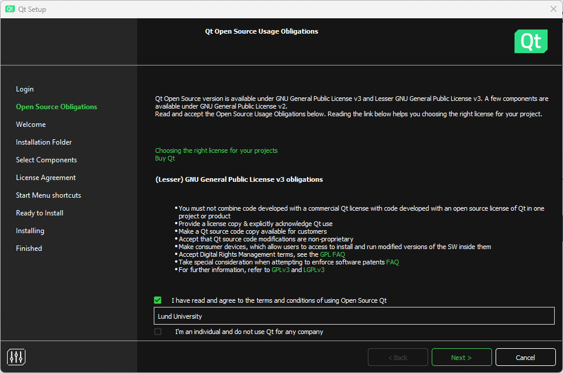
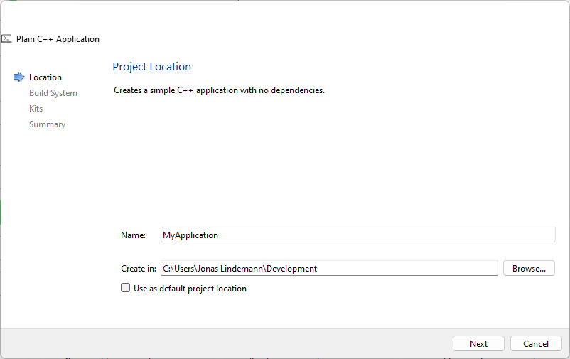

Building and running C++ code
=============================

To install and run C++, you will need a compiler. There are several
compilers available for C++ that work on all major platforms. For this
course, we will be using the GNU C++ compiler. Along with the compiler,
it is recommended to have a good text editor that has support for C++.
To further simplify the process of compiling, running, and debugging C++
code, a development environment is recommended. In this course, we will
use Qt Creator, which is an advanced environment specifically designed
for C++. It provides features such as building, debugging, and running
both command line and graphical applications using Qt.

As we are not going to develop commercial code in this course we can
download and use the open source version of Qt Creator, which can be
downloaded from the following URL:

`Download open source Qt
Creator <https://www.qt.io/download-qt-installer-oss>`__

Installing Qt Creator and C++ compiler (Windows)
------------------------------------------------

Download and run the online installer from the URL above. To use the
installer you need to create an Qt account. When this has been done,
enter your account information into the following dialog box and click
**Next**.

.. figure:: images/qtcreator-installer1.png
   :alt: Image title
   :width: 100.0%

   Image title

Check the box that you agree to the GPL license requirements. Click
**Next**.



   Image title

In the **Select components** section make sure to select:

- Qt 6.5.x
- Qt Creator 10.0.2
- Qt Creator 10.0.2 CDB Debugger support
- Debugging support for Windows
- MinGW 11.2.0 64-bit

Click **Next**.

.. figure:: images/qtcreator-installer3.png
   :alt: Image title
   :width: 100.0%

   Image title

Continue the dialog to complete the installation of Qt Creator on
Windows. When completed you should now have the development environment
Qt Creator and the GCC 11.2 compilers for C++ available. Qt Creator is
now available in the start menu.

Installing Qt Creator and C++ compiler (Linux)
----------------------------------------------

On Linux Qt Creator will use any installed compilers on the system, so
make sure you have installed these before running the installer. This
can be done using the following commands on an Ubuntu system:

::

   sudo apt-get install build-essential

On Linux you also download the online installer using the previous link.
The installer comes in the form of an executable script, which you need
to run. To do this open a terminal and do the following commands on the
downloaded file:

::

   chmod +x qt-unified-linux-x64-4.6.0-online.run
   ./qt-unified-linux-x64-4.6.0-online.run

The installer works just as for the Windows version. Select the
following options in the **Select components** page in the installer:

.. figure:: images/qtcreator-installer4-linux.png
   :alt: Image title
   :width: 100.0%

   Image title

If you want Qt Creator to be available you will need to add the
following to the system path in Linux:

::

   export PATH=$HOME/Qt/[qt version]/gcc_64/bin:$HOME/Qt/Tools/QtCreator/bin:$PATH

Add this file in your **.bash_profile** in your home directory. Replace
**[qt version]** with the installed Qt version.

Installing Qt Creator and C++ compiler (macOS)
----------------------------------------------

TBD.

Creating a C++ project in Qt Creator
------------------------------------

When you start Qt Creator for the first time the following window
appears:


   Image title

On the left side there are 6 main sections in the left toolbar.

- **Welcome** - Shows a start page for Qt Creator with shortcuts and
  example projects.
- **Edit** - Here you edit your files in your project. More on that in
  the following sections.
- **Design** - Used to edit user interfaces when a Qt user interface
  project is used.
- **Debug** - Debug mode used when debugging your project.
- **Projects** - Project configuration options.
- **Help** - Help on how to use Qt Creator.

To create a new project in Qt Creator select **File/New project…** from
the menu or press **[Ctrl]+[Shift]+N**. This brings up a wizard for
creating a new project.

First we need to select the project type. For the most part of this
course we will only need a **Plain C++ Application** project. See below:


   Image title

In the next page we need to specify the name and location of the new
project.



   Image title

Now we need to specify the build system used by this project. The
choices are CMake and QMake. In this course we will focus on CMake for
our projects, so keep the default choice.


   Image title

In this step the compiler kit needs to be selected. If all goes well it
should show a valid configuration. In the image below the MinGW compiler
kit for Windows is preselected.

.. figure:: images/qtcreator-project-5.png
   :alt: Image title
   :width: 100.0%

   Image title

If you want to use version control this can be specified in the
following step.

.. figure:: images/qtcreator-project-6.png
   :alt: Image title
   :width: 100.0%

   Image title

When the guide is completed we should end up with the following window
in Qt Creator. The **Projects** pane will show the files in your project
and the editor will show you the main application source file,
**main.cpp**.


   Image title

Building your application
-------------------------

To build the application select **Build/Build Project “MyAppliction**
from the menu or click on the build button in the lower left toolbar:

.. figure:: images/qtcreator-build-button.png
   :alt: Image title
   :width: 10.0%

   Image title

Output from the build can be shown by clicking the **4 Compile output**
button in the lower part of the window. This brings up the log of the
compiler output.

.. figure:: images/qtcreator-compile-output-1.png
   :alt: Image title
   :width: 100.0%

   Image title

Any issues can also be shown by opening the issues pane using the **1
Issues** button in the lower part of the window.


   Image title

Double clicking a row in the issues pane will bring you to the
corresponding line in the source code.

Running your application
------------------------

Running your application in Qt Creator can be done using the play button
in the lower left toolbar.


   Image title

If your code has not been built it will be built before it is run.
Output from your application is shown in the **3 Application output**
pane in the lower part of the window.-

.. figure:: images/qtcreator-run-1.png
   :alt: Image title
   :width: 100.0%

   Image title

Adding source files to your project
-----------------------------------

Adding files to your project is a 2 step process. First we create the
files and save them in the project source directory. Select **File/New
file…** in the menu. In the guide that comes up select a **General/Empty
file**.


   Image title

Save it as a file called **myfunc.h** in the project source directory.
In the next step just click **Finish**. Qt Creator currently can’t add
files automatically to the CMakeLists.txt file, and it shows the
following dialogue,

.. figure:: images/qtcreator-create-new-file-2.png
   :alt: Image title
   :width: 50.0%

   Image title

asking you if it should copy the filename to the clipboard. Answer
**Yes**.

Next open the CMakeLists.txt file and add **myfunc.h** to the the
**add_executable(…)** statement:

\``\` cmake hl_lines=“8” cmake_minimum_required(VERSION 3.5)

project(MyApplication LANGUAGES CXX)

set(CMAKE_CXX_STANDARD 17) set(CMAKE_CXX_STANDARD_REQUIRED ON)

add_executable(MyApplication myfunc.h main.cpp)

install(TARGETS MyApplication LIBRARY DESTINATION
${CMAKE_INSTALL_LIBDIR} RUNTIME DESTINATION ${CMAKE_INSTALL_BINDIR} )

::


   Same procedure can be done to add a **myfunc.cpp** file. The final CMakeLists.txt should look like:

   ``` cmake hl_lines="8"
   cmake_minimum_required(VERSION 3.5)

   project(MyApplication LANGUAGES CXX)

   set(CMAKE_CXX_STANDARD 17)
   set(CMAKE_CXX_STANDARD_REQUIRED ON)

   add_executable(MyApplication myfunc.h myfunc.cpp main.cpp)

   install(TARGETS MyApplication
       LIBRARY DESTINATION ${CMAKE_INSTALL_LIBDIR}
       RUNTIME DESTINATION ${CMAKE_INSTALL_BINDIR}
   )

Building on the command line
----------------------------

Building a C++ application from the command line can be done using the
following commands:

.. code:: bash

   $ g++ myfunc.h myfunc.cpp main.cpp -o myapp

This will compile and link the source files **myfunc.h**, **myfunc.cpp**
and **main.cpp**, producing an executable **myapp**.

Running on the command line
---------------------------

Running the compiler executable on the command line can be done using
the following command:

.. code:: bash

   $ ./myapp
   Hello World!
